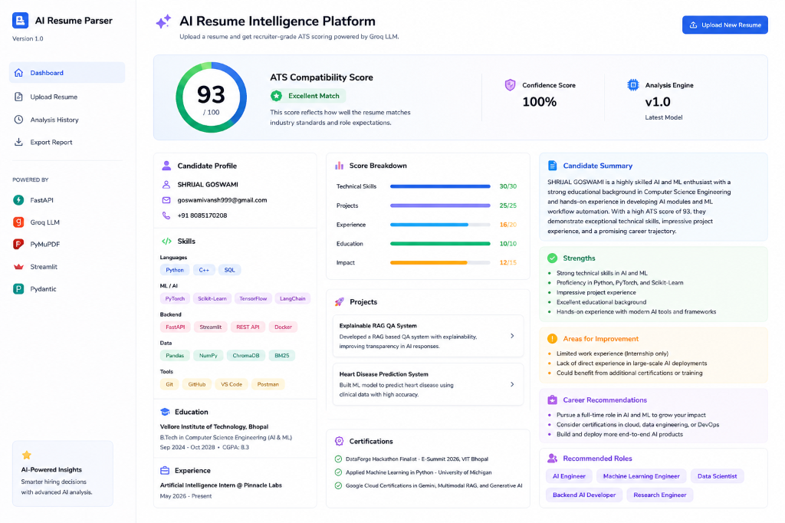
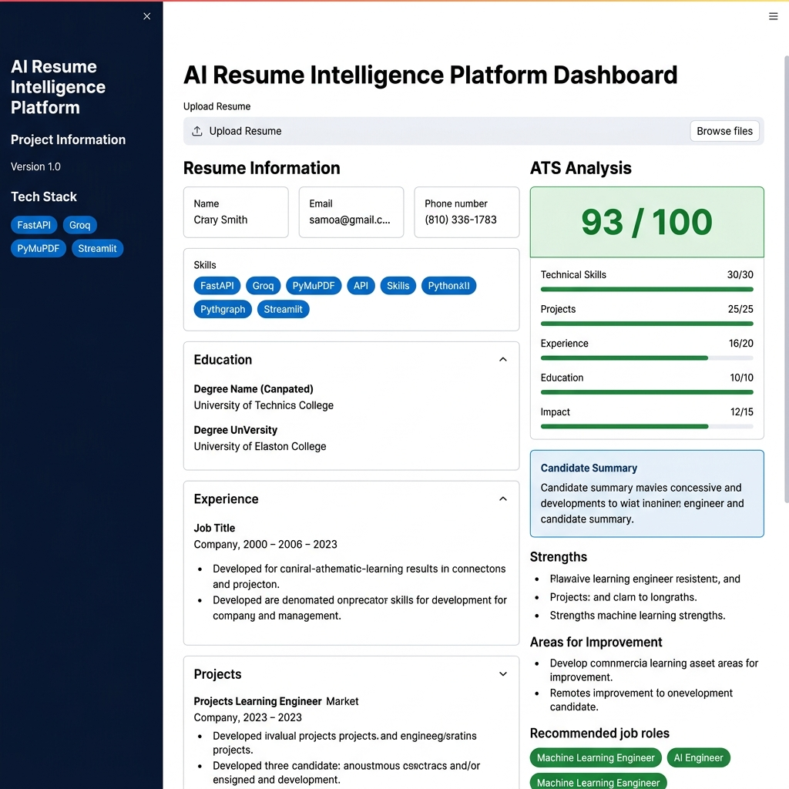

# ✦ AI Resume Intelligence Platform ✦


🚀 Live Demo: https://resume-intelligence-platform.streamlit.app/


[](https://fastapi.tiangolo.com)
[](https://streamlit.io)
[](https://groq.com)
[](https://pydantic.dev)
[](https://python.org)
[](https://opensource.org/licenses/MIT)

An enterprise-grade, recruiter-focused **AI Resume Intelligence Platform** that automates the ingestion, parsing, scoring, and qualitative review of candidate resumes. 

The application utilizes a **hybrid architecture** combining high-speed deterministic NLP rule-engines for structural scoring with advanced Generative AI (Groq Llama-3 API) for cognitive candidate summarization, career trajectory mapping, and interview readiness evaluations.

---

## 📖 Table of Contents
1. [Problem Statement](#-problem-statement)
2. [Key Features](#-key-features)
3. [System Architecture](#-system-architecture)
4. [Project Folder Structure](#-project-folder-structure)
5. [ATS Scoring Methodology](#-ats-scoring-methodology)
6. [API Endpoints](#-api-endpoints)
7. [Screenshots](#-screenshots)
8. [Installation & Setup](#-installation--setup)
9. [Usage Guide](#-usage-guide)
10. [Draw.io Diagram Specification](#-drawio-diagram-specification)
11. [Future Roadmap](#-future-roadmap)
12. [Contributing](#-contributing)
13. [License](#-license)

---

## 🎯 Problem Statement

Recruiting teams at high-growth companies receive thousands of resumes per job posting. Traditional **Applicant Tracking Systems (ATS)** suffer from major limitations:
* **Keyword Matching Vices:** Dumb keyword filters encourage candidates to "stuff keywords," letting weak candidates pass while filtering out qualified individuals with non-standard formatting.
* **Layout Failures:** Traditional parsers routinely fail on multi-column resumes, tables, or mixed PDF/DOCX structures.
* **LLM Hallucinations & Latency:** Relying entirely on LLMs to parse and score resumes is slow, expensive, non-deterministic, and prone to hallucinating scores, making candidate comparison unreliable.

### The Solution: A Hybrid Approach
This platform introduces a **hybrid parsing-scoring-explanation architecture**:
1. **High-Fidelity Document Parsers** handle raw content extraction from PDF/DOCX formats cleanly.
2. **Deterministic Heuristics Engine** extracts details and scores candidates mathematically based on a fixed scoring rubric (eliminating LLM scoring hallucination and guaranteeing 100% consistency across runs).
3. **Structured Generative LLM Layer** (powered by Groq Llama-3) is only used where humans excel: generating contextual summaries, analyzing strengths/gaps, evaluating interview readiness, and suggesting career recommendations.

---

## ✨ Key Features

### 📂 Multi-Format Ingestion
* **High-Fidelity PDF Ingestion:** Powered by `PyMuPDF` (Fitz) to extract raw text structure and order.
* **DOCX Ingestion:** Powered by `python-docx` to handle Microsoft Word files.
* **File Upload Validation:** Backend size enforcement (<10MB) and strict file-type checks (`.pdf` and `.docx`).

### 🧠 Information Extraction & Normalization
* **Semantic Section Isolation:** Heuristically detects boundaries for sections such as Experience, Projects, Education, and Skills.
* **Metadata Extraction:** NLP pattern matching extracts name, phone, email, GPAs, and CGPAs.
* **Skill Normalizer & De-duplicator:** Standardizes, cleans, and groups technical and non-technical skills into unified categories (e.g., Languages, Libraries, Tools).

### 📊 Deterministic ATS Scoring
* Mathematical 100-point rubric assessing **Technical Skills** (30), **Projects** (25), **Work Experience** (20), **Education** (10), and **Quantified Impact** (15).
* **Confidence Metric:** A completeness score (0-100) indicating the presence of critical candidate metadata (name, email, phone, skills, experience, education).

### 🤖 LLM Recruiter Intelligence (Groq Llama-3)
* **Qualitative Analysis:** Generates a 2-3 sentence recruiter-grade summary of the candidate's profile.
* **Gaps & Strengths Identification:** Enumerates clear strengths and actionable areas for improvement.
* **Career Trajectory & Readiness:** Suggests next-step career advice, recommended roles, and assesses interview preparedness.
* **Self-Healing Schema Enforcement:** Relies on Pydantic v2 schemas for backend model validation, with built-in network timeout retries (3x), JSON parse repair (3x), and schema healing (2x).

### 🎨 Recruiter-Grade Streamlit Dashboard
* **3-Column SaaS Layout:** Clean Notion/Stripe/Linear inspired light interface.
* **Interactive Controls:** Upload resumes directly, review parsing stats, and view interactive visual reports.
* **Dynamic Score Hero:** SVG gradient circular progress meter for overall ATS score with performance indicators.
* **Timeline Visualization:** Renders work experiences as an interactive timeline with chronological bullet points and quantified metric highlights.

---

## 🏗️ System Architecture

The platform separates responsibilities between the backend (FastAPI REST service) and the frontend (Streamlit visualization dashboard) for clean separation of concerns.

```
                  ┌──────────────────────────────────────────┐
                  │            Streamlit Frontend            │
                  │   (Dashboard, Upload, Insights Panels)   │
                  └────────────────────┬─────────────────────┘
                                       │
                                       │ HTTP POST / GET (JSON)
                                       ▼
                  ┌──────────────────────────────────────────┐
                  │             FastAPI Backend              │
                  │   (Routing, Validation, Orchestration)   │
                  └────────────────────┬─────────────────────┘
                                       │
         ┌─────────────────────────────┼─────────────────────────────┐
         ▼                             ▼                             ▼
┌──────────────────┐          ┌──────────────────┐          ┌──────────────────┐
│  Parser Layer    │          │  Extraction Layer│          │    ATS Scorer    │
│(PyMuPDF/Docx2Txt)│          │ (NLP & Regex)    │          │  (Deterministic) │
└────────┬─────────┘          └────────┬─────────┘          └────────┬─────────┘
         │                             │                             │
         └─────────────────────────────┼─────────────────────────────┘
                                       ▼
                              ┌──────────────────┐
                              │  Pydantic Schema │
                              │   (ResumeData)   │
                              └────────┬─────────┘
                                       │
                                       ▼
                              ┌──────────────────┐
                              │ Groq Llama-3 API │
                              │ (JSON Explanation│
                              │  & Self-Healing) │
                              └────────┬─────────┘
                                       │
                                       ▼
                              ┌──────────────────┐
                              │ AnalysisResponse │
                              │   (Merged JSON)  │
                              └──────────────────┘
```

### Layer Responsibilities
1. **Upload Layer:** Handles HTTP file multipart uploads, checks constraints (file size & extension), creates secure paths relative to the project root, and persists raw files to disk.
2. **Parsing Layer (`ParserFactory`):** Detects mime-types and routes incoming documents to `PDFParser` or `DOCXParser`. Implements clean error propagation for corrupted or password-protected files.
3. **Extraction Layer (`ResumeService` & `Extractor`):** Runs NLP heuristics to segment files. Applies validators for email/phone patterns and runs skill mapping to normalize tokens and eliminate duplicates.
4. **ATS Scorer Engine (`ats_scorer.py`):** Takes structured data and calculates scores mathematically. Calculates the parsing completeness metric (`confidence_score`) and structural points.
5. **Groq Analysis Layer (`analyzer.py`):** Constructs user prompts with the structured JSON and scoring details already injected. Dispatches requests to the Groq API and validates the returned qualitative explanations against Pydantic schemas.
6. **Dashboard Layer (`app.py`):** Communicates with the FastAPI REST API, handles file uploads, keeps track of view-states, and renders the premium 3-column user interface.

---

## 📂 Project Folder Structure

```
Resume-Parser/
├── backend/                       # FastAPI Python Backend
│   ├── app/
│   │   ├── core/                  # Configuration & Global Constants
│   │   │   ├── __init__.py
│   │   │   └── config.py          # Environment settings loader (Pydantic BaseSettings)
│   │   ├── llm/                   # LLM Client and Prompts Config
│   │   │   ├── __init__.py
│   │   │   ├── analyzer.py        # Orchestrates ATS scorer & Groq API validation
│   │   │   ├── groq_client.py     # Dispatches HTTP requests to Groq SDK
│   │   │   └── prompts.py         # System and User analysis prompts templates
│   │   ├── nlp/                   # NLP, Regex Extraction and ATS Rules
│   │   │   ├── __init__.py
│   │   │   ├── ats_scorer.py      # Mathematical 100-pt scoring implementation
│   │   │   ├── extractor.py       # Heuristics for layout segmenting & regex matches
│   │   │   ├── skill_normalizer.py# Map raw skills into standard categories
│   │   │   ├── skill_postprocessor.py
│   │   │   └── validators.py      # Regex rules for email, phone, and names
│   │   ├── parser/                # Ingestion File Parsers
│   │   │   ├── __init__.py
│   │   │   ├── base.py            # Base abstract parser class
│   │   │   ├── docx.py            # Parser implementation for Microsoft Word files
│   │   │   ├── exceptions.py      # Module-specific ingestion exceptions
│   │   │   ├── factory.py         # Selects PDF or DOCX parser based on extension
│   │   │   └── pdf.py             # Parser implementation for PDF files
│   │   ├── routes/                # FastAPI Controller Endpoints
│   │   │   ├── __init__.py
│   │   │   ├── test.py            # Test routes (raw, extraction, analysis, quality)
│   │   │   └── upload.py          # File upload endpoint
│   │   ├── schemas/               # Pydantic v2 Models (Data Validation)
│   │   │   ├── __init__.py
│   │   │   ├── analysis.py        # Pydantic models for ATS breakdown and LLM output
│   │   │   ├── resume.py          # Pydantic models for structured ResumeData
│   │   │   └── upload.py          # Pydantic response models for uploaded files
│   │   ├── services/              # Business Logic Services Orchestration
│   │   │   └── resume_service.py  # Orchestrates parsing and extraction modules
│   │   ├── __init__.py
│   │   └── main.py                # FastAPI entry point, registers routes & CORS
│   ├── uploads/                   # Temporary upload cache location
│   ├── .env.local                 # Local environment configurations (private)
│   └── requirements.txt           # Backend dependencies (fastapi, groq, etc.)
│
├── frontend/                      # Streamlit Python UI
│   ├── app.py                     # 3-column Streamlit application layout & UI logic
│   └── requirements.txt           # Frontend dependencies (streamlit, requests, etc.)
│
├── datasets/                      # Directory for sample resumes & benchmark datasets
│   └── Shrijal_Goswami_Resume.pdf # Sample PDF resume for immediate testing
│
├── docs/                          # Project documentation assets
│   ├── assets/                    # Screenshots and diagrams
│   │   ├── dashboard_preview.png  # Streamlit UI screenshot
│   │   └── dashboard_mockup.png   # Streamlit UI mock mockup
│   └── portfolio_kit.md           # LinkedIn, Resume bullets, & Video Script templates
│
├── .gitignore                     # Git tracking exclusions
├── pyrightconfig.json             # Python typing analyzer rules configuration
└── README.md                      # Project documentation overview (This file)
```

---

## 📊 ATS Scoring Methodology

The platform calculates a deterministic ATS compatibility score out of **100 points** using the following rubric. This ensures scoring stability:

| Category | Max Score | Evaluation Heuristics |
| :--- | :---: | :--- |
| **Technical Skills** | 30 | Evaluated based on the count of unique, normalized skills found.<br>• 1-4 skills: `10 pts`<br>• 5-8 skills: `16 pts`<br>• 9-12 skills: `22 pts`<br>• 13-16 skills: `27 pts`<br>• 17+ skills: `30 pts` |
| **Projects** | 25 | Evaluated based on the quantity and depth of project descriptions.<br>• 0 projects: `0 pts`<br>• 1 project (brief): `5 pts`<br>• 1 project (detailed, bullets present): `10 pts`<br>• 2 projects (basic descriptions): `18 pts`<br>• 2 detailed projects (3+ bullets each): `20 pts`<br>• 2+ projects with outcomes containing quantified metrics: `25 pts` |
| **Work Experience** | 20 | Evaluated based on career history length and detail richness.<br>• 0 experience entries: `0 pts`<br>• 1 experience entry (short description, <2 bullets): `12 pts`<br>• 1 experience entry (rich description, 2+ bullets): `16 pts`<br>• 2+ experience entries: `20 pts` |
| **Education** | 10 | Evaluated based on academic history, degree, and grade points (GPA/CGPA).<br>• 0 education records: `0 pts`<br>• 1 education entry (no GPA provided): `6 pts`<br>• 1 education entry with GPA/CGPA provided: `8 pts`<br>• 1 entry with CGPA ≥ 7.5 (or GPA ≥ 3.3/4.0): `10 pts`<br>• 2+ education entries: `10 pts` |
| **Quantified Impact** | 15 | Evaluated on presence of metrics (%, $, x multiplier, values, metrics) in work/projects.<br>• Content present, but no numbers/metrics found: `5 pts`<br>• 1 metric found: `9 pts`<br>• 2-3 metrics found: `12 pts`<br>• 4+ metrics found: `15 pts` |
| **Total** | **100** | **Comprehensive mathematical sum of all categories.** |

### Confidence Score (Completeness)
In addition to the ATS score, a **Confidence Score (0-100)** is calculated. It evaluates parsing completeness and penalizes missing crucial fields:
* Starting value: **100**
* Missing Name: **-30**
* Missing Email: **-20**
* Missing Phone: **-15**
* Missing Skills list: **-15**
* Missing Education: **-10**
* Missing Experience: **-10**

---

## ⚡ API Endpoints

FastAPI exposes REST endpoints under `/api/v1`. Documentation is auto-generated by FastAPI at `http://localhost:8001/docs`.

### Ingestion & Analysis APIs
* **`POST /api/v1/upload`**
  * **Payload:** Multipart Form-Data (file: `.pdf` or `.docx`)
  * **Description:** Saves the resume file to the uploads directory. Returns the stored filename, size, and location.
* **`GET /api/v1/test-resume`**
  * **Description:** Tests the raw parsing layer on the first file in the uploads directory. Returns page counts, parser metadata, and a 1000-character raw text preview.
* **`GET /api/v1/test-extraction`**
  * **Description:** Runs structural segmenting on the first file in the uploads folder and parses details into a validated `ResumeData` Pydantic model.
* **`GET /api/v1/test-analysis`**
  * **Description:** Triggers the end-to-end analysis. Orchestrates extraction, deterministic ATS scoring, calls Groq LLM for qualitative insights, merges outputs, and returns an `AnalysisResponse` JSON payload.
* **`GET /api/v1/test-quality`**
  * **Description:** Evaluates parser extraction statistics, mapping skill density, duplicate terms, and metadata completeness.

---

## 📷 Screenshots

### Recruiter Analytics Dashboard
Below is the modern recruiter dashboard interface matching Notion and Stripe's design language:


### Design & Layout Wireframe
The visual structural layout of the 3-column analysis system is shown below:


---

## 🚀 Installation & Setup

### Prerequisites
* Python 3.10 or Python 3.11 installed
* Git
* A Groq API Key (obtain one for free at [console.groq.com](https://console.groq.com/))

### Project Setup
1. **Clone the repository:**
   ```bash
   git clone https://github.com/YOUR_USERNAME/Resume-Parser.git
   cd Resume-Parser
   ```

2. **Create and activate a virtual environment:**
   ```bash
   python -m venv venv
   # On Windows (PowerShell):
   .\venv\Scripts\Activate.ps1
   # On macOS/Linux:
   source venv/bin/activate
   ```

### 1. Backend Setup
1. **Navigate to the backend directory and install dependencies:**
   ```bash
   cd backend
   pip install -r requirements.txt
   ```

2. **Configure environment variables:**
   Create a `.env.local` file inside the `backend/` folder:
   ```env
   # Groq API Configuration
   GROQ_API_KEY=your_groq_api_key_here

   # Configurations
   MAX_FILE_SIZE_MB=10
   ALLOWED_EXTENSIONS=[".pdf", ".docx"]
   ```

3. **Start the FastAPI backend server:**
   ```bash
   python -m uvicorn app.main:app --reload --port 8001
   ```
   *The backend will start and run on `http://localhost:8001`.*

### 2. Frontend Setup
1. **Open a new terminal session, activate the virtual environment, and navigate to the frontend directory:**
   ```bash
   cd frontend
   pip install -r requirements.txt
   ```

2. **Run the Streamlit Dashboard:**
   Make sure you run it from the root of the project to allow relative path resolutions:
   ```bash
   # From the project root (Resume-Parser/)
   venv\Scripts\python.exe -m streamlit run frontend/app.py --server.port 8501
   ```
   *The Streamlit web application will open automatically at `http://localhost:8501`.*

---

## 💡 Usage Guide

1. Open the Streamlit dashboard on your browser (`http://localhost:8501`).
2. Use the **Upload Resume** section in the left panel to upload a resume (`.pdf` or `.docx`).
3. Click the **Analyze Resume** button to trigger the pipeline.
4. View the dashboard:
   * **Left Panel:** File details and structured candidate profile (Name, Contact, Categorized Skills, and Education).
   * **Center Panel:** Overall ATS compatibility score (interactive circle meter), score category breakdown progress bars, and extracted projects list.
   * **Right Panel:** Groq AI-generated recruiter notes: candidate overview, core strengths, gaps to improve, recommended positions, and career paths.

---

## 🎨 Draw.io Diagram Specification

This blueprint contains components, boundaries, and communication flows to easily reconstruct a high-quality system architecture diagram in [Draw.io](https://draw.io) or [Excalidraw](https://excalidraw.com).

### Node Blocks
* **User Boundary (Browser UI):**
  * Component: `Streamlit Application` [Style: Blue Box, Rounded, Text: "Client (Streamlit SPA)"]
* **API Boundary (Backend Server):**
  * Container: `FastAPI App (Running Uvicorn on Port 8001)` [Style: Light Green Container Box]
    * Component: `API Router (upload.py / test.py)` [Style: Green Box, Rounded]
    * Component: `Orchestrator Service (resume_service.py)` [Style: Green Box]
    * Component: `Parser Layer (factory.py → pdf.py / docx.py)` [Style: Yellow Box]
    * Component: `NLP & Heuristics (extractor.py & skill_normalizer.py)` [Style: Purple Box]
    * Component: `Deterministic Scorer (ats_scorer.py)` [Style: Red Box, Text: "ATS Rules Engine"]
    * Component: `Pydantic Schema Validation (ResumeData)` [Style: Orange Box]
    * Component: `Groq Client Orchestrator (analyzer.py)` [Style: Orange Box]
* **External Systems Boundary:**
  * Component: `Local File System (uploads/ directory)` [Style: Cylindrical DB Icon, Grey]
  * Component: `Groq Cloud Services (Groq Llama3 REST SDK)` [Style: Cloud Icon, Gradient Pink]

### Flow Connections (Arrows)
1. `Client Dashboard` ──[ **HTTP POST /upload (File)** ]──> `API Router`
2. `API Router` ──[ **Save File** ]──> `Local File System`
3. `Client Dashboard` ──[ **HTTP GET /test-analysis** ]──> `API Router`
4. `API Router` ──[ **Orchestrate Processing** ]──> `Orchestrator Service`
5. `Orchestrator Service` ──[ **Read File** ]──> `Local File System`
6. `Orchestrator Service` ──[ **Extract Text** ]──> `Parser Layer`
7. `Parser Layer` ──[ **Raw Text** ]──> `NLP & Heuristics`
8. `NLP & Heuristics` ──[ **ResumeData Model** ]──> `Deterministic Scorer`
9. `Deterministic Scorer` ──[ **ATS Score + Breakdown** ]──> `Groq Client Orchestrator`
10. `Groq Client Orchestrator` ──[ **JSON Payload & Prompt** ]──> `Groq Cloud Services`
11. `Groq Cloud Services` ──[ **JSON Response** ]──> `Groq Client Orchestrator` *(validates against schema)*
12. `Groq Client Orchestrator` ──[ **Merged AnalysisResponse** ]──> `API Router`
13. `API Router` ──[ **HTTP 200 (JSON Response)** ]──> `Client Dashboard`

---

## 📈 Future Roadmap

* [ ] **Vector Search & RAG Integration:** Let recruiters upload a Job Description (JD) and perform semantic cosine similarity matching against candidate profiles.
* [ ] **Multi-Candidate Batch Uploads:** Allow users to upload folders containing multiple resumes and display comparative analytical tables.
* [ ] **Downloadable PDF Reports:** Allow recruiters to export the generated dashboard analytics as beautifully formatted PDF summaries.
* [ ] **Structured NER Parser:** Incorporate spaCy or HuggingFace Named Entity Recognition models to parse complicated, non-standard layout resumes with higher accuracy.
* [ ] **Database Persistence:** Add SQLAlchmey, SQLite, or PostgreSQL models to save parsed data and historical analysis runs for persistence.

---

## 🤝 Contributing

Contributions to improve parsing heuristics, design system UI, or scoring algorithms are welcome!
1. Fork the Project.
2. Create your Feature Branch (`git checkout -b feature/AmazingFeature`).
3. Commit your Changes (`git commit -m 'Add some AmazingFeature'`).
4. Push to the Branch (`git push origin feature/AmazingFeature`).
5. Open a Pull Request.

---

## 📄 License

Distributed under the MIT License. See [LICENSE](LICENSE) for more information.
