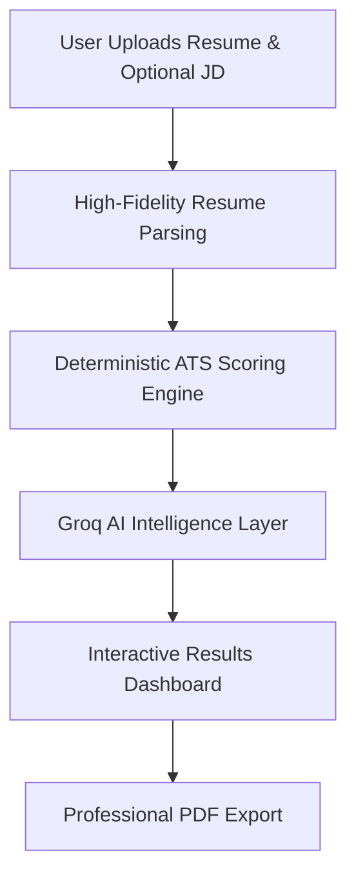
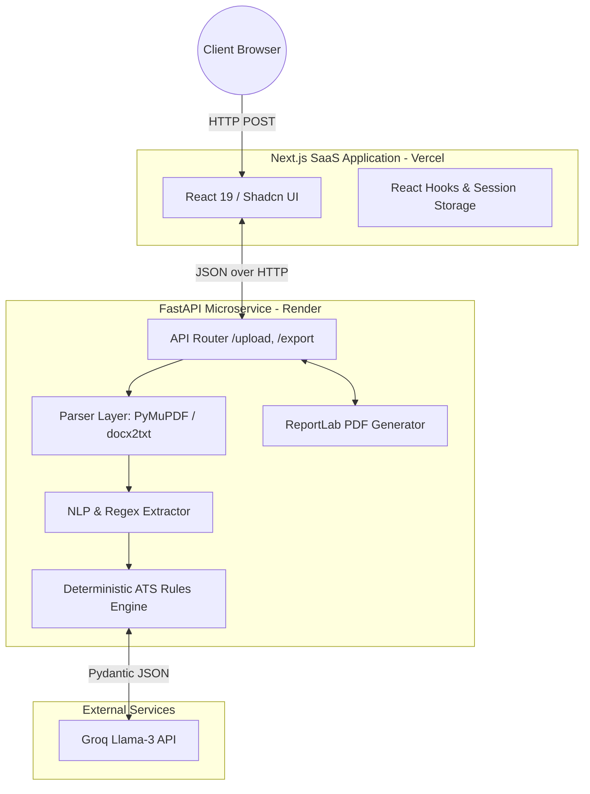

# ✦ HireLens ✦
**AI-Powered Resume Intelligence & ATS Compatibility Engine**

<p align="center">
  
  
  
  
  
  
  
  
  
</p>

<h3 align="center">
  Stop guessing. Start hiring.<br>
  Transform raw resumes into actionable, deterministic intelligence within seconds.
</h3>

---

## 📖 Table of Contents
1. [Executive Overview](#-executive-overview)
2. [What's New in v1.2](#-whats-new-in-v12)
3. [Product Flow: How HireLens Works](#-product-flow-how-hirelens-works)
4. [System Architecture](#-system-architecture)
5. [Technical Highlights](#-technical-highlights)
6. [ATS Scoring Methodology](#-ats-scoring-methodology)
7. [Screenshots](#-screenshots)
8. [Project Folder Structure](#-project-folder-structure)
9. [API Endpoints](#-api-endpoints)
10. [Production Deployment](#-production-deployment)
11. [Roadmap](#-roadmap)
12. [Contributing & License](#-contributing--license)

---

## 🎯 Executive Overview

Recruiting teams at high-growth companies receive thousands of resumes per job posting. Traditional **Applicant Tracking Systems (ATS)** suffer from major limitations:
* **Keyword Matching Vices:** Dumb keyword filters encourage candidates to "stuff keywords," letting weak candidates pass while filtering out qualified individuals with non-standard formatting.
* **Layout Failures:** Traditional parsers routinely fail on multi-column resumes, tables, or mixed PDF/DOCX structures.
* **LLM Hallucinations & Latency:** Relying entirely on LLMs to parse and score resumes is slow, expensive, non-deterministic, and prone to hallucinating scores, making candidate comparison unreliable.

### The Solution: A Hybrid Approach
HireLens introduces a **hybrid parsing-scoring-explanation architecture**:
1. **High-Fidelity Document Parsers** handle raw content extraction from PDF/DOCX formats cleanly.
2. **Deterministic Heuristics Engine** extracts details and scores candidates mathematically based on a fixed scoring rubric (eliminating LLM scoring hallucination and guaranteeing 100% consistency across runs).
3. **Structured Generative LLM Layer** (powered by Groq Llama-3) is only used where humans excel: generating contextual summaries, analyzing strengths/gaps, evaluating interview readiness, and suggesting career recommendations.

---

## 🚀 What's New in v1.2

HireLens has evolved from a simple Python prototype into a premium SaaS product ready for enterprise recruiting teams.

* **Job Description Match Analysis:** Upload a Job Description alongside a resume. The engine cross-references required skills against the candidate's parsed experience to highlight missing skills and calculate a rigorous Job Match Score.
* **Recruiter-Grade Results Dashboard:** A complete overhaul of the frontend using Next.js 16, React 19, and Tailwind CSS. The new dashboard offers beautiful data visualizations, metric score rings, and structured feedback cards.
* **Professional PDF Export:** Recruiters can now export beautifully formatted PDF reports (generated dynamically via ReportLab on the backend) for ATS Analysis or Match Analysis, perfect for sharing with hiring managers.
* **Premium SaaS Frontend:** Utilizing Shadcn UI and Radix UI primitives, the application feels natively premium with micro-animations, glassmorphism, and seamless UX flows.
* **Unified Intelligence Extraction:** Deeper insight generation for interview readiness, candidate strengths, and actionable hiring recommendations.

---

## 🔄 Product Flow: How HireLens Works



1. **User Uploads Resume:** Drag and drop PDF/DOCX files into the sleek Next.js UI.
2. **Resume Parsing:** The FastAPI backend securely extracts raw text and normalizes structures using PyMuPDF and python-docx.
3. **ATS Analysis & Scoring:** The deterministic Python engine calculates completeness, skills density, and quantified impact.
4. **AI Intelligence:** The Groq Llama-3 model interprets the structured data to identify strengths, weaknesses, and interview readiness.
5. **Results Dashboard:** Data is visualized in an interactive, responsive Next.js frontend dashboard.
6. **PDF Export:** Generate branded, comprehensive PDF summaries instantly for offline review.

---

## 🏗️ System Architecture

HireLens separates responsibilities between a modern frontend ecosystem and an ultra-fast Python backend.



### Layer Responsibilities
1. **Frontend (Next.js):** Communicates with the FastAPI REST API, handles file uploads, orchestrates states, and renders the premium multi-column user interface.
2. **Upload & API Router:** Handles multipart uploads, checks constraints (file size & extension), and routes requests.
3. **Parsing Layer (`ParserFactory`):** Detects mime-types and routes incoming documents to `PDFParser` or `DOCXParser`. Implements clean error propagation for corrupted files.
4. **Extraction Layer (`ResumeService` & `Extractor`):** Runs NLP heuristics to segment files. Applies validators for email/phone patterns and runs skill mapping to normalize tokens and eliminate duplicates.
5. **ATS Scorer Engine (`ats_scorer.py`):** Takes structured data and calculates scores mathematically. Calculates the parsing completeness metric (`confidence_score`) and structural points.
6. **Groq Analysis Layer (`analyzer.py`):** Constructs user prompts with the structured JSON and scoring details already injected. Dispatches requests to the Groq API and validates the returned qualitative explanations against Pydantic schemas.
7. **Report Generator (`report_generator.py`):** Compiles the analysis and candidate metadata into a beautifully branded PDF download.

---

## ⚙️ Technical Highlights

* **Deterministic ATS Scoring:** We do not rely on LLMs to generate arbitrary scores. Our 100-point rubric is mathematically calculated based on normalized text structures to guarantee 100% consistency and eliminate scoring hallucinations.
* **Groq AI Analysis:** By utilizing Groq's Llama-3 API infrastructure, we achieve blazing-fast inference times for generating qualitative recruiter insights, making the platform feel instantaneous.
* **Hybrid Architecture:** Deeply separating the extraction layer (Python heuristics) from the intelligence layer (LLMs) from the presentation layer (Next.js) ensures ultimate scalability and maintainability.
* **Structured Resume Parsing:** Self-healing schema enforcement relying on Pydantic v2 ensures that AI responses adhere to strict JSON contracts, with built-in retry and repair mechanisms.

---

## 📊 ATS Scoring Methodology

The platform calculates a deterministic ATS compatibility score out of **100 points** using the following rubric. This ensures scoring stability:

| Category | Max Score | Evaluation Heuristics |
| :--- | :---: | :--- |
| **Technical Skills** | 30 | Evaluated based on the count of unique, normalized skills found. *(Profiles with strong core modern frontend stacks receive partial credit bonuses for high learning agility).*<br>• 1-4 skills: `10 pts`<br>• 5-8 skills: `16 pts`<br>• 9-12 skills: `22 pts`<br>• 13-16 skills: `27 pts`<br>• 17+ skills: `30 pts` |
| **Projects** | 25 | Evaluated based on the quantity and depth of project descriptions.<br>• 0 projects: `0 pts`<br>• 1 project (brief): `5 pts`<br>• 1 project (detailed, bullets present): `10 pts`<br>• 2 projects (basic descriptions): `18 pts`<br>• 2 detailed projects (3+ bullets each): `20 pts`<br>• 2+ projects with outcomes containing quantified metrics: `25 pts` |
| **Work Experience** | 20 | Evaluated based on career history length and detail richness.<br>• 0 experience entries: `0 pts`<br>• 1 experience entry (short description, <2 bullets): `12 pts`<br>• 1 experience entry (rich description, 2+ bullets): `16 pts`<br>• 2+ experience entries: `20 pts` |
| **Education** | 10 | Evaluated based on academic history, degree, and grade points (GPA/CGPA).<br>• 0 education records: `0 pts`<br>• 1 education entry (no GPA provided): `6 pts`<br>• 1 education entry with GPA/CGPA provided: `8 pts`<br>• 1 entry with CGPA ≥ 7.5 (or GPA ≥ 3.3/4.0): `10 pts`<br>• 2+ education entries: `10 pts` |
| **Quantified Impact** | 15 | Evaluated on presence of metrics (%, $, x multiplier, values, metrics) in work/projects.<br>• Content present, but no numbers/metrics found: `5 pts` *(Interns: `10 pts`)*<br>• 1 metric found: `9 pts` *(Interns: `13 pts`)*<br>• 2-3 metrics found: `12 pts` *(Interns: `15 pts`)*<br>• 4+ metrics found: `15 pts` |
| **Total** | **100** | **Comprehensive mathematical sum of all categories.** |

### Confidence Score (Completeness)
In addition to the ATS score, a **Confidence Score (0-100)** is calculated. It evaluates parsing completeness and penalizes missing crucial fields:
* Starting value: **100**
* Missing Name: **-30**
* Missing Email: **-20**
* Missing Phone: **-15**
* Missing Skills list: **-15**
* Missing Education: **-10**
* Missing Experience: **-10**

---

## 📷 Screenshots

### Landing Page

*A premium SaaS landing experience welcoming users to analyze their profiles.*

### Upload Dialog

*Seamless resume and Job Description upload workflow.*

### ATS Analysis Dashboard

*Beautiful data visualizations presenting candidate completeness and skill densities.*

### Job Match Results

*Deep comparative insights highlighting exactly which required skills the candidate is missing.*

### PDF Report Export

*Instantly generated, recruiter-ready PDF intelligence briefs.*

---

## 📂 Project Folder Structure

```text
HireLens/
├── backend/                       # FastAPI Python Backend
│   ├── app/
│   │   ├── core/                  # Configuration & Global Constants
│   │   ├── llm/                   # LLM Client and Prompts Config
│   │   ├── nlp/                   # NLP, Regex Extraction and ATS Rules
│   │   ├── parser/                # Ingestion File Parsers (PDF/DOCX)
│   │   ├── routes/                # FastAPI Controller Endpoints
│   │   ├── schemas/               # Pydantic v2 Models (Data Validation)
│   │   └── services/              # Business Logic & Report Generation
│   └── requirements.txt           # Python dependencies
│
├── resume-hero-section/           # Next.js 16 SaaS Frontend
│   ├── app/                       # App Router pages and layouts
│   ├── components/                # Radix & Shadcn UI components
│   ├── hooks/                     # Custom React hooks (API integration)
│   ├── lib/                       # Utility functions
│   ├── services/                  # Backend API fetch wrappers
│   └── types/                     # TypeScript interfaces matching backend models
│
├── docs/                          # Project documentation and assets
├── deployment/                    # Containerization and CI/CD configs
└── README.md                      # Project documentation overview
```

---

## ⚡ API Endpoints

FastAPI exposes REST endpoints under `/api/v1`. Documentation is auto-generated by FastAPI at `/docs`.

* **`POST /api/v1/upload`** - Saves the resume file to the cache directory.
* **`GET /api/v1/test-analysis`** - Orchestrates extraction, deterministic ATS scoring, calls Groq LLM for qualitative insights, merges outputs, and returns an `AnalysisResponse` JSON payload.
* **`POST /api/v1/match-analysis`** - Uploads a resume and Job Description simultaneously to generate a rigorous comparative match score and missing skills analysis.
* **`POST /api/v1/export-report`** - Generates and returns a downloadable ATS PDF report via ReportLab.
* **`POST /api/v1/export-match-report`** - Generates and returns a downloadable Match PDF report via ReportLab.

---

## ☁️ Production Deployment

### Frontend (Vercel)
The Next.js application is optimized for zero-config Vercel deployment.
1. Connect your GitHub repository to Vercel.
2. Select the `resume-hero-section` root directory.
3. Set the environment variable:
   ```env
   NEXT_PUBLIC_API_URL=https://your-backend-url.onrender.com
   ```
4. Click **Deploy**.

### Backend (Render)
The FastAPI backend is designed to run seamlessly as a Render Web Service.
1. Connect your repository to Render.
2. Set the Root Directory to `backend`.
3. Build Command: `pip install -r requirements.txt`
4. Start Command: `uvicorn app.main:app --host 0.0.0.0 --port $PORT`
5. Environment Variables:
   ```env
   GROQ_API_KEY=your_groq_api_key
   MAX_FILE_SIZE_MB=10
   ```

---

## 🗺️ Roadmap

### Implemented Features (v1.2)
* ✅ High-Fidelity PDF & DOCX Parsing
* ✅ Deterministic ATS Rule Engine
* ✅ Generative AI Intelligence (Groq Llama-3)
* ✅ Job Description Match Analysis
* ✅ Premium Next.js Recruiter Dashboard
* ✅ Dynamic PDF Report Generation

### Future Roadmap
* [ ] **Skill Gap Analysis:** Automated learning paths to bridge missing skills for candidates.
* [ ] **Interview Preparation:** AI-generated mock interview questions based specifically on weak points in the candidate's parsed experience.
* [ ] **Resume History Tracking:** Let candidates maintain a timeline of their resume versions.
* [ ] **Authentication & Profiles:** Full Auth.js integration for saving candidate and recruiter profiles.
* [ ] **Recruiter Portal & Candidate Ranking:** Multi-candidate batch uploads to display comparative analytical tables and rank candidate matches.
* [ ] **Database Persistence:** Migrate to PostgreSQL via Prisma/SQLAlchemy to save parsed data and historical runs.

---

## 🤝 Contributing & License

Contributions to improve parsing heuristics, design system UI, or scoring algorithms are welcome!
1. Fork the Project.
2. Create your Feature Branch (`git checkout -b feature/AmazingFeature`).
3. Commit your Changes (`git commit -m 'Add some AmazingFeature'`).
4. Push to the Branch (`git push origin feature/AmazingFeature`).
5. Open a Pull Request.

**License:** Distributed under the MIT License. See `LICENSE` for more information.

---
<p align="center">
  <i>Built with precision for the modern recruiting workflow.</i>
</p>
