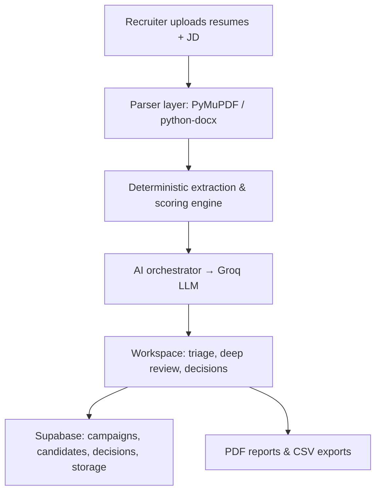
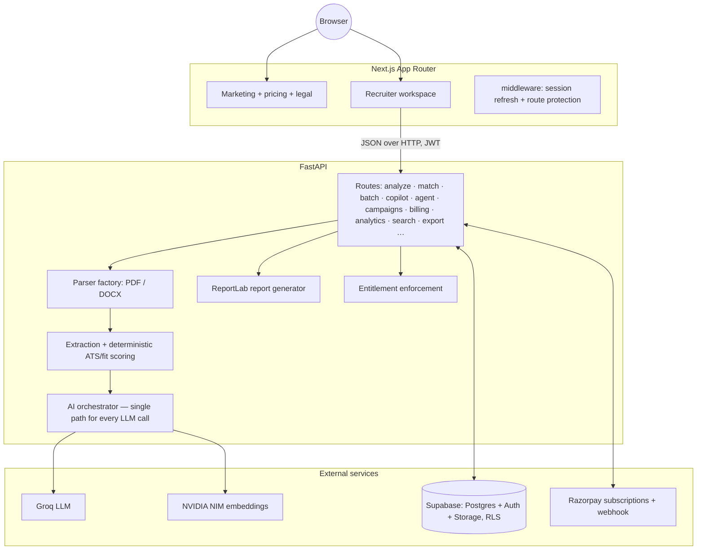

# Hirevo

**Resume and recruiter intelligence for hiring teams.**

Hirevo reads every résumé submitted for a role against that role's job description, scores it deterministically, explains the result with evidence, and records the hiring decisions a team makes on top of it. Production domain: [https://hirevo.in](https://hirevo.in).

---

## Table of Contents

1. [Overview](#overview)
2. [Key Features](#key-features)
3. [How It Works](#how-it-works)
4. [Architecture](#architecture)
5. [Tech Stack](#tech-stack)
6. [Project Structure](#project-structure)
7. [Local Development](#local-development)
8. [Environment Variables](#environment-variables)
9. [Testing](#testing)
10. [Deployment](#deployment)
11. [Payments](#payments)
12. [Current Status](#current-status)
13. [Roadmap](#roadmap)
14. [Contributing & License](#contributing--license)

---

## Overview

Traditional ATS filters reduce candidates to keyword counts: they reward keyword stuffing, fail on non-standard layouts, and — when an LLM is asked to invent the score — produce numbers that change between runs. Hirevo separates the concerns:

1. **High-fidelity parsing** extracts structured content from PDF and DOCX résumés (PyMuPDF, python-docx).
2. **A deterministic scoring engine** computes ATS and job-match scores from a fixed rubric in plain Python — the same résumé always gets the same score.
3. **An LLM layer** (Groq) is used only for what humans would otherwise write: evidence-linked summaries, strengths and gaps, comparisons, interview questions, and copilot answers. Every LLM call in the backend goes through a single orchestrator with instrumentation and QA caching.

On top of that stateless analysis core sits a full multi-tenant product: organizations, roles (hiring campaigns), a candidate pipeline, a decision ledger, entitlement-gated plans, and Razorpay subscription billing.

## Key Features

**Analysis engine**

- Résumé upload and parsing (PDF/DOCX) with strict size/extension limits and clean error propagation for corrupted files
- Deterministic ATS analysis and confidence (parse-completeness) scoring
- Job-description match analysis: coverage of JD-required skills, missing-skill detection, fit scoring with a core-requirements gate
- Batch analysis: rank many résumés against one JD in a single request
- AI recruiter copilot ("Ask") grounded in workspace context, plus candidate comparison and agent-style briefs
- Semantic talent search backed by pluggable embedding providers (NVIDIA NIM in production, dependency-free hashing provider for dev/CI)

**Recruiter workspace** (`app/(hirelens)` route group)

- **Today** — triage inbox for new candidates and pending work
- **Jobs** — hiring campaigns with per-role candidate pipelines, stages, notes, and activity
- **Candidates** — the Candidate Object: a deep-review record with claim/evidence sections, résumé record, and AI analysis tabs
- **Decisions** — a logged, reversible decision ledger with reasoning
- **Interviews** — interview intelligence with exportable interview packs (PDF)
- **Reports, Analytics** — role and pipeline analytics with CSV export (injection-safe cell escaping)
- **AI Audit** — visibility into what the AI layer did and why
- **Ask, Notifications, Settings** — copilot threads, notification center, org/profile/billing/API-key settings

**Platform**

- Authentication with Supabase (email + password: sign-up, login, password reset, invite acceptance), org membership and role-based permissions, Postgres RLS tenant isolation
- Entitlement system: a single plan/feature catalog enforced in the backend (`402` gates) and mirrored byte-for-byte in the frontend for gating UI
- Subscription billing via Razorpay (Plus / Pro monthly plans) — checkout, verification callback, webhook-driven state, cancellation
- Branded PDF report generation (ATS report and match report) via ReportLab
- Marketing site with pricing generated from the same entitlement catalog the product enforces, legal pages (terms, privacy, refunds), contact
- SEO surface derived from one site-identity module: sitemap, robots, canonical/OG metadata, JSON-LD structured data, `llms.txt`, `security.txt`
- Security posture: CSP (report-only/enforce modes), CORS locked down by explicit origin list (refuses to boot unset in production), rate limiting, signed URLs for private storage, destructive tenant-isolation test suite

## How It Works


```mermaid
graph TD
    A[Recruiter uploads resumes + JD] --> B[Parser layer: PyMuPDF / python-docx]
    B --> C[Deterministic extraction & scoring engine]
    C --> D[AI orchestrator → Groq LLM]
    D --> E[Workspace: triage, deep review, decisions]
    E --> F[Supabase: campaigns, candidates, decisions, storage]
    E --> G[PDF reports & CSV exports]
```

1. A recruiter signs in, opens a role, and uploads résumés (drag-and-drop, batch supported).
2. The FastAPI backend parses each document and runs the deterministic extraction and scoring pipeline.
3. The AI orchestrator enriches the structured result with evidence-linked explanations from Groq, validated against Pydantic schemas.
4. Results land in the workspace — triage queue, candidate deep review, comparisons, copilot — and are persisted to Supabase rather than recomputed.
5. Decisions are recorded in the ledger; reports export as branded PDFs, analytics as CSV.

## Architecture


```mermaid
graph TD
    Client((Browser))

    subgraph Frontend [Next.js App Router]
        MKT[Marketing + pricing + legal]
        APPUI[Recruiter workspace]
        MW[middleware: session refresh + route protection]
    end

    subgraph Backend [FastAPI]
        Routes[Routes: analyze · match · batch · copilot · agent · campaigns · billing · analytics · search · export …]
        Parser[Parser factory: PDF / DOCX]
        NLP[Extraction + deterministic ATS/fit scoring]
        Orch[AI orchestrator — single path for every LLM call]
        PDFGen[ReportLab report generator]
        Ent[Entitlement enforcement]
    end

    subgraph Services [External services]
        Groq[Groq LLM]
        NIM[NVIDIA NIM embeddings]
        SB[(Supabase: Postgres + Auth + Storage, RLS)]
        RZP[Razorpay subscriptions + webhook]
    end

    Client --> MKT
    Client --> APPUI
    APPUI -->|JSON over HTTP, JWT| Routes
    Routes --> Parser --> NLP
    NLP --> Orch --> Groq
    Routes --> PDFGen
    Routes --> Ent
    Routes <--> SB
    Routes <--> RZP
    Orch --> NIM
```

Key structural decisions:

- **Stateless AI core, stateful shell.** The analysis endpoints work with no database configured; Supabase adds auth, campaigns, persistence, and storage on top without touching the AI pipeline.
- **One orchestrator.** All backend LLM calls flow through `app/ai/orchestrator` — one place for provider config, instrumentation, and QA-mode caching. Reasoning is Groq-only by design.
- **Deterministic scores, generative prose.** Scores come from code; the LLM never invents a number.
- **Catalog parity.** The entitlements catalog exists as matching TypeScript and Python files; backend enforcement and frontend gating cannot drift.
- **Repository pattern + RLS.** Data access goes through repositories; Postgres row-level security isolates tenants even below the application layer.

## Tech Stack

| Layer | Technology |
| :--- | :--- |
| Frontend | Next.js 16 (App Router, Turbopack), React 19, TypeScript 5, Tailwind CSS 4, Radix UI primitives, TanStack Query, Storybook |
| Backend | FastAPI (Python 3.11), Pydantic v2, Uvicorn |
| Database / Auth / Storage | Supabase (Postgres with RLS, email+password auth, private storage buckets with signed URLs); SQL migrations in `supabase/migrations/` |
| AI / LLM | Groq (reasoning), NVIDIA NIM Nemotron embeddings (semantic search) with a hashing fallback provider for offline dev/CI |
| Parsing | PyMuPDF (PDF), python-docx (DOCX) |
| Reports | ReportLab (server-generated PDF) |
| Payments | Razorpay subscriptions (Plus/Pro plans, signature-verified webhook) |
| Testing | pytest (backend), Vitest + Testing Library (frontend), Playwright-style visual scripts in `frontend/tests/visual/` |
| Infrastructure | Render blueprint (`backend/render.yaml`), Vercel-ready frontend, Dockerfiles + `docker-compose.yml` for a local/self-hosted stack, GitHub Actions CI |

## Project Structure

```text
Resume-Parser/
├── backend/
│   ├── app/
│   │   ├── ai/                # Orchestrator, providers, prompts, embeddings, agent
│   │   ├── core/              # Config, auth, DI, observability, startup checks
│   │   ├── db/                # Supabase client factories & transport
│   │   ├── nlp/               # Extraction, deterministic ATS/fit scoring, ranking
│   │   ├── parser/            # PDF/DOCX parser factory
│   │   ├── repositories/      # Data access (repository pattern)
│   │   ├── routes/            # analyze · match · batch · copilot · agent · campaigns ·
│   │   │                      # billing · analytics · search · reports · export · org · admin …
│   │   ├── schemas/           # Pydantic v2 models
│   │   └── services/          # Business logic, persistence, storage, report generator
│   ├── scripts/               # Razorpay plan setup, QA org seeding, backup/restore …
│   ├── tests/                 # pytest suites
│   └── render.yaml            # Render deployment blueprint
├── frontend/
│   ├── app/
│   │   ├── (marketing)/       # Landing, pricing, contact, terms/privacy/refunds
│   │   ├── (hirelens)/        # Workspace: today, jobs, candidates, decisions,
│   │   │                      # interviews, reports, ask, ai-audit, notifications, settings
│   │   └── auth/              # Login, signup, reset, invite acceptance
│   ├── components/            # Workspace components, marketing frames, brand mark
│   ├── lib/                   # SEO/site identity, pricing, legal, analytics, supabase clients
│   └── tests/                 # Vitest suites + visual walkthrough scripts
├── supabase/migrations/       # Schema, RLS policies, storage buckets, auth triggers
├── docs/                      # Engineering docs: architecture, API, AI pipeline, security,
│                              # billing, deployment, runbooks, ADRs (see docs/README.md)
└── docker-compose.yml         # Local/self-hosted full stack
```

> The `(hirelens)` route group and `components/hirelens/` paths are internal identifiers retained from before the rebrand; they never appear in user-facing URLs.

## Local Development

Prerequisites: Python 3.11+, Node 24+, pnpm.

**Backend**

```bash
cd backend
python -m venv venv && venv/Scripts/activate   # or source venv/bin/activate
pip install -r requirements.txt
cp .env.example .env                            # fill in at least GROQ_API_KEY
uvicorn app.main:app --reload --port 8000
```

Interactive API docs are served at `http://localhost:8000/docs`. Without Supabase credentials the backend runs fully stateless — the analysis endpoints work; auth and persistence routes stay disabled.

**Frontend**

```bash
cd frontend
pnpm install
cp .env.example .env.local                      # points at http://localhost:8000 by default
pnpm dev
```

**Full stack via Docker**

```bash
docker compose up --build                       # API on :8000, web on :3000
```

## Environment Variables

Each side documents every variable it reads in its `.env.example` — those files are the reference. The important ones:

| Variable | Where | Purpose |
| :--- | :--- | :--- |
| `GROQ_API_KEY` | backend | LLM analysis (analysis endpoints return 503 without it) |
| `ALLOWED_ORIGINS` | backend | Explicit CORS allowlist; production refuses to boot if unset |
| `SUPABASE_URL` / `SUPABASE_ANON_KEY` / `SUPABASE_SERVICE_ROLE_KEY` / `SUPABASE_JWT_SECRET` | backend | Database, auth verification, storage |
| `EMBEDDING_PROVIDER` / `EMBEDDING_MODEL` / `NVIDIA_API_KEY` | backend | Semantic search (`nvidia` in production, `hashing` for dev/CI) |
| `RAZORPAY_KEY_ID` / `RAZORPAY_KEY_SECRET` / `RAZORPAY_WEBHOOK_SECRET` | backend | Payment credentials (never hardcoded) |
| `RAZORPAY_PLAN_PLUS_INR` / `RAZORPAY_PLAN_PRO_INR` | backend | Dashboard-created plan ids, verified at boot against the pricing catalog |
| `ENTITLEMENT_ENFORCEMENT` | backend | Rollback lever for plan gating (`on` by default) |
| `NEXT_PUBLIC_API_URL` | frontend | Backend base URL |
| `NEXT_PUBLIC_SUPABASE_URL` / `NEXT_PUBLIC_SUPABASE_ANON_KEY` | frontend | Auth + persistence (blank = stateless mode) |
| `NEXT_PUBLIC_SITE_URL` | frontend | Canonical origin; defaults to `https://hirevo.in` |
| `CSP_MODE` | frontend | `off` / `report-only` / `enforce` |

## Testing

```bash
# Backend
cd backend && pytest

# Frontend
cd frontend && pnpm test        # Vitest
cd frontend && pnpm typecheck   # tsc --noEmit
cd frontend && pnpm lint        # ESLint
```

Both suites are substantial (1,300+ backend tests, 600+ frontend tests) and cover, among other things: tenant isolation, entitlement enforcement on every gated surface, checkout state machine and billing UI, CSV injection safety, crawl/SEO safety, analytics URL redaction, accessibility of authenticated screens, and export attribution. A separate opt-in destructive suite (`HL_ALLOW_DESTRUCTIVE_TESTS=1`) exercises runtime tenant isolation against a live non-production stack. CI (GitHub Actions) runs tests plus Docker image builds for both services.

## Deployment

- **Backend — Render.** `backend/render.yaml` is a ready Render blueprint; secrets (`GROQ_API_KEY`, Supabase, Razorpay, `ALLOWED_ORIGINS`) are set in the dashboard. A production boot fails fast on unsafe configuration (missing CORS allowlist, mismatched Razorpay plans).
- **Frontend — Vercel.** Standard Next.js deployment from the `frontend/` directory; set `NEXT_PUBLIC_API_URL`, the Supabase publics, and `NEXT_PUBLIC_SITE_URL` per environment (previews should declare their own origin rather than claiming `hirevo.in`).
- **Self-hosted.** Multi-stage Dockerfiles for both services and `docker-compose.yml` for a complete local stack.

Operational docs — deployment, monitoring, disaster recovery, rollback — live in [`docs/`](docs/README.md).

## Payments

Billing is subscription-based through Razorpay:

- Plans (**Plus**, **Pro**; monthly, INR) are created once in the Razorpay dashboard and bound by id via environment variables; the app verifies them at boot against its own pricing catalog and never creates plans at runtime.
- Checkout runs through Razorpay's hosted modal; the backend verifies the callback signature, and the **webhook** (`/api/v1/billing/webhook/razorpay`, signature-verified) is the single source of truth for subscription state transitions.
- Plan limits and features are enforced server-side through the entitlement catalog (`402` responses), with `ENTITLEMENT_ENFORCEMENT=off` as a no-deploy rollback lever.
- Card details never touch Hirevo servers.

## Current Status

Hirevo is an actively developed product. Working today, verified by the test suites in this repository:

- Next.js frontend: marketing site, auth flows, and the full recruiter workspace
- FastAPI backend: analysis, matching, batch ranking, copilot/agent, campaigns, analytics, search, exports
- Supabase integration: auth, multi-tenant data with RLS, private storage
- Razorpay subscription billing with entitlement enforcement
- Groq-powered AI layer behind a single orchestrator
- ReportLab PDF reports and CSV analytics export

The backend reached feature-complete status for V1 in August 2026 and is in production-hardening mode (bug fixes only); active development is focused on frontend/UX.

## Roadmap

The maintained roadmap lives in [`docs/ROADMAP.md`](docs/ROADMAP.md); version history is in [`CHANGELOG.md`](CHANGELOG.md).

## Contributing & License

Contribution guidelines are in [`CONTRIBUTING.md`](CONTRIBUTING.md). This repository does not currently ship an open-source license file; all rights reserved unless a license is added.
