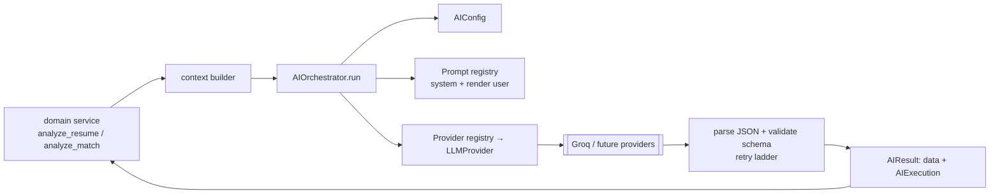

# AI Architecture (Foundation Layer)

> The AI Foundation Layer introduced in **V4 Sprint 3**. Every AI interaction in
> the product flows (or will flow) through a single orchestration service — no
> page, component, or route calls an LLM provider directly. Cross-refs:
> [AI_PIPELINE.md](./AI_PIPELINE.md) (the deterministic + LLM pipeline),
> [decisions/ADR-006](./decisions/ADR-006-ai-orchestration-layer.md),
> [ADR-002](./decisions/ADR-002-groq.md).

## Why

Before Sprint 3, each AI flow (resume analysis, job matching, batch, copilot)
built prompts, called Groq, and hand-rolled its own retry/parse ladder. That
couples the whole app to one vendor and scatters retry, parsing, and
observability logic. The Foundation Layer centralizes all of it so future AI
features (Copilot, semantic search, comparison, interview generation) are a
prompt + a schema away — and swapping/adding providers is a single class.

## Module map (`backend/app/ai/`)

```
app/ai/
├── config.py          # AIConfig — provider/model/temperature/limits (from settings)
├── providers/         # provider abstraction
│   ├── base.py        #   LLMProvider ABC (complete / stream / complete_messages)
│   ├── groq_provider.py
│   └── registry.py    #   name → provider (register OpenAI/Anthropic/… here)
├── prompts/           # versioned prompt templates by capability
│   ├── base.py        #   PromptTemplate(id, version, system, render)
│   └── registry.py    #   Capability → template (reuses app/llm/*_prompts)
├── gateway/           # AI Gateway (Sprint 7.5) — provider/model selection
│   ├── roles.py       #   ModelRole (DEFAULT/FAST/CHEAP/LONG_CONTEXT/PREMIUM/EMBEDDINGS)
│   ├── model_registry.py   # ModelSpec metadata + cost estimation
│   ├── provider_registry.py# ProviderSpec metadata (capabilities, per-role models)
│   ├── gateway.py     #   resolve(role) → (provider,model), fallback chain, runtime switch
│   └── usage.py       #   usage / cost / provider-health tracker
├── embeddings/        # retrieval layer — provider-agnostic vectorisation (NO LLM)
│   ├── base.py        #   EmbeddingProvider (mirrors LLMProvider)
│   ├── hashing_provider.py  # default, dependency-free deterministic embedding
│   ├── openai_provider.py   # optional (EMBEDDING_PROVIDER=openai)
│   ├── registry.py    #   name → embedding provider
│   └── service.py     #   embed_texts / embed_query (observed)
├── context/           # reusable context builders → prompt variables
│   ├── base.py
│   └── builders.py    #   resume / job-matching / batch context
├── schemas/           # typed contracts
│   ├── base.py        #   Capability, ChatMessage, ProviderResponse, AIExecution, AIResult
│   └── responses.py   #   forward-looking response contracts (interview pack, comparison, …)
├── orchestrator/
│   └── orchestrator.py#   AIOrchestrator.run(capability, variables, schema) → AIResult
└── utils/
    ├── errors.py      #   AIError hierarchy (subclasses RuntimeError → back-compat)
    └── json.py        #   fence-stripping + JSON parsing
```

## The orchestrator



`orchestrator.run(capability, variables, schema, **overrides)`:
1. Resolves config (provider, model, temperature, max_tokens, timeout, retries).
2. Looks up the capability's **prompt template**, renders `system` + `user`.
3. Calls the selected **provider** (one attempt at a time).
4. Runs the **retry ladder** — network 3 → JSON-parse 3 → schema 2 (the exact
   historical semantics), parsing + validating against the caller's Pydantic `schema`.
5. Returns `AIResult(data=<validated schema>, execution=<AIExecution>)`.
6. On exhaustion raises a typed `AIError` (a `RuntimeError` subclass) — never a
   raw provider error.

Domain logic (deterministic scoring, merging, fallbacks) stays with the caller;
the orchestrator owns only the LLM round-trip.

## AI Gateway (V4 Sprint 7.5)

The orchestrator resolves **which provider + model** through the **AI Gateway**
(`ai/gateway/`) — "Stripe for AI providers". Features request a logical `ModelRole`
(DEFAULT_REASONING, FAST_REASONING, CHEAP_REASONING, LONG_CONTEXT,
PREMIUM_REASONING, EMBEDDINGS); the gateway maps role → (provider, model) from
config, builds a **configurable fallback chain**, tracks usage/cost/health, and
supports a **runtime provider switch** that updates the whole platform at once. See
[ADR-011](./decisions/ADR-011-ai-gateway-and-provider-management.md) and
[sprints/V4_SPRINT7_5.md](./sprints/V4_SPRINT7_5.md). Admin: `GET /ai/config`,
`GET /ai/usage`, `POST /ai/provider` (authenticated, no secrets).

## Provider abstraction

`LLMProvider` (`providers/base.py`) exposes `complete()`,
`complete_messages()` (multi-turn), and `stream()`. Providers are lazy (SDK
imported only when selected); an unconfigured provider raises `AIConfigError`,
which the gateway treats as a fallback signal. **Adding a provider** = implement
`LLMProvider`, register it, add a `ProviderSpec` — callers are unchanged.

| Provider | Status |
|----------|--------|
| Groq (`llama-3.3-70b-versatile`) | ✅ active (default) |
| Gemini · Anthropic · OpenAI · OpenRouter | ✅ registered — enable by config (`AI_PROVIDER` + key) |
| Embeddings: hashing (default) · OpenAI · Gemini | ✅ configurable (`EMBEDDING_PROVIDER`) |

Switching providers/models is **configuration only** — no feature-level code
changes. Every capability (Copilot, Comparison, Semantic Search, Interview
Intelligence) routes through the gateway automatically.

## Prompt management

`PromptTemplate(id, version, system, render)` — one per capability, registered in
`prompts/registry.py`. Templates **reuse** the existing prompt text/builders in
`app/llm/*_prompts.py` (single source of truth) while adding versioning and
lookup. Prompts never live in route handlers.

## Context builders

`context/builders.py` turns domain objects into the variable mapping a template
renders from (`build_resume_analysis_context`, `build_job_matching_context`,
`build_batch_candidate_context`). Future features compose builders instead of
assembling strings; the richer multi-source copilot grounding
(`app/services/candidate_context.py`) will converge here.

## Structured responses

Active capabilities validate against existing schemas — `GroqExplanation`,
`GroqMatchAnalysis`, `GroqBatchAnalysis`. `schemas/responses.py` adds
**forward-looking contracts** (`InterviewPackResponse`,
`CandidateComparisonResponse`, `HiringRecommendationResponse`,
`CandidateSummaryResponse`) so features built later return predictable JSON, not
free-form text.

## Configuration

All AI parameters come from `AIConfig` (`ai/config.py`), sourced from env-driven
settings — no scattered constants:

| Setting | Default |
|---------|---------|
| `AI_DEFAULT_PROVIDER` | `groq` |
| `AI_DEFAULT_MODEL` | `llama-3.3-70b-versatile` |
| `AI_TEMPERATURE` | `0.2` |
| `AI_MAX_TOKENS` | `2048` |
| `AI_TIMEOUT_SECONDS` | `30` |
| `AI_MAX_NETWORK_RETRIES` / `_JSON_` / `_SCHEMA_` | `3` / `3` / `2` |

Per-call overrides are accepted by `orchestrator.run(...)`.

## Error handling

`utils/errors.py`: `AIError` (base, `RuntimeError` subclass) →
`AIConfigError` (non-retryable), `AIProviderError`, `AITimeoutError`,
`AIRateLimitError`, `AIParseError`, `AIValidationError`. Each carries a
`retryable` flag and a safe `public_message`. Raw provider exceptions are wrapped
at the provider boundary — the frontend never sees vendor internals. Because
`AIError` subclasses `RuntimeError`, existing routes that map `RuntimeError → 503`
keep working unchanged.

## Observability

Every orchestrated call produces an `AIExecution`: `capability, provider, model,
success, latency_ms, network_attempts, json_attempts, schema_attempts,
retry_count, usage (tokens), error`. It's logged (`logger "app.ai"`) and returned
on `AIResult.execution`. This is the extension point for future metrics/tracing —
no over-engineering, just clean hooks.

## Recruiter Copilot (V4 Sprint 4)

The `RECRUITER_COPILOT` capability is now live and built entirely on this layer —
see [ADR-007](./decisions/ADR-007-ai-recruiter-copilot.md) and
[sprints/V4_SPRINT4.md](./sprints/V4_SPRINT4.md). Additions:

- **Prompt** — `prompts/copilot.py`: versioned system prompt (`v2.0`) encoding the
  recruiter persona, the **context priority** (Campaign → Candidate → Resume → JD
  → Notes → History → LLM), grounding rules, and a JSON contract; plus versioned
  per-intent task instructions.
- **Context builders** — `context/copilot_context.py` (campaign / dashboard /
  history + `classify_intent`) compose with the multi-source
  `services/candidate_context.py` (now including a `RecruiterNotesSource`). A
  product-layer `services/copilot_resolver.py` reads RLS-scoped repositories and
  resolves the highest-priority context for the page.
- **Schema** — the model fills `CopilotLLMOutput`; the **server** attaches the
  authoritative `sources_used` (attribution can't be fabricated).
- **Service** — `ai/services/copilot_service.py` (`generate_copilot_answer`) is the
  thin orchestrator seam; degrades gracefully, never raises.

Persistent, page-scoped conversations use the Sprint 1 tables (migration `0005`
made candidate/campaign nullable). A single Cursor-style panel mounted in the root
layout follows the recruiter across pages.

## AI Candidate Comparison (V4 Sprint 5)

The `CANDIDATE_COMPARISON` capability is live — an AI Hiring Analyst comparing 2–5
candidates from one campaign. See [ADR-008](./decisions/ADR-008-ai-candidate-comparison.md)
and [sprints/V4_SPRINT5.md](./sprints/V4_SPRINT5.md).

- **Prompt** — `prompts/comparison.py` (`v1.0`): analyst persona, anti-fabrication
  rules, JSON contract mirroring `ComparisonLLMOutput`.
- **Context** — `context/comparison_context.py` composes each candidate's resume,
  analysis, ATS, match, and notes with the JD + campaign metadata (condensed to
  stay within provider limits) plus a verbatim roster.
- **Schema** — `schemas/comparison.py`: `CandidateComparisonReport` (executive
  summary, rankings, skill matrix, strengths, risks, hiring recommendation,
  interview focus, trade-offs) with server-attached `sources_used`.
- **One engine, two callers** — `services/comparison_service.run_comparison(...)`
  (RLS-scoped, same-campaign-validated, deterministic fallback) is called by both
  the campaign route and the Copilot (`services/copilot_comparison`) — no
  duplicated logic. Reusable substrate for future Executive Reports / Hiring
  Workflows / Autonomous Recruiting.

## Predictive intelligence — AI explains, never forecasts (V8 Sprint 13)

Forecasts are **deterministic** (statistical models over the Organizational Digital
Twin in `app/prediction/`), not LLM output. AI capabilities *consume* them: Executive
Reports inject a deterministic forecast the LLM explains, the Copilot answers "what
happens if…" via the same engine, and the Agent has a `forecast` tool. No capability
computes forecasts itself, and the prediction layer is **independent of the AI gateway**
(no gateway import). See
[ADR-017](./decisions/ADR-017-predictive-intelligence-architecture.md) and
[sprints/V8_SPRINT13.md](./sprints/V8_SPRINT13.md).

## Organizational memory before reasoning (V7 Sprint 12)

Every AI capability retrieves long-term **organizational memory** before it reasons:
Capability → `memory_block(org_id, query)` → prepend Organizational Memory → (semantic
retrieval) → AI Gateway → LLM. Memory is structured, time-aware, org-scoped, and
explainable (source/timestamp/confidence/why). The Copilot, Comparison, Interview, and
Report services inject it; approved agent decisions feed it. The `app/knowledge` layer
is **independent of the AI gateway** (no gateway import). See
[ADR-016](./decisions/ADR-016-organizational-knowledge-architecture.md) and
[sprints/V7_SPRINT12.md](./sprints/V7_SPRINT12.md).

## Integration platform & AI separation (V6 Sprint 11)

The Autonomous Agent (and every feature) orchestrates external tools **only** by
emitting events — never by calling an external API. Agent → `emit_event` →
Dispatcher → Workflow Engine → Integration Layer → Provider. On approval of an agent
recommendation the route emits `agent_recommendation_approved`; the agent service
imports no integration code (verified). See
[ADR-015](./decisions/ADR-015-integration-platform-architecture.md) and
[sprints/V6_SPRINT11.md](./sprints/V6_SPRINT11.md).

## Enterprise org-awareness (V6 Sprint 10)

Every AI capability is organization-aware. The gateway `usage_tracker` calls an
org rollup hook (registered by `app/enterprise/` so `app.ai` stays dependency-free)
that attributes each AI call's `ai_requests`/`tokens` to the request's
`current_org_id`. AI capabilities are gated by per-org **feature flags** (reports,
agent, …) and the AI provider switch is org-admin-gated + audited. See
[ADR-014](./decisions/ADR-014-enterprise-platform-architecture.md) and
[sprints/V6_SPRINT10.md](./sprints/V6_SPRINT10.md).

## Autonomous Recruiting Agent (V4 Sprint 9)

The agent is an ORCHESTRATION layer — it observes the pipeline and coordinates the
existing engines through a **Tool Registry**, owning no business logic. See
[ADR-013](./decisions/ADR-013-autonomous-agent-architecture.md) and
[sprints/V4_SPRINT9.md](./sprints/V4_SPRINT9.md).

- **Tools** (`ai/agent/tools.py`) wrap existing services (`search_candidates`,
  `compare_candidates`, `generate_interview_pack`, `generate_executive_report`) +
  retrieval reads; a cached `ToolContext` avoids N+1.
- **Workflows** (`ai/agent/workflows.py`) — 5 deterministic triggers → explainable
  recommendations referencing the engine tool that can act on them.
- **Engine** (`ai/agent/engine.py`) runs workflows + one `AGENT_REASONING`
  briefing pass via the orchestrator.
- **Approval** — `agent_recommendations` (migration `0007`); pending → approved /
  rejected / dismissed (executed = future); idempotent scans. No production data is
  modified.
- **Reuse** — `services/agent_service.run_agent_scan(...)` (schedulable — takes
  repos) is called by the route and by the Copilot (`services/copilot_agent`).

## Executive Intelligence (V4 Sprint 8)

The `EXECUTIVE_REPORT` capability is an AI decision system for leadership — it
composes the existing analytics + engines into a grounded executive briefing. See
[ADR-012](./decisions/ADR-012-executive-intelligence-architecture.md) and
[sprints/V4_SPRINT8.md](./sprints/V4_SPRINT8.md).

- **Deterministic first** — `services/report_data.py` gathers real metrics from the
  existing analytics/campaign/activity repositories (bounded queries, no N+1). The
  LLM never computes statistics; it only narrates them.
- **Prompt/context** — `prompts/report.py` (`v1.0`, "cite only provided numbers") +
  `context/report_context.py`.
- **Merge** — the model fills `ExecutiveReportLLMOutput`; the server attaches the
  real `metrics`/`campaigns`/`productivity`/`talent_snapshot` into `ExecutiveReport`.
- **One engine, reused** — `services/report_service.run_executive_report(...)`
  (schedulable — takes repos) is called by the route and by the Copilot
  (`services/copilot_report`). Recruiter-ready PDF export is client-side.

## Interview Intelligence (V4 Sprint 7)

The `INTERVIEW_GENERATION` capability is a complete interview workbench, reused by
the candidate-detail tab, the Copilot, and Comparison. See
[ADR-010](./decisions/ADR-010-interview-intelligence-engine.md) and
[sprints/V4_SPRINT7.md](./sprints/V4_SPRINT7.md).

- **Prompt** — `prompts/interview.py` (`v1.0`): interview-intelligence persona,
  anti-fabrication rules, JSON contract; versioned per-focus task instructions
  (blueprint/technical/behavioral/leadership/manager/culture_fit/scorecard/followup)
  power interactive mode.
- **Context** — `context/interview_context.py` composes the reusable candidate
  context (resume/analysis/ATS/match/ranking/JD/notes) + campaign + optional
  comparison/semantic findings.
- **Schema** — `schemas/interview.py`: `InterviewPack` (strategy, annotated
  questions, verification, risks, scorecard, recommendation) + server sources.
- **One engine** — `services/interview_service.run_interview(...)` (RLS-scoped,
  interactive focus/sections, deterministic fallback) is called by the route and by
  the Copilot (`services/copilot_interview`) — no duplicated logic. Recruiter-ready
  PDF export is generated client-side.

## Semantic Talent Search (V4 Sprint 6)

Retrieval is a **separate responsibility from the LLM** — the LLM never retrieves;
embeddings never explain. See [ADR-009](./decisions/ADR-009-semantic-search-architecture.md)
and [sprints/V4_SPRINT6.md](./sprints/V4_SPRINT6.md).

- **Embedding layer** (`ai/embeddings/`) — an `EmbeddingProvider` abstraction that
  mirrors `LLMProvider`: default dependency-free hashing provider, optional OpenAI,
  registry + observed service. Provider-agnostic (`EMBEDDING_PROVIDER`).
- **Vector store** (`services/vector_search.py`) — a `VectorStore` interface with a
  recruiter-scoped cosine `SupabaseVectorStore` over jsonb embeddings
  (`candidate_embeddings`, migration `0006`); isolated pgvector upgrade path.
- **Pipeline** (`services/embedding_pipeline.py`) — normalise profile → content-hash
  gate (regenerate only on change) → upsert.
- **Engine** (`services/talent_search.py`) — `search_talent` / `search_similar`,
  reused by the search routes AND the Copilot (`services/copilot_search`). The
  Copilot runs retrieval with no LLM, then explains via the orchestrator as a
  follow-up.

## Conversation readiness → built

The multi-turn (`ChatMessage`, `complete_messages()`) and `stream()` interfaces
from Sprint 3 underpin the Copilot. Streaming remains architecture-ready (the UI
uses request/response today); tool-calling and long-term memory attach next.

## Integration status

| Flow | Path |
|------|------|
| Resume analysis (`analyze_resume`) | ✅ via orchestrator (`RESUME_ANALYSIS`) |
| Job matching (`analyze_match`) | ✅ via orchestrator (`JOB_MATCHING`) |
| Recruiter Copilot (`generate_copilot_answer`, `answer_question`) | ✅ via orchestrator (`RECRUITER_COPILOT`) |
| Candidate Comparison (`generate_comparison`) | ✅ via orchestrator (`CANDIDATE_COMPARISON`) |
| Semantic Talent Search (`talent_search`) | ✅ embeddings only — retrieval is separate from the LLM |
| Interview Intelligence (`generate_interview_pack`) | ✅ via orchestrator (`INTERVIEW_GENERATION`) |
| Executive Intelligence (`generate_executive_report`) | ✅ via orchestrator (`EXECUTIVE_REPORT`, LONG_CONTEXT) |
| Autonomous Agent (`agent_engine`) | ✅ orchestrates existing engines via tools; `AGENT_REASONING` briefing |
| Batch candidate (`analyze_candidate`) | 🚧 legacy helpers (registered; migration pending) |

Copilot (both the persisted V5 flow and the stateless endpoint) now runs through
the orchestrator — no provider is called outside `app/ai`. Batch keeps its proven
legacy path (zero regression risk to Sprint 2's upload flow); it is registered in
the prompt registry, so migrating it is a mechanical follow-up.

## Verification (Sprint 3)

Resume analysis + job matching verified end-to-end **through the orchestrator**
against live Groq (15/15 checks: deterministic scores preserved, LLM text
generated, versions intact, observability captured — latency/model/tokens). Batch
path re-verified. Backend imports with 23 API routes (backward compatible);
frontend `tsc` + `next build` clean. See
[sprints/V4_SPRINT3.md](./sprints/V4_SPRINT3.md).
