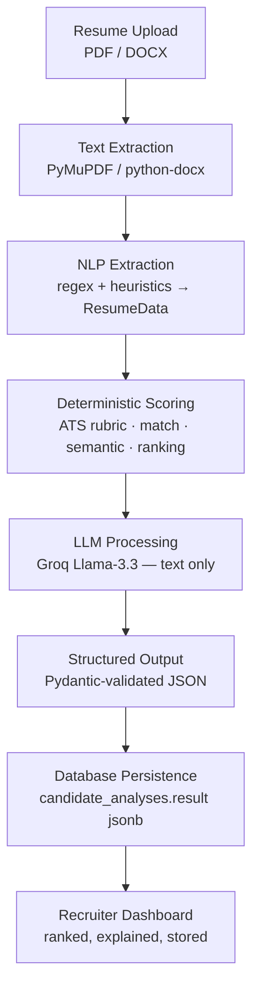

# AI Pipeline

> How a resume becomes ranked, explained intelligence. HireLens uses a **hybrid**
> architecture: deterministic Python does all the math (scores, ranking, similarity);
> the LLM does only what humans are good at (summaries, reasoning, recommendations).
> Cross-refs: [ARCHITECTURE.md](./ARCHITECTURE.md), [DATABASE.md](./DATABASE.md),
> [ADR-002](./decisions/ADR-002-groq.md), [ADR-004](./decisions/ADR-004-store-ai-output.md).

---

## End-to-end flow



**Key principle:** numeric authority is deterministic. The LLM's output schemas
contain **no score fields**, so it structurally *cannot* override a computed
number — and the prompts say so explicitly.

---

## Stage 1 — Text extraction (`app/parser/`)

Factory + Strategy pattern. `ParserFactory.get_parser(path)` selects by suffix:

| Format | Parser | Library | Notes |
|--------|--------|---------|-------|
| `.pdf` | `PDFParser` | **PyMuPDF** (`fitz`) | iterates pages, joins `get_text()`; real page count |
| `.docx` | `DocxParser` | **python-docx** | paragraphs + table cells; page count estimated `len(text)//3000` |

Failures raise `ParserError`. `parse_file()` returns `(text, page_count, parser_name)`.

## Stage 2 — NLP extraction (`app/nlp/extractor.py`)

Pure regex + heuristics (**no ML**). `extract_resume_data(text) → ResumeData`:

- **Section segmentation** — `detect_sections()` matches keyword headers
  (summary/education/experience/projects/skills/certifications).
- **Name** — first 4 lines, skipping emails/URLs/phones/CV-keywords, 1–4 words.
- **Email** — RFC-style regex. **Phone** — international/US patterns in `text[:1200]`.
- **Skills** — hardcoded `COMMON_SKILLS` word-boundary match + Skills-section
  split, then `normalize_skills()` (canonical casing, ~50 aliases, noise removal)
  and `postprocess_skills()` (dedup, category ordering).
- **Education / experience / projects** — line heuristics: GPA regex, duration
  ranges, role keywords, bullet detection, wrapped-line merging.

`clean_and_validate_resume_data()` (`validators.py`) dedupes and drops malformed
entries (non-fatal warnings).

## Stage 3 — Deterministic scoring (`app/nlp/`)

### ATS score — `ats_scorer.calculate_ats_score()` → `(ats_score, breakdown, confidence)`

| Category | Max | Rule (summary) |
|----------|:---:|----------------|
| Technical Skills | 30 | by unique-skill count: 1–4→10, 5–8→16, 9–12→22, 13–16→27, 17+→30 (+4 core-frontend bonus) |
| Projects | 25 | depth/bullets; **25 if quantified metrics present** |
| Experience | 20 | 1 entry→12/16, 2+→20 |
| Education | 10 | GPA-aware: 6 / 8 / 10 |
| Quantified Impact | 15 | metric count (intern-softened tiers) |
| **Total** | **100** | deterministic sum |

**Confidence (0–100)** — parsing completeness, starts 100; penalties: name −30,
email −20, phone −15, skills −15, education −10, experience −10.

### Match score — `match_scorer.calculate_match_score()` → `(score, category)`
Skill Match 40 · Hiring Alignment 25 · Project Relevance 15 · Strengths Balance
20. Category: ≥85 Excellent, ≥70 Strong, ≥50 Moderate, else Weak.

### Semantic similarity — `ranking_engine.semantic_similarity()`
**Pure-Python bag-of-words term-frequency cosine** (`collections.Counter`) — **no
TF-IDF, no embeddings, no external library**. Returns 0.0–1.0.

### Weighted ranking — `ranking_engine.compute_candidate_score()`
Each dimension = ratio(0–1) × weight → `CandidateScore` with explainable
per-component line items.

| Weight (default `RankingWeights`) | Value |
|-----------------------------------|:-----:|
| Skills | 30 |
| Experience | 20 |
| Projects | 15 |
| ATS | 10 |
| Education | 10 |
| Semantic | 10 |
| Achievements | 5 |
| **Total** | **100** |

Weights are per-campaign overridable (stored in `campaigns.ranking_weights`).

## Stage 4 — LLM processing (`app/llm/`)

**Client** (`groq_client.call_groq`): model **`llama-3.3-70b-versatile`**,
`temperature=0.2`, `max_tokens=2048`, `timeout=30s`, **3 network retries**.
`GroqConfigError` (missing/placeholder key) is never retried.

| Flow | Function | Order | LLM output schema (text only) |
|------|----------|-------|-------------------------------|
| Single ATS | `analyzer.analyze_resume` | score → LLM explain | `GroqExplanation` (summary, strengths, gaps, readiness, roles) |
| JD Match | `match_analyzer.analyze_match` | LLM → score | `GroqMatchAnalysis` (matching/missing skills, relevance, recs) |
| Batch | `batch_analyzer.analyze_candidate` | 1 JD-aware call/resume | `GroqBatchAnalysis` (+ interview questions) |
| Copilot | `copilot.answer_question` | grounded Q&A | `CopilotResponse` (answer, confidence, evidence, followups) |

**Reliability ladder** (all flows): network retries → JSON-parse retries
(`_strip_fences` removes ```` ```json ```` fences) → Pydantic schema-validation
retries. On exhaustion the caller **degrades** rather than failing:

- Batch: LLM failure → deterministic-only `CandidateResult` ("AI insights
  temporarily unavailable"); one bad resume never fails the batch.
- Copilot: `_fallback_response` builds a deterministic answer from structured
  fields, `degraded=true`, `confidence=0`.

**Copilot grounding:** context is built from pluggable `ContextSource`s
(`candidate_context.py`) into one labeled text block declared "the ONLY source of
truth"; the model is instructed to never invent skills/employers/dates and to
state when data is absent. History is bounded (8 turns, 1200 chars/msg).

**Batch concurrency** (`services/batch_service.py`): `asyncio.Semaphore(5)` +
`run_in_threadpool`; results sorted by `(overall_score, ats_score)` desc, ranked,
and aggregated into `BatchAnalytics`.

## Stage 5 — Structured output

Every LLM response is validated against a Pydantic v2 schema before use. The
canonical batch record is `CandidateResult` (see [DATABASE.md](./DATABASE.md) and
[API.md](./API.md)) — reused verbatim as Copilot input.

## Stage 6 — Persistence (`services/persistence_service.py`)

`POST /api/v1/campaigns/{id}/persist-batch` stores each successful
`CandidateResult` as a `candidates` row + a `candidate_analyses` row whose
`result` jsonb is the **verbatim** AI output, plus a `batch_analyzed` activity
event. AI logic is never re-run here.

## Stage 7 — Recruiter dashboard

The frontend reads persisted candidates + their latest analysis, ranked by
`overall_score`, with pipeline stages, notes, and Copilot — all durable across
sessions.

---

## Why AI results are stored, not recomputed

1. **Cost** — Groq is billed per token; a stored result is free to re-read.
   Recomputing on every dashboard view would multiply LLM spend by traffic.
2. **Latency** — reads are instant; re-running parse + scoring + LLM is seconds.
3. **Consistency** — a recruiter revisiting a candidate sees the *same* analysis
   they made decisions on; re-running an LLM (even at temp 0.2) can drift.
4. **Auditability** — `candidate_analyses` is versioned, preserving the exact
   output behind each hiring decision.

Full rationale: [ADR-004](./decisions/ADR-004-store-ai-output.md).

---

## Future: AI provider abstraction

Today Groq is called directly via `groq_client.call_groq`. Planned: a provider
interface (`LLMProvider.complete(system, user, schema)`) with adapters for Groq,
OpenAI, Anthropic, and local models, enabling per-task model routing, failover,
and cost-based selection — without touching the scoring or persistence layers.
See [ROADMAP.md](./ROADMAP.md).
