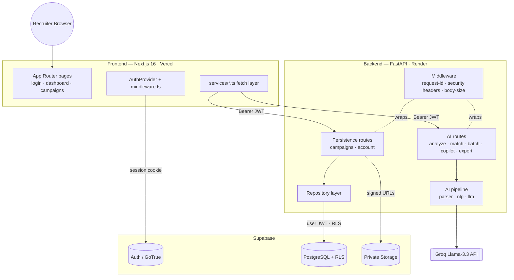
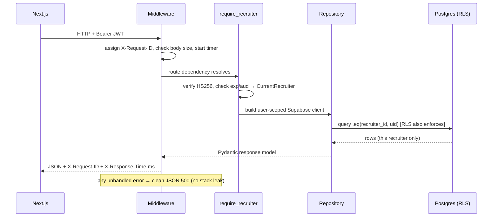
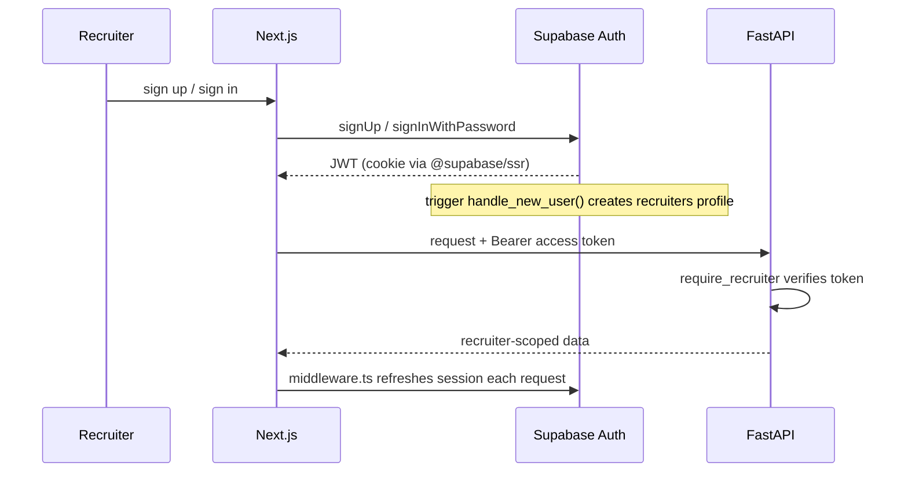
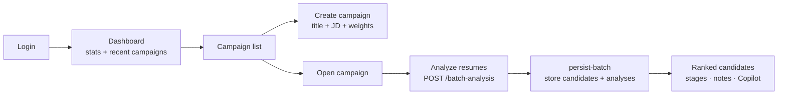
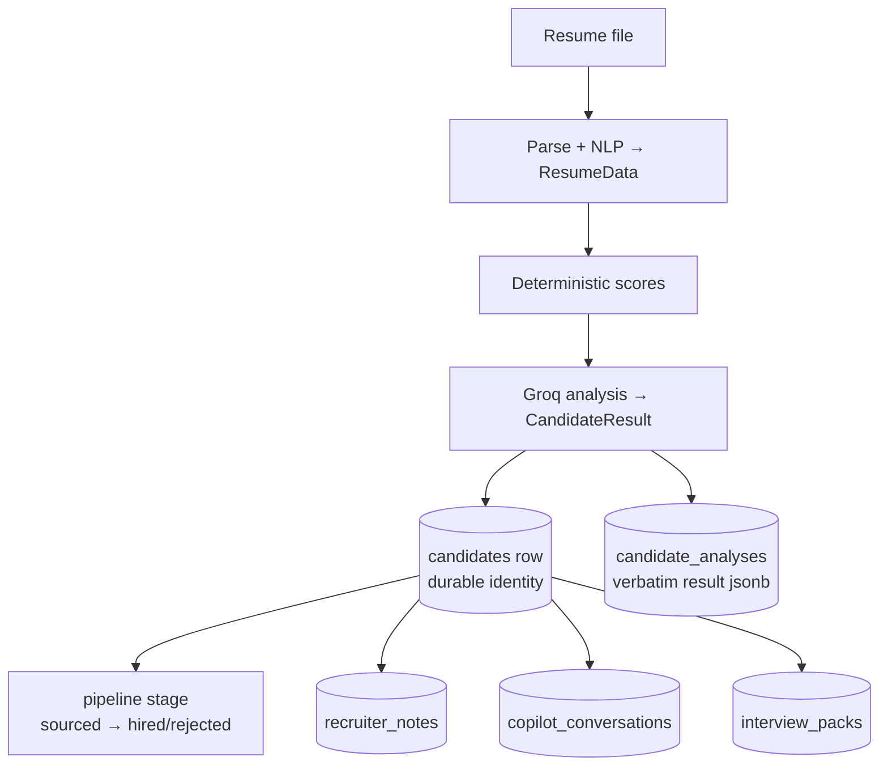

# Architecture

> The system from top to bottom: Frontend → Backend → Authentication → Database
> → AI → Storage. Cross-refs: [DATABASE.md](./DATABASE.md),
> [AI_PIPELINE.md](./AI_PIPELINE.md), [SECURITY.md](./SECURITY.md),
> [API.md](./API.md).

HireLens is a **hybrid AI SaaS**: a Next.js frontend, a stateless FastAPI AI
microservice, and a Supabase persistence platform (Postgres + Auth + Storage)
layered on top. The AI pipeline is deterministic-first; persistence is additive
and never changes AI logic.

---

## System overview

---

## Layer-by-layer

### 1. Frontend (`resume-hero-section/`)
Next.js 16 (App Router), React 19, Tailwind v4, shadcn/Radix. Responsibilities:
render UI, handle uploads, hold auth session (`@supabase/ssr` + `AuthProvider`),
guard routes (`proxy.ts` — the Next.js 16 successor to `middleware.ts`), and call
the backend through typed fetch wrappers
(`services/api.ts` for stateless AI, `services/campaigns-api.ts` for authed
persistence — the latter attaches `Authorization: Bearer <token>`).

### 2. Backend (`backend/app/`)
FastAPI ASGI app. Two families of routes under `/api/v1`:
- **Stateless AI** (`analyze`, `match`, `batch`, `copilot`, `export`) — no auth,
  no DB; each request carries all state.
- **Persistence** (`campaigns`, `account`) — require a recruiter JWT and operate
  on that recruiter's data only.

All requests pass through middleware (request-id/logging, security headers,
body-size guard, and a per-IP rate limiter on expensive/unauthenticated routes).
Business logic lives in `services/`; data access in `repositories/`; AI in
`parser/` + `nlp/` + `llm/`.

### 3. Authentication (`app/core/auth.py`)
Supabase issues JWTs; the backend verifies them locally (HS256) and resolves a
`CurrentRecruiter`. `require_recruiter` / `optional_recruiter` are FastAPI
dependencies. See [SECURITY.md](./SECURITY.md).

### 4. Database (Supabase Postgres)
9 tables with RLS (`recruiter_id = auth.uid()`), reached **as the user** so the
DB enforces tenant isolation. Repositories add a second scoping filter. See
[DATABASE.md](./DATABASE.md).

### 5. AI (`app/parser`, `app/nlp`, `app/llm`, `app/ai`)
Hybrid: deterministic parsing/scoring/ranking + Groq Llama-3.3 for text only.
**Every** LLM request — résumé/batch analysis, comparison, interview, copilot,
match, report, agent — flows through a **single AI Orchestrator** (`app/ai/
orchestrator`): prompt registry → QA cache → provider selection + fallback chain →
retry policy (rate-limits not retried) → usage tracking → provider. No direct
provider calls remain in the backend. Results are stored
(`candidate_analyses.result`), not recomputed. See
[AI_ARCHITECTURE.md](./AI_ARCHITECTURE.md) and [AI_PIPELINE.md](./AI_PIPELINE.md).

### 6. Storage (Supabase Storage)
Four private buckets, recruiter-namespaced keys, object-level RLS, signed-URL
downloads via `StorageService`. See [DATABASE.md](./DATABASE.md#storage-buckets).

---

## Request lifecycle (persistence endpoint)

For **stateless AI endpoints** the flow is the same minus the auth/repo/DB steps:
middleware → route → `save_upload_to_temp` → threadpool(parse → score → Groq) →
`finally` deletes the temp file → JSON.

---

## Authentication lifecycle

---

## Recruiter flow

## Candidate flow (data lineage)

A candidate begins as an uploaded file, becomes structured `ResumeData`, is scored
deterministically and analyzed by the LLM into a `CandidateResult`, then persists
as a durable `candidates` row with its analysis, and thereafter accumulates
pipeline stage, notes, conversations, and interview packs.

---

## Deployment topology

| Component | Host | Entry |
|-----------|------|-------|
| Frontend | Vercel | Next.js (`resume-hero-section/`) |
| Backend | Render (primary) / Vercel (best-effort) | `uvicorn app.main:app` / `api/index.py` |
| Database, Auth, Storage | Supabase | managed |
| LLM | Groq | `llama-3.3-70b-versatile` |

See [DEPLOYMENT.md](./DEPLOYMENT.md).
