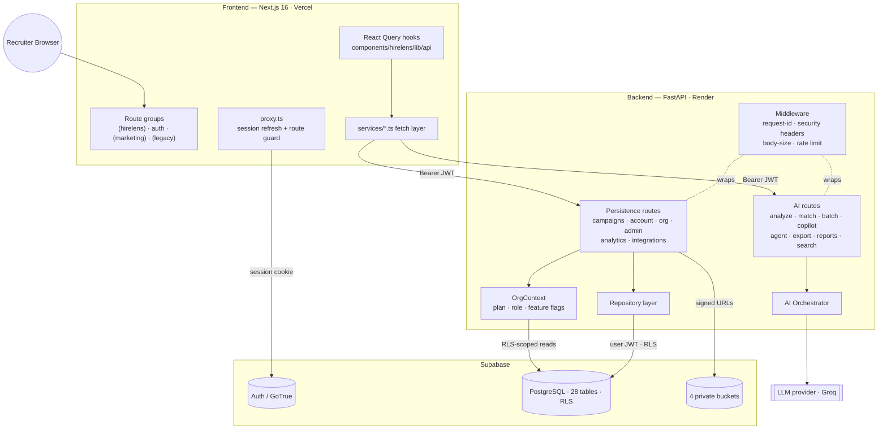
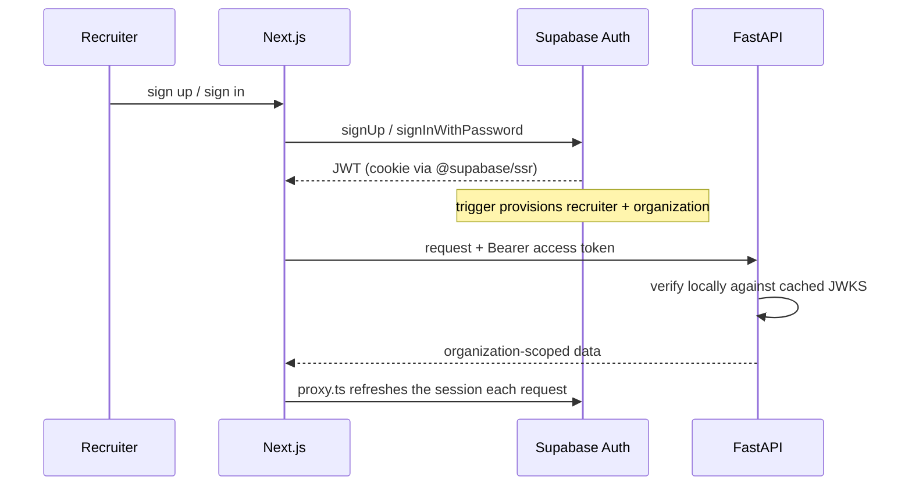
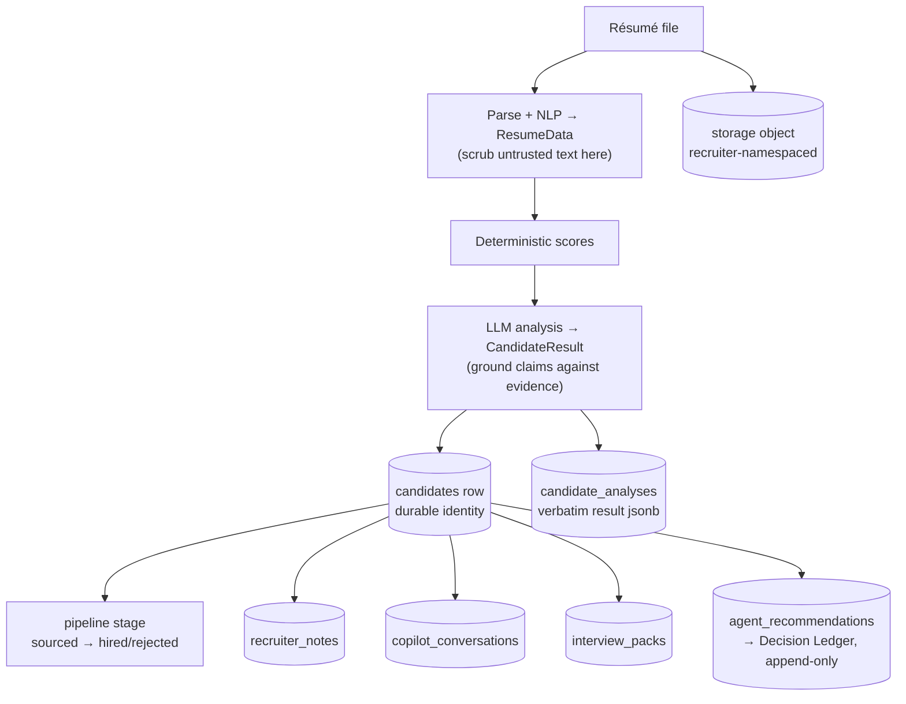

# Architecture — Hirevo V4 (final)

> **This document describes a frozen architecture.** V4 is the baseline for all
> future development: no structural changes, no API-contract changes, no schema
> changes without an approved migration. See [CONTRIBUTING.md](../CONTRIBUTING.md)
> for what may change and what may not.
>
> Companions: [DATABASE.md](./DATABASE.md) · [API.md](./API.md) ·
> [SECURITY.md](./SECURITY.md) · [AI_ARCHITECTURE.md](./AI_ARCHITECTURE.md) ·
> [DEPLOYMENT.md](./DEPLOYMENT.md) · [MONITORING.md](./MONITORING.md)

Hirevo is a **hybrid AI SaaS**: a Next.js frontend, a stateless FastAPI AI
service, and a Supabase persistence platform (Postgres + Auth + Storage) layered
on top.

Two properties explain most of the design and are worth stating before the
diagrams, because nearly every decision downstream follows from them:

1. **The AI pipeline is deterministic-first.** Parsing, scoring and ranking are
   ordinary Python. The LLM produces *prose and judgement*, never a number that
   the product treats as authoritative. This is what makes results reproducible
   and explainable, and it is why an LLM outage degrades the product rather than
   breaking it.
2. **Persistence is additive.** It was layered on top of a working stateless
   service without changing AI logic. That is why the stateless AI endpoints still
   run with zero Supabase configuration, and why the persistence layer can fail
   without taking résumé analysis with it.

---

## System overview


```mermaid
graph TD
    Client((Recruiter Browser))

    subgraph FE [Frontend — Next.js 16 · Vercel]
        Groups["Route groups<br/>(hirelens) · auth · (marketing) · (legacy)"]
        Proxy["proxy.ts<br/>session refresh + route guard"]
        Query[React Query hooks<br/>components/hirelens/lib/api]
        Svc[services/*.ts fetch layer]
    end

    subgraph BE [Backend — FastAPI · Render]
        MW["Middleware<br/>request-id · security headers<br/>body-size · rate limit"]
        Org["OrgContext<br/>plan · role · feature flags"]
        AIroutes["AI routes<br/>analyze · match · batch · copilot<br/>agent · export · reports · search"]
        Persist["Persistence routes<br/>campaigns · account · org · admin<br/>analytics · integrations"]
        Repos[Repository layer]
        Orch[AI Orchestrator]
    end

    subgraph SB [Supabase]
        AuthS[(Auth / GoTrue)]
        DB[("PostgreSQL · 28 tables · RLS")]
        Store[(4 private buckets)]
    end

    Groq[[LLM provider · Groq]]

    Client --> Groups
    Proxy -->|session cookie| AuthS
    Svc -->|Bearer JWT| AIroutes
    Svc -->|Bearer JWT| Persist
    Query --> Svc
    Persist --> Org
    Org -->|RLS-scoped reads| DB
    AIroutes --> Orch
    Orch --> Groq
    Persist --> Repos
    Repos -->|user JWT · RLS| DB
    Persist -->|signed URLs| Store
    MW -.wraps.- AIroutes
    MW -.wraps.- Persist
```

---

## Layer by layer

### 1. Frontend — `frontend/`

Next.js 16 App Router, React 19, Tailwind v4, Radix primitives. The root layout is
a minimal document skeleton; each **route group** supplies its own layout,
providers and chrome, which is what keeps the four surfaces from leaking into one
another.

```
app/
├─ (hirelens)/      V4 authenticated product. Mounts HireLensProviders + the `.hl` shell.
│   ├─ home/                          → Decision Inbox (landing surface)
│   ├─ roles/                         → Role index
│   │   └─ [roleId]/                  → Role Workspace (lenses via ?lens=)
│   │       ├─ candidates/[id]/       → Deep Review (Dossier)
│   │       └─ decisions/[id]/        → Decision Intelligence (memo)
│   ├─ ledger/                        → Decision Ledger (append-only)
│   ├─ talent/                        → Talent discovery
│   ├─ analytics/                     → Analytics
│   ├─ interviews/                    → Interview workspace
│   ├─ notifications/                 → Notifications Center
│   ├─ settings/[[...slug]]/          → Settings
│   ├─ learning/                      → Deferred placeholder (no backend)
│   └─ ask/  foundations/             → Ask · dev showcase
├─ auth/            /auth/login|signup|forgot|reset|accept|callback
├─ (marketing)/     Public landing — no shell, no providers, no auth
└─ (legacy)/        Hirevo V1 — FROZEN. Reachable through the "Classic" nav group.
```

`proxy.ts` (the Next.js 16 successor to `middleware.ts`) refreshes the Supabase
session and guards protected routes. The routing *decision* is a pure function —
`resolveMiddlewareAction` in `lib/auth-routing.ts` — so the security logic is unit
tested in isolation rather than only through the framework. Legacy protected
routes redirect to `/login`; V4 routes to `/auth/login`.

With no Supabase env vars the proxy is a no-op, which is what allows the public
stateless app to run unauthenticated.

### 2. Design system

**Optical Clarity**, scoped under `.hl` in `app/globals.css`.

- **Type:** Fraunces (editorial display), Inter (UI), JetBrains Mono
  (data/scores/IDs). Utilities `.hl-display-*`, `.hl-body*`, `.hl-mono`, `font-hl-*`.
- **Colour:** `--hl-*` tokens — canvas/subtle/muted surfaces, borders, foreground
  scale, Iris accent `#5B5BD6`; the **Focus scale** (`--hl-score-*`, shared via
  `components/hirelens/lib/focus-scale.ts`); the **Prism** AI gradient. Light and
  first-class dark.
- **Signatures:** hairline-not-shadow depth; Prism reserved for AI output only;
  Rack Focus (dim + desaturate + blur) on decision objects; editorial display type
  rationed to one moment per surface.
- **Contrast is pinned by test.** `tests/contrast.test.ts` asserts WCAG AA floors
  against `globals.css` itself, including that disabled text stays deliberately
  *below* AA. A token is one value shared by hundreds of call sites, so a palette
  tweak is the cheapest possible way to make text unreadable everywhere at once.

The `(marketing)` group mounts no `.hl` shell, no providers and no auth, and uses a
separate `--mkt-*` palette. The isolation is deliberate in both directions: the
cinematic marketing language cannot leak into the product, and the product's
Optical Clarity cannot bleed into marketing.

### 3. Shared components

- **Shell:** `AppShell`, `LeftNav` (Instrument Rail), `TopBar`,
  `WorkspaceSwitcher`, `CommandPalette`, `ShellProvider` (`useShell`).
- **Primitives:** `Button`, `Drawer` (rack focus), `Dialog`, `Tabs`, `Avatar`,
  `Kbd`, `Badge`, toasts, `EmptyState` / `ErrorState` / `LoadingScreen`,
  and `DataTable` (sortable, searchable, paginated, selectable — with `aria-sort`
  and keyboard-activable rows).
- **Domain:** `AIAnswer` (the single AI render surface), `ScoreMeter`,
  `ConfidencePill`, `ApprovalCard`, `ConfidenceChip`.

Shared primitives are lifted the moment duplication appears rather than on
principle — `focus-scale.ts` came out of Triage, `DataTable` out of the Ledger.

### 4. Frontend data flow

React Query over the shared `@/services/*` layer; hooks live in
`components/hirelens/lib/api/*`. Candidates are normalised through
`lib/candidate.ts` `toRow` into `CandidateRow`; the analysis payload is carried
**verbatim** as `CandidateResult` rather than reshaped, so what the UI shows is
what the model produced. Mutations are optimistic with rollback.

### 5. Backend — `backend/app/`

FastAPI ASGI app. Two families of routes under `/api/v1`:

- **Stateless AI** — `analyze`, `match`, `batch`, `copilot`, `agent`, `export`,
  `reports`, `search`. Stateless in the sense that each request carries all its
  state and touches no database — but **not unauthenticated**: since the RBAC
  sweep (29 Jul 2026) they require a recruiter JWT and a permission (`ai.use`,
  `export`). They cost money per call, so they also sit behind a rate limiter.
- **Persistence** — `campaigns`, `account`, `org`, `admin`, `analytics`,
  `integrations`, `knowledge`, `prediction`. Require a recruiter JWT and operate
  only on that recruiter's organization.

Every request passes through middleware: request ID and access logging, security
headers, an early body-size guard, and a per-client rate limiter on the expensive
unauthenticated routes. Business logic lives in `services/`, data access in
`repositories/`, AI in `parser/` + `nlp/` + `llm/` + `ai/`.

### 6. Authentication — `app/core/auth.py`

Supabase issues the JWT; the backend verifies it **locally** and resolves a
`CurrentRecruiter`. Verification dispatches on the token's `alg`:

| `alg` | Path |
|---|---|
| ES256 / RS256 | JWKS, fetched once and cached (`JWKS_CACHE_SECONDS`, default 600) |
| HS256 | `SUPABASE_JWT_SECRET` (legacy projects) |
| unparseable | immediate 401 — no outbound call |
| anything else | remote Supabase Auth fallback |

Modern Supabase projects issue **ES256**, and before the JWKS path existed every
authenticated request made a network call to Supabase Auth to verify the token.
Adding local verification removed roughly half the latency from authenticated
requests. An unparseable token short-circuits so a flood of garbage tokens cannot
be turned into a flood of outbound requests.

`require_recruiter` / `optional_recruiter` are the FastAPI dependencies.

### 7. Authorization — `app/enterprise/`

Above authentication sits the organization layer. `resolve_org_context` turns a
`CurrentRecruiter` into an `OrgContext` carrying organization, workspace, role,
plan and feature flags. Every authorization decision reads from it.

Resolution reads through the **user-scoped** Supabase client, so RLS constrains
what the resolution itself can see — the context cannot claim membership of an org
the user is not in. Privileged mutations then use the service client scoped
explicitly to the resolved `organization_id`.

The four org lookups (organization, membership, subscription, feature flags)
depend only on `organization_id` and not on each other, so they are issued
concurrently. This is deliberately **concurrency, not caching**: authorization
state must never be stale, so a revoked role takes effect on the very next
request.

Feature flags are enforced server-side by a `feature_gate()` dependency, not just
hidden in the UI.

### 8. Database — Supabase Postgres

28 tables. RLS is enforced through `is_org_member` / `is_org_admin` helpers rather
than a bare `recruiter_id = auth.uid()` comparison, because access is organization-
scoped rather than user-scoped. Queries run **as the user**, so Postgres is the
thing enforcing tenant isolation; repositories add a second scoping filter as
defence in depth, never as the primary control.

15 forward-only migrations. `audit_logs` is append-only and is refused by the
restore path — see [DISASTER_RECOVERY.md](./DISASTER_RECOVERY.md).

Tenant isolation is verified by a runtime suite (`tests/test_tenant_isolation.py`,
25 checks) that creates real users in two organizations and attempts real
cross-tenant reads and writes. It is the authoritative answer to "can one customer
see another's data", and it is the first thing to run after any restore.

### 9. AI — `app/ai`, `app/parser`, `app/nlp`, `app/llm`

Deterministic parsing, scoring and ranking; the LLM for language only. **Every**
LLM request — résumé and batch analysis, comparison, interview generation,
copilot, match, report, agent — flows through a single **AI Orchestrator**
(`app/ai/orchestrator`): prompt registry → QA cache → provider selection and
fallback chain → retry policy → usage tracking → provider. No direct provider
calls remain anywhere in the backend, which is what makes provider switching a
configuration change.

Retries are bounded and typed: network errors back off exponentially with jitter,
transient rate limits get a small number of extra attempts honouring
`Retry-After`, and **quota exhaustion is never retried** — retrying a quota error
just spends the next quota window faster.

Analysis results are **stored** (`candidate_analyses.result`), not recomputed. The
same résumé viewed twice does not cost twice, and a candidate's score does not
change because a model was updated underneath them.

**Untrusted input.** A résumé is attacker-controlled text that goes into a prompt.
Three layers, in order:

1. `scrub()` at the single extraction chokepoint in `parser/factory.py` — drops
   whole instruction-like *lines*, not just matched phrases, because leaving the
   surrounding line left the payload's own skill list standing as apparent
   evidence.
2. `fence()` wraps untrusted text in a per-call nonce so the model can tell
   document from instruction.
3. `ground_claims()` drops `matching_skills` the résumé does not evidence, and
   **reclassifies them into `missing_skills`**. Dropping alone was not enough:
   the score is `matching/(matching+missing)`, so silently discarding a fabricated
   claim *raised* the score.

Each layer was added because the previous one was measurably bypassed.
`tests/test_prompt_injection.py` holds the regressions.

### 10. Storage — Supabase Storage

Four private buckets, recruiter-namespaced keys, object-level RLS, signed-URL
downloads through `StorageService` (`SIGNED_URL_TTL_SECONDS`, default 3600).

Deleting a campaign or bulk-deleting candidates removes the storage prefix as well
as the rows. Without that, deleted candidates left their résumés — real personal
data — orphaned in the bucket, invisible to the product and undeletable through
it.

One operational nuance worth knowing before answering an erasure request: a
successful `download()` is **not** proof an object exists, because Supabase serves
a just-deleted object from cache for a short window. The bucket **listing** is
authoritative.

---

## Request lifecycle — persistence endpoint

```mermaid
sequenceDiagram
    participant FE as Next.js
    participant MW as Middleware
    participant Dep as require_recruiter
    participant Org as resolve_org_context
    participant Repo as Repository
    participant DB as Postgres (RLS)

    FE->>MW: HTTP + Bearer JWT
    MW->>MW: request ID, body-size guard, timer
    MW->>Dep: route dependency resolves
    Dep->>Dep: verify locally (JWKS/HS256) → CurrentRecruiter
    Dep->>Org: resolve org, role, plan, flags (4 concurrent RLS reads)
    Org->>Repo: user-scoped client + organization_id
    Repo->>DB: query (RLS enforces; filter is defence in depth)
    DB-->>Repo: rows for this organization only
    Repo-->>MW: Pydantic response model
    MW-->>FE: JSON + X-Request-ID + X-Response-Time-ms
    Note over MW: unhandled error → clean JSON 500, full traceback logged, no stack leaked
```

Stateless AI endpoints follow the same path minus auth/org/DB: middleware → route
→ `save_upload_to_temp` → threadpool(parse → score → LLM) → `finally` deletes the
temp file → JSON. The `finally` matters: without it a parse failure leaves
résumés on disk.

## Authentication lifecycle


```mermaid
sequenceDiagram
    participant U as Recruiter
    participant FE as Next.js
    participant SB as Supabase Auth
    participant API as FastAPI

    U->>FE: sign up / sign in
    FE->>SB: signUp / signInWithPassword
    SB-->>FE: JWT (cookie via @supabase/ssr)
    Note over SB: trigger provisions recruiter + organization
    FE->>API: request + Bearer access token
    API->>API: verify locally against cached JWKS
    API-->>FE: organization-scoped data
    FE->>SB: proxy.ts refreshes the session each request
```

## Candidate data lineage


```mermaid
flowchart TD
    F[Résumé file] --> X["Parse + NLP → ResumeData<br/>(scrub untrusted text here)"]
    X --> S[Deterministic scores]
    S --> A["LLM analysis → CandidateResult<br/>(ground claims against evidence)"]
    A --> C[(candidates row<br/>durable identity)]
    A --> AN[(candidate_analyses<br/>verbatim result jsonb)]
    F --> B[(storage object<br/>recruiter-namespaced)]
    C --> ST[pipeline stage<br/>sourced → hired/rejected]
    C --> NT[(recruiter_notes)]
    C --> CP[(copilot_conversations)]
    C --> IP[(interview_packs)]
    C --> LG[(agent_recommendations<br/>→ Decision Ledger, append-only)]
```

A candidate begins as an uploaded file, becomes structured `ResumeData`, is scored
deterministically, is analysed by the LLM into a `CandidateResult`, persists as a
durable `candidates` row with its analysis and its stored binary, and thereafter
accumulates stage, notes, conversations, interview packs and resolved
recommendations. Resolved recommendations are permanent — the ledger is the record
of what was decided, so it cannot be rewritten after the fact.

---

## Deployment topology

| Component | Host | Entry |
|---|---|---|
| Frontend | Vercel | Next.js (`frontend/`) |
| Frontend (portable) | any container host | `frontend/Dockerfile` |
| Backend | Render | `uvicorn app.main:app` via `render.yaml` |
| Backend (portable) | any container host | `backend/Dockerfile` |
| Database · Auth · Storage | Supabase | managed |
| LLM | Groq (`openai/gpt-oss-120b`) | provider-agnostic via the orchestrator |

See [DEPLOYMENT.md](./DEPLOYMENT.md) for the procedure and
[OPERATIONS.md](./OPERATIONS.md) for running it.

---

## Extension points

These exist in the type system and the UI already and light up when a backend
arrives — no redesign required. They are listed so a future contributor extends
rather than rebuilds.

- **Outcome tracking** → unlocks Learning, Ledger outcomes, regret analysis.
- **Signal-level confidence** → the `RecommendationSignal[]` model and the
  conditional Confidence panel populate as-is.
- **Source-conflict engine** → the `EvidenceConflict[]` renderer in Deep Review
  lights up (it renders empty today).
- **Bulk-stage and get-by-id endpoints** → replace client-side list scans and
  per-item mutation loops.
- **Notification backend** → `NotificationStateSource` is the async seam; the
  local store swaps out with no UI change.
