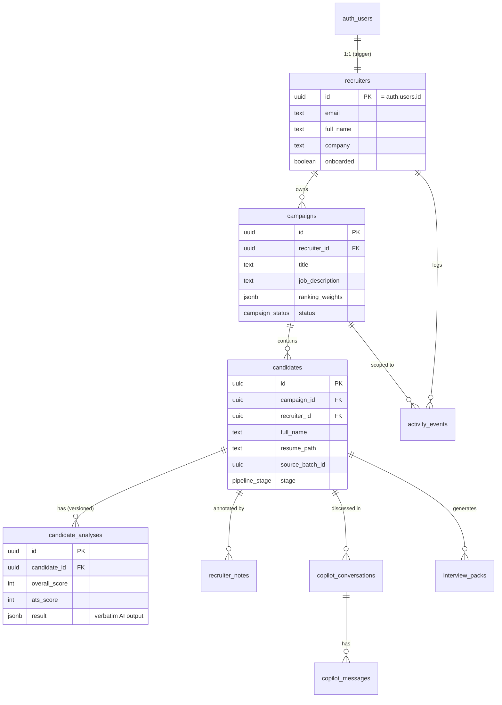

# Database

> Postgres schema, migrations, relationships, RLS, and storage for HireLens.
> The persistence layer was introduced in **V4 Sprint 1** on top of the
> previously stateless AI backend. See [ARCHITECTURE.md](./ARCHITECTURE.md) and
> [SECURITY.md](./SECURITY.md).

- **Engine:** PostgreSQL (managed by Supabase)
- **Extensions:** `pgcrypto` (UUIDs), `pg_trgm` (fuzzy search)
- **Access model:** the API talks to Postgres **as the end user** (anon key + user
  JWT) so Row Level Security is always enforced; repositories add a second
  `recruiter_id` filter as defense in depth.
- **Migrations:** `supabase/migrations/`, applied in numeric order.

---

## Migrations

| File | Purpose |
|------|---------|
| `0001_initial_schema.sql` | Enums, tables, indexes, `updated_at` triggers, `candidate_latest_analysis` view |
| `0002_rls_policies.sql` | Enables RLS and creates owner policies on every table |
| `0003_storage_buckets.sql` | Creates 4 private buckets + object-level RLS |
| `0004_auth_triggers.sql` | Auto-provisions a `recruiters` profile on sign-up; keeps email in sync |

> **Convention:** migrations are additive and idempotent where practical
> (`create ... if not exists`, `do $$ ... exception when duplicate_object`). Never
> edit a shipped migration — add a new numbered file.

---

## Entity Relationship Diagram



Every child row carries `recruiter_id` (denormalized) so RLS is a single
index-backed equality check. Deletes cascade top-down: removing a recruiter
removes all their data; removing a campaign removes its candidates and children.

---

## Enumerated types

| Type | Values |
|------|--------|
| `campaign_status` | `draft`, `active`, `paused`, `archived` |
| `pipeline_stage` | `sourced`, `screening`, `shortlisted`, `interview`, `offer`, `hired`, `rejected` |
| `message_role` | `user`, `assistant`, `system` |
| `activity_type` | `campaign_created`, `campaign_updated`, `campaign_archived`, `batch_analyzed`, `candidate_added`, `candidate_stage_changed`, `note_added`, `copilot_message`, `interview_pack_generated`, `resume_uploaded` |

---

## Tables

### `recruiters`
Profile mirroring `auth.users` (1:1). Auto-created by the `handle_new_user`
trigger on sign-up.

| Column | Type | Notes |
|--------|------|-------|
| `id` | uuid PK | `references auth.users(id) on delete cascade` |
| `email` | text | not null; synced from auth |
| `full_name`, `company`, `job_title`, `avatar_url` | text | nullable |
| `onboarded` | boolean | default `false` |
| `metadata` | jsonb | default `{}` |
| `created_at`, `updated_at` | timestamptz | `updated_at` trigger |

### `campaigns`
One hiring process (e.g. "Backend Engineer Hiring").

| Column | Type | Notes |
|--------|------|-------|
| `id` | uuid PK | `gen_random_uuid()` |
| `recruiter_id` | uuid FK | → `recruiters(id)` cascade |
| `title` | text | not null |
| `role_title`, `department`, `location`, `employment_type` | text | nullable |
| `job_description` | text | default `''` |
| `jd_storage_path` | text | optional uploaded JD file key |
| `ranking_weights` | jsonb | defaults sum to 100 (see [AI_PIPELINE.md](./AI_PIPELINE.md)) |
| `status` | campaign_status | default `draft` |
| `metadata` | jsonb | default `{}` |

**Indexes:** `(recruiter_id, created_at desc)`, `(recruiter_id, status)`, GIN trgm on `title`.

### `candidates`
A durable person/resume within a campaign (the pipeline's `candidate_id` is
ephemeral; this is the stable identity).

| Column | Type | Notes |
|--------|------|-------|
| `id` | uuid PK | |
| `campaign_id` | uuid FK | → `campaigns(id)` cascade |
| `recruiter_id` | uuid FK | → `recruiters(id)` cascade |
| `full_name`, `email`, `phone` | text | |
| `resume_path` | text | private `resumes` bucket key — never a public URL |
| `resume_filename` | text | |
| `source_batch_id` | uuid | correlates candidates from one batch run |
| `stage` | pipeline_stage | default `sourced` |
| `is_favorite` | boolean | default `false` |

**Indexes:** `(campaign_id, created_at desc)`, `(recruiter_id)`, `(campaign_id, stage)`, `(source_batch_id)`, GIN trgm on `full_name`.

### `candidate_analyses`
**Stored AI output** — references, never recomputes. `result` holds the verbatim
`CandidateResult` JSON produced by the batch pipeline; scalar columns are
denormalized projections for cheap ranking/filtering. Versioned (append on re-run).

| Column | Type | Notes |
|--------|------|-------|
| `id` | uuid PK | |
| `candidate_id`, `campaign_id`, `recruiter_id` | uuid FK | cascade |
| `analysis_version` | text | default `v1.0` |
| `rank`, `overall_score`, `ats_score` | int | projections of `result` |
| `semantic_similarity`, `years_experience` | double precision | |
| `match_category`, `recommendation` | text | |
| `result` | jsonb | **not null** — the full AI output |

**Indexes:** `(candidate_id, created_at desc)`, `(campaign_id, overall_score desc)`, `(recruiter_id)`.

### `recruiter_notes`
| Column | Type | Notes |
|--------|------|-------|
| `id` | uuid PK | |
| `candidate_id`, `campaign_id`, `recruiter_id` | uuid FK | cascade |
| `body` | text | not null |
| `pinned` | boolean | default `false` |

### `copilot_conversations` / `copilot_messages`
Persisted Copilot threads (replaces the previous client-only history).

`copilot_conversations`: `id`, `candidate_id`, `campaign_id`, `recruiter_id`,
`title`, `metadata`, timestamps.

`copilot_messages`: `id`, `conversation_id` FK, `recruiter_id`, `role`
(`message_role`), `content`, `metadata` jsonb (assistant turns store
`confidence`, `evidence[]`, `reasoning_summary`, `followups`, `degraded`),
`created_at`. Indexed `(conversation_id, created_at asc)`.

### `interview_packs`
`id`, `candidate_id`, `campaign_id`, `recruiter_id`, `title`, `questions` jsonb
(list of `{question, category, rationale}`), `storage_path` (optional PDF in
`interview-packs` bucket), `metadata`, timestamps.

### `activity_events`
Append-only recruiter timeline. `id`, `recruiter_id`, `campaign_id?`,
`candidate_id?`, `type` (`activity_type`), `summary`, `payload` jsonb,
`created_at`. Indexed `(recruiter_id, created_at desc)`.

---

## Views

### `candidate_latest_analysis`
`security_invoker = true` view returning the most recent `candidate_analyses`
row per candidate (`distinct on (candidate_id) ... order by created_at desc`).
`security_invoker` ensures the **caller's** RLS applies, not the view owner's.

---

## Triggers

| Trigger | Table | Fires | Function |
|---------|-------|-------|----------|
| `trg_*_updated_at` | all mutable tables | before update | `set_updated_at()` — stamps `updated_at = now()` |
| `on_auth_user_created` | `auth.users` | after insert | `handle_new_user()` — inserts `recruiters` profile (`security definer`) |
| `on_auth_user_email_updated` | `auth.users` | after update of email | `handle_user_email_update()` — syncs `recruiters.email` |

---

## Row Level Security

RLS is **enabled on every table**. Policies (migration `0002`):

- `recruiters`: `select`/`update`/`insert` where `id = auth.uid()` (self only).
- All owned tables (`campaigns`, `candidates`, `candidate_analyses`,
  `recruiter_notes`, `copilot_conversations`, `copilot_messages`,
  `interview_packs`, `activity_events`): `select`/`insert`/`update`/`delete`
  where `recruiter_id = auth.uid()`.
- `(select auth.uid())` is wrapped so the planner caches it per statement.
- Grants: `authenticated` role gets table DML through RLS; `anon` gets nothing.

Full policy rationale in [SECURITY.md](./SECURITY.md).

---

## Storage buckets

All **private** (migration `0003`). Object keys are namespaced by recruiter id:

```
‹recruiter_id›/‹campaign_id›/‹candidate_id›/‹filename›
```

| Bucket | Size limit | MIME allow-list |
|--------|-----------|-----------------|
| `resumes` | 10 MB | pdf, docx |
| `job-descriptions` | 5 MB | pdf, txt, docx |
| `interview-packs` | 10 MB | pdf |
| `avatars` | 2 MB | png, jpeg, webp |

Object-level RLS on `storage.objects`: `(storage.foldername(name))[1] =
auth.uid()::text` for select/insert/update/delete. Downloads use short-lived
**signed URLs** — public URLs are never issued.

---

## Future schema evolution

- **Organizations / teams:** an `organizations` table + `recruiter_id → org_id`
  to support multi-seat billing; RLS extends to org membership.
- **Candidate dedup:** a person-level table keyed by email/hash across campaigns.
- **Realtime:** enable Supabase Realtime on `candidates` / `candidate_analyses`
  for live pipeline boards (keys are already realtime-ready).
- **Keyset pagination:** list endpoints will page on `(created_at, id)`; the
  trgm indexes already support server-side search.
- **Soft deletes / audit:** `deleted_at` columns + an immutable audit log derived
  from `activity_events`.

See [ROADMAP.md](./ROADMAP.md) for sequencing.
