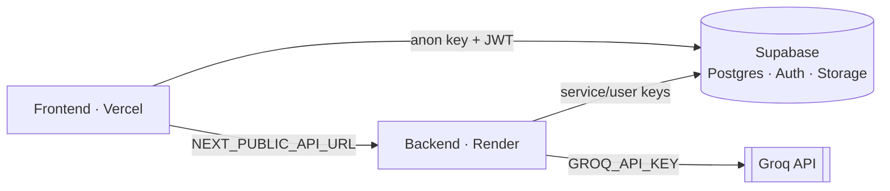

# Deployment

> How to run HireLens across development, staging, and production. Cross-refs:
> [README.md](../README.md), [SECURITY.md](./SECURITY.md),
> [ARCHITECTURE.md](./ARCHITECTURE.md).

## Topology



| Component | Recommended host | Why |
|-----------|------------------|-----|
| Frontend | **Vercel** | Native Next.js, zero-config |
| Backend | **Render** (or Railway) | Long-running ASGI, no cold-start caps, PyMuPDF-friendly |
| Backend (best-effort) | Vercel Python (`api/index.py`) | Works but constrained: ephemeral `/tmp`, 60s cap vs multi-second LLM calls |
| DB / Auth / Storage | **Supabase** | Managed Postgres + GoTrue + Storage |
| LLM | **Groq** | `llama-3.3-70b-versatile` |

---

## Environments

| | Development | Staging | Production |
|--|-------------|---------|------------|
| Frontend | `next dev` (localhost:3000) | Vercel preview | Vercel prod |
| Backend | `uvicorn app.main:app --reload` (localhost:8000) | Render (staging service) | Render (prod service) |
| Supabase | free project / local | staging project | prod project |
| `ENVIRONMENT` | `development` | `staging` | `production` |
| CORS | `*` | explicit preview origins | explicit prod origin(s) |

> In production, set `ALLOWED_ORIGINS` to explicit origins (never `*` — startup
> warns) so CORS credentials work and cross-site access is restricted.

---

## Environment variables

### Backend (`backend/.env.example`)
| Variable | Required | Purpose |
|----------|:--------:|---------|
| `ENVIRONMENT` | no | `development`\|`staging`\|`production` |
| `GROQ_API_KEY` | for AI | Groq LLM key |
| `ALLOWED_ORIGINS` | prod | comma-separated CORS origins |
| `MAX_FILE_SIZE_MB` | no | upload cap (default 10) |
| `TEMP_UPLOAD_DIR` | no | ephemeral upload dir |
| `SUPABASE_URL` | for persistence | project URL |
| `SUPABASE_ANON_KEY` | for persistence | user-scoped client key (RLS enforced) |
| `SUPABASE_SERVICE_ROLE_KEY` | admin ops | **backend-only**, bypasses RLS |
| `SUPABASE_JWT_SECRET` | for auth | HS256 token verification |
| `SIGNED_URL_TTL_SECONDS` | no | signed download lifetime (default 3600) |

### Frontend (`resume-hero-section/.env.example`)
| Variable | Required | Purpose |
|----------|:--------:|---------|
| `NEXT_PUBLIC_API_URL` | yes | backend base URL (no trailing slash) |
| `NEXT_PUBLIC_SUPABASE_URL` | for auth | Supabase project URL |
| `NEXT_PUBLIC_SUPABASE_ANON_KEY` | for auth | public anon key |

> **Both apps run with zero Supabase config** (stateless mode). Persistence and
> auth activate only when the Supabase vars are set.

---

## Supabase setup

1. Create a Supabase project; copy URL + anon + service-role keys and the JWT
   secret (Settings → API).
2. Apply migrations **in order** via the SQL editor or CLI:
   ```bash
   supabase db push          # or run supabase/migrations/0001..0004 in the SQL editor
   ```
   This creates tables, RLS, storage buckets, and the auth trigger.
3. Ensure email auth is enabled (Authentication → Providers).

---

## Backend on Render

`backend/render.yaml` (Blueprint) defines service `hirelens-api`:
- **Root dir:** `backend`
- **Build:** `pip install -r requirements.txt`
- **Start:** `uvicorn app.main:app --host 0.0.0.0 --port $PORT`
- **Health check:** `/health`
- **Runtime:** Python 3.11.9 (`runtime.txt`)
- Env vars synced via dashboard: `GROQ_API_KEY`, `ALLOWED_ORIGINS`, Supabase keys.

`Procfile` mirrors this for Railway/Heroku-style hosts:
`web: uvicorn app.main:app --host 0.0.0.0 --port ${PORT:-8000}`.

## Frontend on Vercel

1. Import repo; set project root to `resume-hero-section`.
2. Set env vars (`NEXT_PUBLIC_API_URL`, `NEXT_PUBLIC_SUPABASE_URL`,
   `NEXT_PUBLIC_SUPABASE_ANON_KEY`).
3. Deploy. `next.config.mjs` sets `images.unoptimized: true`; `vercel.json`
   (in `backend/`) is only for the best-effort Python backend on Vercel.

## Domain

Point your apex/subdomain at Vercel (frontend). Add the backend origin to
`ALLOWED_ORIGINS`. Use HTTPS everywhere; Supabase and Groq are HTTPS by default.

---

## Scaling strategy

- **Frontend:** Vercel scales automatically (edge/CDN).
- **Backend:** stateless — scale horizontally behind Render's load balancer.
  The batch pipeline is CPU/LLM-bound; move heavy batches to a queue + workers
  as volume grows (see [ROADMAP.md](./ROADMAP.md#cost-scaling-plan)).
- **Database:** Supabase vertical scaling → read replicas → connection pooling
  (PgBouncer) for many concurrent recruiters.
- **Cost control:** stored AI results mean repeat reads never re-invoke the LLM
  (see [ADR-004](./decisions/ADR-004-store-ai-output.md)).

## Disaster recovery

| Concern | Mitigation |
|---------|-----------|
| Data loss | Supabase automated backups / PITR (plan-dependent); export migrations are version-controlled |
| Region outage | Restore Supabase from backup; redeploy stateless backend elsewhere |
| Secret leak | Rotate Groq key + Supabase service key / JWT secret; service key never leaves the backend |
| Bad deploy | Vercel instant rollback; Render manual rollback / redeploy prior commit |
| LLM outage | Endpoints degrade gracefully (deterministic fallback), so the app stays up |

> **Recovery posture:** the backend holds no durable state (all state is in
> Supabase), so backend recovery is a redeploy. Durable-data recovery is a
> Supabase restore.
