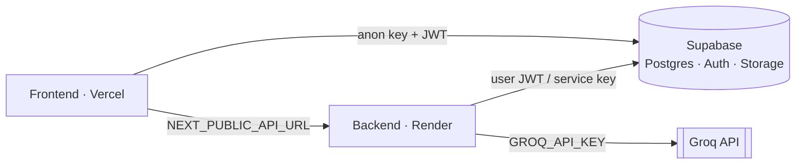

# Deployment

> How to get HireLens into production, and how to get it back out. Day-2 running is
> [OPERATIONS.md](./OPERATIONS.md); what to watch is
> [MONITORING.md](./MONITORING.md); backup and restore is
> [DISASTER_RECOVERY.md](./DISASTER_RECOVERY.md); current release status is
> [RELEASE_CANDIDATE.md](../RELEASE_CANDIDATE.md).

## Topology


```mermaid
graph LR
    FE[Frontend · Vercel] -->|NEXT_PUBLIC_API_URL| API[Backend · Render]
    FE -->|anon key + JWT| SB[(Supabase<br/>Postgres · Auth · Storage)]
    API -->|user JWT / service key| SB
    API -->|GROQ_API_KEY| Groq[[Groq API]]
```

| Component | Host | Why |
|---|---|---|
| Frontend | **Vercel** | Native Next.js 16, Node runtime for `proxy.ts` |
| Backend | **Render** | Long-running ASGI, no cold-start cap on multi-second LLM calls, PyMuPDF-friendly |
| Database · Auth · Storage | **Supabase** | Managed Postgres + GoTrue + Storage. **Paid tier required for PITR** |
| LLM | **Groq** | `llama-3.3-70b-versatile`; swappable by configuration |

**Co-locate the backend with Supabase.** Cross-region round-trips dominate
everything else: measured ~2 s per query from a distant host versus tens of
milliseconds co-located. No amount of application work compensates for that.

## Environments

| | Development | Staging | Production |
|---|---|---|---|
| Frontend | `next dev` (:3000) | Vercel preview | Vercel production |
| Backend | `uvicorn app.main:app --reload` (:8000) | Render staging service | Render production service |
| Supabase | local / free project | **dedicated staging project** | production project |
| `ENVIRONMENT` | `development` | `staging` | `production` |
| CORS | `*` | explicit preview origins | explicit production origin(s) |

Staging must be a **separate Supabase project**, not a schema inside the
production one. The release gate deletes rows; pointed at production it would
delete customer data. `release-gate.yml` refuses to run when the staging URL
equals the production URL, but the project separation is the actual control.

---

## 1. Environment variables

### Backend

| Variable | Required | Notes |
|---|:--:|---|
| `ENVIRONMENT` | **yes** | `production`. Enables fail-closed CORS validation at startup. |
| `ALLOWED_ORIGINS` | **yes** | Explicit frontend origins, comma-separated. **`*` aborts startup in production.** |
| `GROQ_API_KEY` | **yes** | AI endpoints return 503 without it. Free tier is 100k tokens/day. |
| `SUPABASE_URL` | **yes** | Project URL. Also derives the JWKS endpoint. |
| `SUPABASE_ANON_KEY` / `SUPABASE_PUBLISHABLE_KEY` | **yes** | Either name works. |
| `SUPABASE_SERVICE_ROLE_KEY` / `SUPABASE_SECRET_KEY` | **yes** | Bypasses RLS — server only, never shipped to a browser. |
| `TRUST_PROXY_HEADERS` | **yes on Render** | `true` only behind a proxy that *overwrites* `X-Forwarded-For`. Off by default so a directly-exposed instance cannot be spoofed. |
| `LOG_LEVEL` | no | Default `INFO`. Raise to `DEBUG` during an incident without a code change. An unrecognised value falls back to `INFO` rather than failing to boot. |
| `SUPABASE_JWT_SECRET` | no | Legacy HS256 only. Modern projects issue ES256 and verify via JWKS. |
| `SUPABASE_JWKS_URL` | no | Derived from `SUPABASE_URL` when unset. |
| `JWKS_CACHE_SECONDS` | no | Default 600. Bounds how long a revoked signing key could still verify. |
| `SIGNED_URL_TTL_SECONDS` | no | Default 3600. Résumé download links. |
| `MAX_FILE_SIZE_MB` | no | Default 10. |
| `TEMP_UPLOAD_DIR` | no | Must be writable; **startup fails fast if it is not**. |

`Settings` declares 67 fields, all with defaults. The table above is the subset
without which a production deployment is broken; the full surface is
`backend/app/core/config.py` and `backend/.env.example`.

> **`Settings` uses `extra="ignore"`.** A misspelled variable name in a hosting
> dashboard is **silently discarded** — no error, no warning. `SUPBASE_URL`
> yields a service that boots healthy with no database.
> `tests/test_deployment_config.py` cross-checks every name in `render.yaml` and
> the `.env.example` files against the real fields for exactly this reason, but it
> cannot see what you typed into a dashboard. After changing an env var, confirm
> the effect at `/health`.

### Frontend

| Variable | Required | Notes |
|---|:--:|---|
| `NEXT_PUBLIC_API_URL` | **yes** | Backend base URL, no trailing slash. |
| `NEXT_PUBLIC_SUPABASE_URL` | **yes** | Must be the same project as the backend's. |
| `NEXT_PUBLIC_SUPABASE_ANON_KEY` | **yes** | Anon key only. |

That is the entire frontend configuration surface, and `test_deployment_config.py`
asserts it stays that way in both directions — a variable the code reads but
nobody documents becomes an empty string in production, which surfaces as an
unexplained runtime failure rather than a configuration error.

**Anything prefixed `NEXT_PUBLIC_` is compiled into the browser bundle.** The
service-role key must never carry that prefix; there it is a full RLS bypass
handed to every visitor.

---

## 2. Dependency pinning

`requirements.txt` declares open lower bounds (`fastapi>=0.100.0`) and is the
human-readable statement of intent. **Deploys install `requirements.lock.txt`** —
the exact 49-package set the release was verified against.

This is not hygiene. Measured 2026-07-26: a clean resolve of `requirements.txt`
selected fastapi 0.140.0 and groq 1.6.0, while every gate in the Release Candidate
ran against 0.139.2 and 1.5.0. Redeploying an unchanged commit could therefore
ship a different application, and an unbounded range means a future rebuild can
pull a major release with no code change at all.

`render.yaml`, `backend/Dockerfile` and CI all install from the lock;
`test_deployment_config.py` fails if any of them drifts back. To upgrade:

```bash
cd backend
pip install -r requirements.txt --upgrade
python -m tests.test_ai_gateway          # ...and the rest of the suite
pip freeze > requirements.lock.txt       # only once it is green
```

---

## 3. Deployment steps

1. **Migrations first.** `supabase db push` (15 migrations). They are
   **forward-only** — no down scripts. Never pair a migration with an app change
   in a single un-rehearsed step.
2. **Backend.** Render picks up `backend/render.yaml`. Confirm the start command
   retains `--proxy-headers --forwarded-allow-ips="*"`; without it every caller
   shares one rate-limit bucket and HSTS is never emitted.
3. **Set backend env vars** (§1). The blueprint declares the Supabase keys as
   `sync: false`, so Render prompts for each at apply time.
4. **Verify the backend before touching the frontend** — §6.
5. **Frontend.** Import the repo on Vercel with the project root set to
   `resume-hero-section`; set the three `NEXT_PUBLIC_*` vars; deploy.
6. **Smoke test** — §7. Do not announce until it passes.
7. **Take a backup and verify it** (DR §3.2). The first backup happens *after* the
   first successful deploy, not before.

`Procfile` mirrors the Render start command for Railway/Heroku-style hosts.
`test_deployment_config.py` asserts `Procfile`, `render.yaml` and the `Dockerfile`
all keep `--proxy-headers` — if one drops it, that deployment silently loses
per-client rate limiting and stops emitting HSTS, with no error anywhere.

---

## 4. CI/CD

Vercel and Render deploy from their own Git integrations. GitHub Actions does
**not** deploy — a second deploy path would race them and make "what is live"
ambiguous. Actions is the gate.

### `.github/workflows/ci.yml` — every push and pull request

| Job | Steps |
|---|---|
| `frontend` | `pnpm install --frozen-lockfile` · `typecheck` · `lint` · `test` (101 tests) · production build · standalone build |
| `backend` | install from the lock · import + startup validation · 10 offline suites |
| `containers` | build both images, run each, assert `/health` and asset serving |

Make these **required status checks** on `main` in branch protection. A workflow
that exists but is not required is documentation, not a gate.

The `containers` job matters more than it looks. The images were authored on a
machine with no Docker daemon, so **until that job has run green the container
path is unverified** (§5). It also catches the failure mode a plain page check
calls green: `standalone` does not trace `.next/static` or `public/`, so a missing
`COPY` yields a 200 response with every stylesheet 404ing.

### `.github/workflows/release-gate.yml` — on demand, before a release

The four destructive suites (tenant isolation, decision ledger, résumé storage,
end-to-end workflow) plus the DR drill, against **staging**. They create and
delete real rows, which is why they are kept out of CI: on a shared project one
run's teardown would delete another run's fixtures, and the flake would look like
a product bug.

Requires repository secrets `STAGING_SUPABASE_URL`, `STAGING_SUPABASE_ANON_KEY`,
`STAGING_SUPABASE_SERVICE_ROLE_KEY`, `STAGING_GROQ_API_KEY`. If one is missing the
run **fails** rather than skipping — a green tick on a gate that never executed is
worse than a red one.

---

## 5. Container deployment

Render-from-source is the deployed path. The images are the portable one: another
container host, self-hosting, or `docker compose` locally.

```bash
cp .env.docker.example .env.docker      # fill in — use a STAGING Supabase project
docker compose --env-file .env.docker up --build
# frontend http://localhost:3000 · API http://localhost:8000/health
```

Postgres, Auth and Storage are **not** containerised. A local Supabase would mean
a different auth issuer, different JWKS and different RLS state from production —
exactly the divergence that makes a "works in compose" result meaningless.

**Three things that will bite you:**

- **`NEXT_PUBLIC_*` are build args, not runtime env.** They are inlined into the
  client bundle at build time, so an image built for staging cannot be promoted to
  production. There is no runtime override that fixes it.
- **`NEXT_PUBLIC_API_URL` is resolved by the browser**, so inside compose it must
  be the published host URL (`http://localhost:8000`), never the service name
  (`http://api:8000`) — that only resolves inside the Docker network.
- **`TRUST_PROXY_HEADERS` must be `false`** when the container is directly
  exposed. With no proxy overwriting `X-Forwarded-For`, trusting it lets any
  caller spoof a fresh rate-limit bucket per request.

### Verification status — read before relying on the images

| Step | Status |
|---|---|
| Dependency set resolves and installs clean, reproducing the verified 49 packages | **VERIFIED** — fresh venv, identical to the lock |
| Backend suites pass against the pinned set | **VERIFIED** — 8 offline suites pass, 1 skips by configuration, 3 destructive-gated |
| `uvicorn` start command (identical to `Procfile`) serves `/health` | **VERIFIED** — 200, all three dependencies `configured` |
| Backend `HEALTHCHECK` command | **VERIFIED** — run verbatim, exit 0 |
| Frontend standalone build emits `server.js` | **VERIFIED** |
| `.next/standalone` server serves pages and assets | **VERIFIED** — `/` and `/auth/login` 200; traced CSS and `public/` assets byte-for-byte identical to source |
| Frontend `HEALTHCHECK` command | **VERIFIED** — run verbatim, exit 0 |
| **`docker build` of either image** | **UNVERIFIED** — no Docker daemon where they were authored |
| **`docker compose up` end to end** | **UNVERIFIED** — same reason |

Every step *inside* the Dockerfiles was verified on the host; what is unverified is
Docker's own assembly of them. The `containers` CI job closes that gap — run it
before treating this path as production-ready.

---

## 6. Health checks

```
GET /health   → 200
```

Returns status, version, uptime and dependency states, and never exposes secrets
(`test_production_logging.py` asserts that). **A green deploy requires all three
dependencies `configured`:**

```json
{"dependencies": {"llm": "configured", "persistence": "configured", "auth": "configured"}}
```

`not_configured` means an env var is missing. `llm: not_configured` still serves
parsing but returns 503 from the AI endpoints.

**`persistence: not_configured` in production means the entire authenticated
product is dead while the service reports healthy.** Startup logs an `ERROR`
naming the missing variables. It is not fatal, because a stateless deployment
(public résumé analysis, no accounts) is a configuration this app deliberately
supports — but in production the far more likely cause is a forgotten env var.

Render's health check path is already `/health`. `HEAD /health` is supported and
excluded from the OpenAPI schema.

---

## 7. Production smoke test

Run in order. Stop and roll back on the first failure.

| # | Check | Expected |
|---|---|---|
| 1 | `GET /health` | 200, three dependencies `configured` |
| 2 | `GET /api/v1/me` with no token | 401 |
| 3 | `GET /api/v1/me` with a garbage token | 401, and **no** outbound Supabase Auth call in the logs |
| 4 | Response headers on an HTTPS request | `Strict-Transport-Security`, `X-Frame-Options: DENY`, CSP present |
| 5 | CORS preflight from a non-allowlisted origin | Not reflected as allowed |
| 6 | Requests from two different client IPs | Distinct rate-limit buckets (proves `--proxy-headers` + `TRUST_PROXY_HEADERS`) |
| 7 | Sign in through the UI | Lands on `/home`, no console errors |
| 8 | Create a role | Persists; appears in `/roles` |
| 9 | Upload 2 résumés | Candidates appear with scores; 2 storage objects created |
| 10 | Open a candidate | Dossier renders with `Sources: Résumé` |
| 11 | Compare 2 candidates | Ranked output, no `degraded` flag |
| 12 | Generate an interview pack | Renders; `interview.generated` in the audit log |
| 13 | `/analytics` | Counts match the data just created |
| 14 | Toggle a feature flag off, call its endpoint | 403 |
| 15 | Delete the test role | Rows **and** storage objects gone |
| 16 | Resize to 390 px | No horizontal scroll; rail collapses to 56 px |
| 17 | Take and verify a backup | `VERIFIED` |

Steps 8–15 create real data — step 15 is what leaves production clean.

---

## 8. Rollback

| Failure | Action | Notes |
|---|---|---|
| Frontend bad | Vercel → Instant Rollback | No schema coupling in the current release |
| Backend bad | Render → redeploy the previous commit | Config-only problem? Fix the env var and restart instead |
| Migration bad | **Restore; do not "un-migrate"** | Forward-only. DR §4.2, then re-apply good migrations |
| Data damaged | DR §4.1 (scoped) before §4.2 (cluster) | A scoped restore does not roll back other tenants |
| AI provider down | None needed | The orchestrator falls back and marks results `degraded` |

After **any** restore, run the isolation suite before reopening traffic:

```bash
HL_ALLOW_DESTRUCTIVE_TESTS=1 ENVIRONMENT=staging \
  python -m tests.test_tenant_isolation      # expect 25 pass / 0 fail
```

Deeper detail in [ROLLBACK.md](./ROLLBACK.md).

---

## 9. Supabase setup (new environment)

1. Create the project; copy the URL, anon key and service-role key (Settings → API).
2. Apply migrations **in order**: `supabase db push`. This creates the tables, RLS,
   the four storage buckets and the auth trigger.
3. Enable email auth (Authentication → Providers).
4. **Enable PITR** (paid tier). Without it there are no automated backups — see
   DR §3.1. This is one of the two things standing between the current release and
   READY FOR PRODUCTION.
5. Take a backup and verify it before letting anyone sign up.

## 10. Scaling

- **Frontend:** Vercel scales automatically.
- **Backend:** stateless — scale horizontally. Two caveats. The rate limiter is
  in-process, so it does **not** span replicas: with N replicas the effective
  limit is N× the configured one. Put the real limit at the edge. And the batch
  pipeline is CPU- and LLM-bound; move heavy batches to a queue and workers as
  volume grows.
- **Database:** Supabase vertical scaling → read replicas → PgBouncer pooling.
- **Cost:** stored AI results mean repeat reads never re-invoke the LLM
  ([ADR-004](./decisions/ADR-004-store-ai-output.md)). The AI endpoints were the
  cost risk while they were anonymous; since the RBAC sweep (29 Jul 2026) they
  require a recruiter JWT + `ai.use`, so spend is attributable to an organization.
  Watch per-org spend rather than relying on a WAF — see MONITORING §5.
