# Project Audit — HireLens

> **Type:** inspection & planning (no features implemented). **Date:** 2026-07-18.
> **Scope:** full repository, configuration, database (from migrations), auth,
> storage, AI, and production readiness. Audited against source of truth — the
> code and `supabase/migrations/`, not a live Supabase instance (none is
> configured in this environment; see [Phase 3](#phase-3--supabase-audit)).
> Cross-refs: [ARCHITECTURE](./ARCHITECTURE.md), [DATABASE](./DATABASE.md),
> [SECURITY](./SECURITY.md), [API](./API.md), [ROADMAP](./ROADMAP.md).

---

## 🟢 Activation update (2026-07-18) — persistence layer LIVE

The original audit below was written when **no** Supabase project was configured.
That has since been resolved and **re-verified against the live project**:

- **Env configured** (both apps). Config was made tolerant of Supabase's newer
  key names (`SUPABASE_PUBLISHABLE_KEY` / `SUPABASE_SECRET_KEY` / `SUPABASE_JWKS_URL`)
  and the browser `NEXT_PUBLIC_SUPABASE_URL` alias was added.
- **Migrations `0001–0004` applied** — all 9 tables + 4 private buckets exist live.
- **15/15 end-to-end checks passed:** `handle_new_user` + `updated_at` triggers,
  FK cascade deletes, RLS tenant isolation (anon sees 0 rows), email sign-in →
  JWT (asymmetric/JWKS) → backend validation (401 invalid / 200 valid), and
  storage upload → signed URL → download.
- **Production build:** passes (0 TS errors).

**Updated Infrastructure Readiness: ~92%** (was 25%). Remaining points are
production *hardening* (rate limiting, monitoring/alerting, custom domain,
automated test suite), not activation blockers. Section scores below that changed
are annotated inline; the pre-activation narrative is retained for history.

---

## Executive summary

HireLens is two products in one repo: a **shipped, stateless AI engine** (v1.2 —
ATS analysis, JD match, batch ranking, Copilot, PDF export) and a **code-complete
but not-yet-provisioned persistence platform** (V4 — Supabase auth, campaigns,
storage, RLS). The code is clean, well-layered, and documented. The gap to
"autonomous feature development" is **configuration and provisioning**, not
architecture: no live Supabase project is wired locally, several third-party
services named in the brief (Google OAuth, Resend, Razorpay) are **not
implemented**, and there is **no automated test suite** or rate limiting.

**Overall production readiness: ~60%** (stateless AI ~85%; V4 persistence ~55%).

| Health area | Score | One-line |
|-------------|:-----:|----------|
| Repository | 🟢 85% | Clean structure; a few README mismatches |
| Architecture | 🟢 88% | Strong layering, hybrid AI, additive persistence |
| Security | 🟡 70% | RLS + JWT + headers solid; no rate limiting, no tests |
| Database | 🟢 85% | Well-indexed, RLS everywhere; minor constraint gaps |
| AI infrastructure | 🟡 65% | Robust retries/fallback; single provider, no abstraction |
| Deployment readiness | 🟡 60% | Frontend ready; Supabase unprovisioned; no domain/monitoring |

---

## Phase 1 — Repository audit (doc ↔ code mismatches)

| # | Area | Finding | Severity |
|---|------|---------|:--------:|
| 1 | README folder structure | Lists a **`deployment/`** directory that **does not exist** | Low |
| 2 | README screenshots | References `docs/assets/placeholder-*.png` (5 files); **`docs/assets/` does not exist** → broken image links | Low |
| 3 | Version drift | Backend `APP_VERSION = "1.2.0"` while V4 persistence is merged; docs call it `v4.0.0` unreleased (intentional, but code constant is stale) | Low |
| 4 | README API section | Now updated to include persistence routes ✅ (was stateless-only) | Resolved |
| 5 | Deleted assets | `git status` shows `docs/assets/dashboard_*.png` deleted; README still points at asset paths | Low |
| 6 | New `docs/` set | `docs/*` (ARCHITECTURE, DATABASE, API, AI_PIPELINE, SECURITY, DEPLOYMENT, etc.) **match the implementation** (generated from code this session) ✅ | OK |

**Code ↔ DB ↔ API:** consistent. The `candidate_analyses.result` jsonb stores the
verbatim `CandidateResult`; API schemas (`schemas/campaign.py`) mirror the table
columns; all 19 `/api/v1` routes match [API.md](./API.md).

**Recommended fixes:** create `docs/assets/` with placeholder images (or delink),
remove the `deployment/` reference, and bump `APP_VERSION`/gate it when V4 is cut.

---

## Phase 2 — Environment variables

Sources inspected: `backend/.env.example`, `backend/.env.local` (present, keys
only — values redacted), `resume-hero-section/.env.example`,
`resume-hero-section/.env.local` (present). No Vercel/Supabase dashboards are
reachable from this environment; those columns reflect what the code expects.

| Variable | Required | Present (local) | Used by | Description | Missing? |
|----------|:--------:|:---------------:|---------|-------------|:--------:|
| `GROQ_API_KEY` | for AI | ✅ set | `groq_client` | Groq LLM key | — |
| `ENVIRONMENT` | no | ❌ (default `development`) | config/startup | Deploy env label | optional |
| `MAX_FILE_SIZE_MB` | no | ✅ | upload/body limits | Upload cap (10) | — |
| `ALLOWED_EXTENSIONS` | no | ✅ | upload validation | `.pdf,.docx` | — |
| `ALLOWED_ORIGINS` | prod | ✅ | CORS | Allowed origins | — |
| `TEMP_UPLOAD_DIR` | no | ❌ (default temp) | upload_utils | Temp dir | optional |
| `SUPABASE_URL` | persistence | ❌ **not set** | db client, auth | Project URL | **Yes (blocks V4)** |
| `SUPABASE_ANON_KEY` | persistence | ❌ **not set** | user client | Anon key | **Yes (blocks V4)** |
| `SUPABASE_SERVICE_ROLE_KEY` | admin ops | ❌ not set | service client | Bypasses RLS | for admin ops |
| `SUPABASE_JWT_SECRET` | auth | ❌ **not set** | auth.py | Verify tokens | **Yes (blocks auth)** |
| `SIGNED_URL_TTL_SECONDS` | no | ❌ (default 3600) | storage | Signed URL TTL | optional |
| `NEXT_PUBLIC_API_URL` | yes | ✅ (frontend) | `services/*.ts` | Backend base URL | — |
| `NEXT_PUBLIC_SUPABASE_URL` | auth | ❌ **not set** | supabase clients | Project URL | **Yes (blocks auth UI)** |
| `NEXT_PUBLIC_SUPABASE_ANON_KEY` | auth | ❌ **not set** | supabase clients | Anon key | **Yes (blocks auth UI)** |

**Analysis:**
- **Unused variables:** none detected — every declared setting is referenced.
- **Duplicate variables:** `SUPABASE_URL` (backend) vs `NEXT_PUBLIC_SUPABASE_URL`
  (frontend) and the two anon keys are the **same values in different scopes** —
  expected, not a defect.
- **Never commit:** `GROQ_API_KEY`, `SUPABASE_SERVICE_ROLE_KEY`,
  `SUPABASE_JWT_SECRET`. ✅ `.gitignore` covers `.env` and `.env.local`; only
  `.env.example` (placeholders) is tracked.
- **Missing from `.env.example`:** none — both example files document every var.
- **Blocking gap:** the entire V4 persistence/auth layer is **inert locally**
  because no Supabase vars are set in either `.env.local`. This is the #1 thing
  to fix before feature work on campaigns/auth.

---

## Phase 3 — Supabase audit

> ⚠️ **No live Supabase project is configured** (`SUPABASE_URL` unset). This audit
> reflects the **declared schema** in `supabase/migrations/` — the source of
> truth to be applied to a project. It has **not** been verified against a
> running instance. Do not treat "Existing" below as confirmed-in-cloud until the
> migrations are pushed and inspected.

### Existing (declared in migrations)
- **Extensions:** `pgcrypto`, `pg_trgm`.
- **Enums:** `campaign_status`, `pipeline_stage`, `message_role`, `activity_type`.
- **Tables (9):** `recruiters`, `campaigns`, `candidates`, `candidate_analyses`,
  `recruiter_notes`, `copilot_conversations`, `copilot_messages`,
  `interview_packs`, `activity_events`.
- **Views:** `candidate_latest_analysis` (`security_invoker`).
- **Functions:** `set_updated_at`, `handle_new_user`, `handle_user_email_update`.
- **Triggers:** `updated_at` on all mutable tables; `on_auth_user_created`,
  `on_auth_user_email_updated` on `auth.users`.
- **RLS:** enabled + owner policies on all 9 tables.
- **Buckets (4, private):** `resumes`, `job-descriptions`, `interview-packs`,
  `avatars`, each with object-level RLS.

### Missing (declared but not activated / not present)
- **Live project provisioning** — migrations not applied anywhere reachable here.
- **Auth providers:** only email/password intended; **Google OAuth is NOT
  configured** (code is provider-agnostic but no provider enabled).
- **Realtime:** not enabled on any table; no client subscribes.
- **`copilot_*` usage:** tables exist but the copilot route doesn't write to them yet.

### Future recommendations (migrations only — never modify prod in place)
- `0005_pagination_search.sql` — composite `(recruiter_id, created_at, id)` keyset
  indexes for pagination.
- `0006_realtime.sql` — add `candidates`, `candidate_analyses` to the realtime publication.
- `0007_organizations.sql` — multi-tenant org model (see [Phase 4](#phase-4--database-quality-review)).
- Enable Google OAuth in the dashboard when ready (no schema change).

---

## Phase 4 — Database quality review

| Aspect | Status | Notes / suggested improvement |
|--------|:------:|-------------------------------|
| Indexes | 🟢 Good | FK + query indexes present; trgm on `title`/`full_name`. Add keyset `(recruiter_id, created_at, id)` for pagination. |
| Foreign keys | 🟢 Good | All relationships FK'd with `on delete cascade`. |
| Cascade rules | 🟢 Good | Deleting recruiter/campaign cascades correctly. Consider `on delete set null` for `activity_events.candidate_id` to retain history when a candidate is deleted (currently cascades away). |
| Nullable columns | 🟡 Review | `candidates.email` nullable (OK — parsing may miss it). Consider `not null` default `''` for consistency with `full_name`. |
| Unique constraints | 🟡 Gap | No uniqueness preventing the **same candidate twice in a campaign** (e.g. `unique(campaign_id, lower(email))` partial where email present). No `unique` on `recruiter_notes`/`interview_packs` (intended). |
| Query performance | 🟢 Good | `candidate_latest_analysis` uses `distinct on`; list endpoints hydrate counts per-row (N+1 — batch with a single aggregate query at scale). |
| RLS coverage | 🟢 Complete | All 9 tables + storage objects. `force row level security` not set (owner still bypasses) — consider `force` for extra strictness. |

**Highest-value improvements:** (1) candidate-dedup unique constraint, (2) keyset
pagination indexes, (3) replace per-row `count_candidates` hydration with one
grouped query, (4) `force row level security`.

---

## Phase 5 — Authentication audit

| Item | Status | Notes |
|------|:------:|-------|
| Supabase Auth | 🟢 | Email/password via GoTrue; profile auto-provisioned by trigger |
| JWT validation | 🟢 | Local HS256 (`app/core/auth.py`), checks `exp`/`sub`/`aud`; remote fallback |
| Google OAuth | 🔴 **Not implemented** | Design is provider-agnostic; no provider enabled, no UI button |
| Session refresh | 🟢 | `middleware.ts` refreshes on every request via `@supabase/ssr` |
| Middleware | 🟢 | Guards `/dashboard`, `/campaigns`; redirects auth routes when logged in |
| Protected routes | 🟢 | Backend `require_recruiter` on all persistence endpoints |
| Role handling | 🟡 Minimal | `CurrentRecruiter.role` carried from JWT (always `authenticated`); **no RBAC / no roles table** |
| Admin flow | 🔴 **Not implemented** | No admin role, routes, or UI |
| Recruiter flow | 🟢 | Full: login → dashboard → campaigns → candidates |
| Candidate flow | 🔴 **Not implemented** | No candidate accounts/auth; candidates are data, not users |

**Security gaps:** (1) no rate limiting on auth endpoints (brute-force exposure),
(2) no MFA, (3) token revocation limited to expiry, (4) no RBAC for future
admin/team features. None are blockers for the current recruiter-only product but
all are prerequisites for multi-tenant/admin work.

---

## Phase 6 — Storage audit

All buckets **private**; keys namespaced `‹recruiter_id›/‹campaign_id›/‹candidate_id›/‹file›`.

| Bucket | Purpose | File types | Limit | Access | RLS | Signed URLs |
|--------|---------|-----------|:-----:|:------:|:---:|:-----------:|
| `resumes` | Candidate resumes | pdf, docx | 10 MB | Private | uid-prefix | ✅ backend-minted, TTL 1h |
| `job-descriptions` | Uploaded JD files | pdf, txt, docx | 5 MB | Private | uid-prefix | ✅ |
| `interview-packs` | Generated PDFs | pdf | 10 MB | Private | uid-prefix | ✅ |
| `avatars` | Recruiter avatars | png, jpeg, webp | 2 MB | Private | uid-prefix | ✅ |

- **Naming convention:** enforced by `StorageService.object_key` (rejects keys not
  prefixed with the recruiter id).
- **Public/private:** all private; downloads only via short-lived signed URLs.
- **Lifecycle recommendations:** add retention/cleanup (delete resumes when a
  candidate is deleted — currently the DB row cascades but the storage object is
  orphaned); consider moving to cold storage after N months; scan uploads for
  malware before persisting. `interview-packs`/`avatars` buckets exist but have
  **no writers yet** (feature pending).

---

## Phase 7 — AI infrastructure audit

| Aspect | Status | Notes |
|--------|:------:|-------|
| Groq integration | 🟢 | `groq_client.call_groq`, model `llama-3.3-70b-versatile`, temp 0.2, 2048 tok |
| Prompt management | 🟡 | Prompts in per-feature `*_prompts.py` modules; no versioning/registry |
| Retry logic | 🟢 | 3-tier ladder: network → JSON-parse → schema-validation |
| Rate limiting | 🔴 **None** | Only an internal `asyncio.Semaphore(5)` bounding batch concurrency |
| Timeout handling | 🟢 | 30s per request |
| Token accounting | 🔴 **None** | No usage/cost tracking per request or tenant |
| Error handling | 🟢 | Graceful degradation (deterministic fallback; batch never fails whole) |
| Provider abstraction | 🔴 **None** | Groq called directly; swapping providers requires editing `groq_client` + callers |

### Recommended provider abstraction (swap Groq/OpenAI/Anthropic/Gemini/OpenRouter without touching business logic)

```mermaid
graph LR
    Callers[analyzer · batch · match · copilot] --> I[LLMProvider interface<br/>complete&#40;system, user, schema&#41;]
    I --> G[GroqAdapter]
    I --> O[OpenAIAdapter]
    I --> A[AnthropicAdapter]
    I --> Ge[GeminiAdapter]
    I --> R[OpenRouterAdapter]
```

- Define `LLMProvider.complete(system_prompt, user_prompt, *, schema, temperature)`
  returning validated structured output.
- Move the retry/JSON-repair ladder into a shared base so every adapter inherits it.
- Select the adapter from config (`LLM_PROVIDER`, `LLM_MODEL`) — callers keep
  calling one interface. Add per-call token accounting in the base.
- Keep deterministic scoring **outside** the abstraction (it's not LLM work).

This is the single highest-leverage AI refactor (P3 impact, medium effort). See
[ADR-002](./decisions/ADR-002-groq.md).

---

## Phase 8 — Payment readiness (Razorpay) — **not implemented; spec only**

> No payment code exists. This documents what a future Razorpay integration needs.

- **Required keys:** `RAZORPAY_KEY_ID`, `RAZORPAY_KEY_SECRET`,
  `RAZORPAY_WEBHOOK_SECRET` (backend only; never `NEXT_PUBLIC_*`).
- **Webhook endpoint:** `POST /api/v1/webhooks/razorpay` — must read the **raw
  body** (signature is computed over raw bytes), return 2xx fast, process async.
- **Signature verification:** HMAC-SHA256 of the raw payload with
  `RAZORPAY_WEBHOOK_SECRET`, compared to `X-Razorpay-Signature` (constant-time).
- **Order flow:** create order server-side (`orders.create`) → return `order_id`
  to client → Razorpay Checkout → verify `razorpay_payment_id` +
  `razorpay_signature` server-side → mark paid.
- **Subscription flow:** create plan + subscription server-side; handle
  `subscription.charged`, `subscription.halted`, `subscription.cancelled` webhooks.
- **Database additions (migration only):** `subscriptions` (recruiter_id, plan,
  status, current_period_end, razorpay ids), `payments` (amount, currency,
  status, razorpay_payment_id, invoice), `plans` (code, price, limits). Add
  `recruiters.plan`/`quota` or an org-level equivalent.
- **Security:** verify every webhook signature; treat webhooks as the source of
  truth (not client callbacks); idempotency keys on payment rows; never expose
  the key secret; PCI scope stays with Razorpay (no card data touches us).

---

## Phase 9 — Email infrastructure (Resend) — **not implemented**

> No email provider is integrated (no `resend`, `nodemailer`, or SMTP anywhere).

| Piece | Status | Notes |
|-------|:------:|-------|
| Resend integration | 🔴 Missing | No SDK, no `RESEND_API_KEY` |
| Email templates | 🔴 Missing | None |
| Verification emails | 🟡 Partial | Handled by **Supabase Auth** (built-in) if enabled — not custom |
| Password reset | 🟡 Partial | Supabase Auth built-in; no custom flow/UI |
| Recruiter notifications | 🔴 Missing | e.g. "batch complete", "candidate replied" |
| Candidate notifications | 🔴 Missing | No candidate comms channel |

**Missing pieces to add:** `RESEND_API_KEY`, a `services/email_service.py`
(provider-agnostic), transactional templates (welcome, batch-complete,
digest), and event hooks (e.g. after `persist_batch`). Supabase already covers
auth-lifecycle emails (verify/reset) — custom product emails are the gap.

---

## Phase 10 — Production readiness

| Area | Score | Explanation |
|------|:-----:|-------------|
| Vercel deployment (frontend) | 🟢 90% | `next.config.mjs` ready; needs Supabase env vars set in Vercel |
| Supabase production | 🔴 40% | Migrations written but **not provisioned/applied**; no project wired |
| Domain setup | 🔴 20% | Not configured |
| HTTPS | 🟢 100% | Vercel/Render/Supabase/Groq all HTTPS by default |
| Security headers | 🟢 100% | `SecurityHeadersMiddleware` (nosniff, DENY, CSP, etc.) |
| Logging | 🟢 85% | Structured, request-id-correlated; no log aggregation/retention |
| Monitoring | 🟡 45% | `/health` with dep status; no APM/uptime/alerting wired |
| Backups | 🟡 40% | Relies on Supabase backups (plan-dependent; not verified) |
| Disaster recovery | 🟡 55% | Documented ([DEPLOYMENT.md](./DEPLOYMENT.md)); not exercised |
| Automated tests | 🔴 15% | **No test suite** in repo; verification is manual (TestClient/tsc) |
| Rate limiting | 🔴 0% | None |

**Overall: ~60%.** The **stateless AI product is ~85% production-ready** (already
has a live demo). The **V4 persistence platform is ~55%** — code-complete but
gated on provisioning, env config, tests, and rate limiting.

---

## Phase 11 — Technical debt backlog

### 🔴 Critical
| Item | Why it matters | Effort | Risk | Sprint |
|------|----------------|:------:|:----:|:------:|
| Provision Supabase + set env (both apps) | V4 auth/persistence is inert without it | S | Low | V4 S2 |
| No automated tests | Regressions ship silently; blocks confident autonomous dev | L | High | V4 S2 |
| No rate limiting (auth + AI) | Brute-force + cost-abuse exposure | M | High | V4 S2 |

### 🟠 High
| Item | Why | Effort | Risk | Sprint |
|------|-----|:------:|:----:|:------:|
| Wire Copilot conversation persistence | Tables exist but unused; feature half-built | M | Med | V4 S2 |
| Client-side resume upload to storage | Resumes analyzed then discarded | M | Med | V4 S2 |
| Candidate-dedup unique constraint | Duplicate candidates per campaign | S | Med | V4 S2 |
| Keyset pagination + grouped counts | List endpoints won't scale (N+1) | M | Med | V4 S2 |

### 🟡 Medium
| Item | Why | Effort | Risk | Sprint |
|------|-----|:------:|:----:|:------:|
| LLM provider abstraction | Vendor lock-in; enables cost/failover | M | Low | V4 S3 |
| Monitoring/alerting + log retention | Blind to prod incidents | M | Med | V4 S3 |
| Storage lifecycle/orphan cleanup | Orphaned files on candidate delete | S | Low | V4 S3 |
| Token accounting | No cost visibility per tenant | M | Low | V4 S3 |
| README asset/dir mismatches | Broken images; minor polish | S | Low | V4 S2 |

### 🟢 Low
| Item | Why | Effort | Risk | Sprint |
|------|-----|:------:|:----:|:------:|
| Bump `APP_VERSION` for V4 | Stale version constant | XS | Low | V4 S2 |
| `force row level security` | Extra strictness | XS | Low | V4 S3 |
| Prompt versioning/registry | Maintainability | M | Low | Later |

---

## Phase 12 — Final audit report

### Repository health — 🟢 85%
Clean monorepo (backend / frontend / supabase / docs). Layering is textbook
(routes → services/repositories → parser/nlp/llm). Minor README mismatches
(missing `deployment/` and `docs/assets/`). Documentation set is complete and
accurate.

### Architecture health — 🟢 88%
Hybrid AI (deterministic scoring + LLM text) is a genuine strength; persistence
was added additively without touching AI logic; graceful degradation throughout.

### Security health — 🟡 70%
RLS on every table + storage object, JWT verification, security headers, magic-byte
file validation, secrets kept out of git. Gaps: no rate limiting, no tests, no
RBAC, verification depends on Supabase provisioning.

### Database health — 🟢 85%
Well-indexed, fully FK'd, RLS-complete, versioned migrations. Gaps: candidate
dedup constraint, pagination indexes, N+1 count hydration.

### AI infrastructure — 🟡 65%
Excellent reliability (retry ladder + fallback). Gaps: single provider, no
abstraction, no rate limiting, no token accounting.

### Deployment readiness — 🟡 60%
Frontend deploy-ready; backend host configs present; **Supabase unprovisioned**;
no domain/monitoring/tests.

### Missing configurations (do before feature work)
1. Set `SUPABASE_URL`, `SUPABASE_ANON_KEY`, `SUPABASE_SERVICE_ROLE_KEY`,
   `SUPABASE_JWT_SECRET` in `backend/.env.local` (+ Render).
2. Set `NEXT_PUBLIC_SUPABASE_URL`, `NEXT_PUBLIC_SUPABASE_ANON_KEY` in
   `resume-hero-section/.env.local` (+ Vercel).
3. Apply `supabase/migrations/0001–0004` to a Supabase project.
4. (When needed) `RESEND_API_KEY`, Razorpay keys — not yet required.

### Recommended next steps
1. Provision Supabase + wire env → smoke-test the full auth→campaign→persist flow.
2. Add a minimal automated test suite (backend `pytest` + a frontend build/CI gate).
3. Add rate limiting (auth + AI endpoints).
4. Complete the two half-built features (Copilot persistence, resume storage).
5. Fix README mismatches; bump version constant.

---

## Ready for Autonomous Feature Development

- [x] Repository structure understood and documented
- [x] Architecture, database, API, AI pipeline documented and verified against code
- [x] Every environment variable identified, mapped to its consumer, and gap-flagged
- [x] Database schema (tables, RLS, triggers, storage) audited from migrations
- [x] Auth model understood (recruiter-only; OAuth/roles/admin/candidate flows confirmed **absent**)
- [x] AI pipeline + provider-swap path documented
- [x] Payment (Razorpay) and email (Resend) requirements specified (not implemented)
- [x] Production-readiness scored with explanations
- [x] Prioritized technical-debt backlog created
- [x] **Supabase project provisioned and env vars set** — ✅ live-verified 2026-07-18 (15/15 e2e)
- [ ] **Automated test suite in place** (needed for safe autonomous changes)
- [ ] **Rate limiting added** (needed before public exposure)

> **Verdict:** the persistence infrastructure is **fully operational** and
> verified end-to-end against the live project. The codebase is understood well
> enough to build features autonomously without re-asking about structure or
> config. Two production-hardening items remain (automated tests, rate limiting)
> — recommended before public exposure, but they no longer block feature work on
> the persistence layer.
