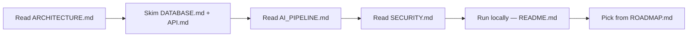

# HireLens Documentation

> The single source of truth for HireLens — an AI-powered hiring intelligence
> platform. Start here, then follow the links.

HireLens turns raw resumes into ranked, explained, **persistent** hiring
intelligence using a hybrid engine: deterministic Python for all scoring and
an LLM (Groq Llama-3.3) for human-grade reasoning. As of **V4** it is a
stateful SaaS platform with recruiter accounts, hiring campaigns, and storage.

---

## Map of the docs

| Doc | What's inside |
|-----|---------------|
| [ARCHITECTURE.md](./ARCHITECTURE.md) | System layers, request & auth lifecycles, recruiter/candidate flows (Mermaid) |
| [DATABASE.md](./DATABASE.md) | Migrations, tables, relationships, indexes, triggers, RLS, storage |
| [API.md](./API.md) | Every endpoint: method, auth, request, response, errors |
| [AI_PIPELINE.md](./AI_PIPELINE.md) | Parse → extract → score → LLM → persist; why results are stored |
| [SECURITY.md](./SECURITY.md) | Auth, authorization, JWT, RLS, storage, file validation, secrets |
| [DEPLOYMENT.md](./DEPLOYMENT.md) | Dev/staging/prod, env vars, Vercel, Render, Supabase, DR |
| [FEATURES.md](./FEATURES.md) | Full feature inventory with status & priority |
| [ROADMAP.md](./ROADMAP.md) | Vision, phases, priority matrix, cost scaling |
| [CHANGELOG.md](./CHANGELOG.md) | Semantic version history |
| [PROJECT_AUDIT.md](./PROJECT_AUDIT.md) | Full project audit: config, DB, auth, AI, readiness, tech-debt backlog |
| [sprints/](./sprints/) | Per-sprint implementation records |
| [decisions/](./decisions/) | Architecture Decision Records (ADRs) |

---

## Quick orientation for a new engineer



- **What is this?** A hybrid AI hiring platform — see [ARCHITECTURE.md](./ARCHITECTURE.md).
- **Where's the data?** Supabase Postgres — see [DATABASE.md](./DATABASE.md).
- **How does the AI work?** [AI_PIPELINE.md](./AI_PIPELINE.md).
- **How do I call it?** [API.md](./API.md).
- **How do I run it?** Root [README.md](../README.md) → *Running locally*.

---

## Repository layout

```text
Resume-Parser/
├── backend/                 # FastAPI service (AI pipeline + persistence API)
│   └── app/{core,db,llm,nlp,parser,repositories,routes,schemas,services}
├── resume-hero-section/     # Next.js 16 frontend (App Router)
│   └── {app,components,lib,services,types}
├── supabase/migrations/     # SQL: schema, RLS, storage, auth triggers
├── docs/                    # ← you are here
│   ├── sprints/  decisions/
└── README.md
```

---

## Conventions

- **Never invent features** — docs describe only what's in the codebase; planned
  work is explicitly marked 🗓️.
- **Cross-link** related docs rather than duplicating.
- **Migrations are immutable** — add a new numbered file, never edit a shipped one.
- **Numeric authority is deterministic** — the LLM never sets scores.

Contributions welcome — see the root [README.md](../README.md#contributing).
