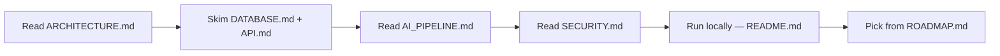

# HireLens Documentation

> The single source of truth for HireLens — an AI-powered hiring intelligence
> platform. Start here, then follow the links.

HireLens turns raw resumes into ranked, explained, **persistent** hiring
intelligence using a hybrid engine: deterministic Python for all scoring and
an LLM (Groq Llama-3.3) for human-grade reasoning. As of **V4** it is a
stateful SaaS platform with recruiter accounts, hiring campaigns, and storage.

---

## Map of the docs

| Doc | What's inside |
|-----|---------------|
| [ARCHITECTURE.md](./ARCHITECTURE.md) | **The final V4 architecture — frozen.** System layers, request & auth lifecycles, data lineage, extension points |
| [../CONTRIBUTING.md](../CONTRIBUTING.md) | What may change under the freeze, the gate, schema-change rules |
| [DATABASE.md](./DATABASE.md) | Migrations, tables, relationships, indexes, triggers, RLS, storage |
| [API.md](./API.md) | Every endpoint: method, auth, request, response, errors |
| [AI_PIPELINE.md](./AI_PIPELINE.md) | Parse → extract → score → LLM → persist; why results are stored |
| [AI_ARCHITECTURE.md](./AI_ARCHITECTURE.md) | AI Foundation Layer — orchestrator, providers, prompts, context, observability |
| [SECURITY.md](./SECURITY.md) | Auth, authorization, JWT, RLS, storage, file validation, secrets |
| [DEPLOYMENT.md](./DEPLOYMENT.md) | Env vars, dependency pinning, deploy steps, CI/CD, containers, health checks, smoke test, rollback |
| [OPERATIONS.md](./OPERATIONS.md) | Day-2 running: routine tasks, runbooks, incident response, secrets rotation, erasure requests, known limits |
| [MONITORING.md](./MONITORING.md) | Logging, health, the alert set, latency baselines, and what is *not* instrumented |
| [DISASTER_RECOVERY.md](./DISASTER_RECOVERY.md) | Backup, verify, restore — each procedure marked VERIFIED or UNVERIFIED |
| [../RELEASE_CANDIDATE.md](../RELEASE_CANDIDATE.md) | Current release status, remaining issues, accepted debt |
| [FEATURES.md](./FEATURES.md) | Full feature inventory with status & priority |
| [ROADMAP.md](./ROADMAP.md) | Vision, phases, priority matrix, cost scaling |
| [CHANGELOG.md](../CHANGELOG.md) | Semantic version history |
| [PROJECT_AUDIT.md](./PROJECT_AUDIT.md) | Full project audit: config, DB, auth, AI, readiness, tech-debt backlog |
| [MONETIZATION_ARCHITECTURE.md](./MONETIZATION_ARCHITECTURE.md) | Plans, entitlements, quotas — the commercial layer's design |
| [OPERATIONAL_HARDENING_BACKLOG.md](./OPERATIONAL_HARDENING_BACKLOG.md) | PITR, audit trail, retention, deletion procedure — **blocks first payment** |
| [MIGRATION_ROLLBACK_NOTES.md](./MIGRATION_ROLLBACK_NOTES.md) | Per-migration rollback strategy for the billing schema (0022–0027) |
| [BILLING_ARCHITECTURE.md](./BILLING_ARCHITECTURE.md) | Phase 4 — Razorpay subscriptions, mandates, webhooks, dunning. The design |
| [BILLING_TODO.md](./BILLING_TODO.md) | **Every open payment item**, with blast radius and priority. Start here before touching billing |
| [HANDOFF.md](./HANDOFF.md) | Current state of the monetization work; §12 is the live section |
| [RELEASE_CANDIDATE_CHECKLIST.md](./RELEASE_CANDIDATE_CHECKLIST.md) | **The release gate.** Nothing ships until its P0 boxes are ticked |
| [decisions/](./decisions/) | Architecture Decision Records (ADRs) |
| [security/](./security/) | Permission matrix, tenant isolation, security validation |
| [qa/](./qa/) | Runtime validation records, cited by the backend test suite |
| [archive/](./archive/) | Finished work — completed sprints, superseded programs. Not authoritative |

---

## Quick orientation for a new engineer


```mermaid
graph LR
    A[Read ARCHITECTURE.md] --> B[Skim DATABASE.md + API.md]
    B --> C[Read AI_PIPELINE.md]
    C --> D[Read SECURITY.md]
    D --> E[Run locally — README.md]
    E --> F[Pick from ROADMAP.md]
```

- **What is this?** A hybrid AI hiring platform — see [ARCHITECTURE.md](./ARCHITECTURE.md).
- **Where's the data?** Supabase Postgres — see [DATABASE.md](./DATABASE.md).
- **How does the AI work?** [AI_PIPELINE.md](./AI_PIPELINE.md).
- **How do I call it?** [API.md](./API.md).
- **How do I run it?** Root [README.md](../README.md) → *Running locally*.

---

## Repository layout

```text
Resume-Parser/
├── backend/                 # FastAPI service (AI pipeline + persistence API)
│   └── app/{core,db,llm,nlp,parser,repositories,routes,schemas,services}
├── resume-hero-section/     # Next.js 16 frontend (App Router)
│   └── {app,components,lib,services,types}
├── supabase/migrations/     # SQL: schema, RLS, storage, auth triggers
├── docs/                    # ← you are here
│   ├── decisions/  security/  qa/  rca/
│   └── archive/             # finished work, kept for the record
└── README.md
```

---

## Conventions

- **Never invent features** — docs describe only what's in the codebase; planned
  work is explicitly marked 🗓️.
- **Cross-link** related docs rather than duplicating.
- **Migrations are immutable** — add a new numbered file, never edit a shipped one.
- **Numeric authority is deterministic** — the LLM never sets scores.

Contributions welcome — see the root [README.md](../README.md#contributing).
