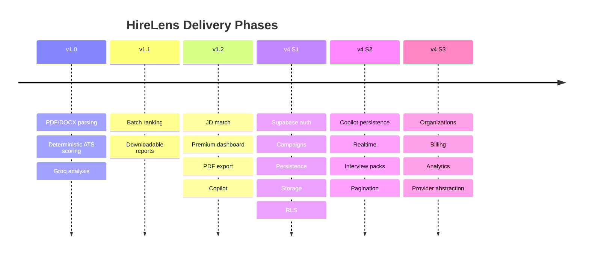

# Roadmap

> Forward-looking product and engineering direction. This is **not** a changelog
> — completed work lives in [CHANGELOG.md](./CHANGELOG.md) and
> [sprints/](./sprints/). Here we track vision, phases, and what is
> **Implemented**, **In Progress**, or **Planned**.

---

## Vision

Make hiring intelligent, fair, and fast — replacing dumb keyword ATS filters
with a hybrid engine that combines **deterministic scoring** (no hallucinated
numbers) and **generative reasoning** (human-grade insight), on a persistent
platform recruiters return to every day.

## Mission

Give every recruiting team a system that parses any resume reliably, ranks
candidates transparently, explains its reasoning, and remembers everything —
so no qualified candidate is lost to formatting and no decision is a black box.

## Current version

- **Shipped:** `v1.2.0` — stateless AI: ATS analysis, JD match, batch ranking,
  Copilot, PDF export.
- **In development:** `v4.0.0` — **Supabase Foundation** (auth, campaigns,
  persistence, storage, RLS). Sprint 1 is feature-complete and the persistence
  infrastructure is **activated & live-verified** (2026-07-18, 15/15 e2e checks);
  see [sprints/V4_SPRINT1.md](./sprints/V4_SPRINT1.md) and
  [PROJECT_AUDIT.md](./PROJECT_AUDIT.md).

---

## Status legend

| Symbol | Meaning |
|:------:|---------|
| ✅ | Implemented (in the codebase today) |
| 🚧 | In Progress (partially built) |
| 🗓️ | Planned (not started) |

---

## Feature roadmap

### ✅ Implemented
- Hybrid resume parsing (PDF/DOCX) + deterministic ATS scoring
- Groq Llama-3 qualitative analysis (summary, strengths, gaps, readiness)
- Job-description match analysis
- Batch resume ranking with analytics
- AI Recruiter Copilot (grounded Q&A per candidate)
- PDF report export (ATS + Match)
- **Recruiter authentication** (email + password, Supabase)
- **Hiring Campaigns** (CRUD, candidates, pipeline stages, notes, activity)
- **Persistence** of batch AI output (`candidate_analyses`, referenced not recomputed)
- **Private storage** buckets + signed URLs
- **Row Level Security** across all tables and storage

### 🚧 In Progress
- Copilot conversation persistence (tables + repository exist; route auto-save pending)
- Client-side resume upload to storage during batch (endpoint exists; batch flow wiring pending)
- Recruiter onboarding flow (profile fields exist; guided UX pending)

### 🗓️ Planned
- Realtime pipeline board (Supabase Realtime)
- Interview-pack generation → PDF in `interview-packs` bucket
- Keyset pagination + server-side search (trgm indexes already in place)
- OAuth providers (Google / GitHub)
- Organizations / teams (multi-seat) + billing
- Rate limiting + audit log
- Analytics dashboards from `candidate_analyses` projections
- AI provider abstraction (multi-model routing / failover)

---

## Development phases

| Phase | Theme | Status |
|-------|-------|:------:|
| v1.0–v1.2 | Stateless AI intelligence | ✅ |
| **V4 Sprint 1** | Persistence foundation | ✅ |
| V4 Sprint 2 | Realtime + Copilot memory + packs | 🗓️ |
| V4 Sprint 3 | Multi-tenant org, billing, analytics | 🗓️ |

---

## Priority matrix

| Initiative | Impact | Effort | Priority |
|-----------|:------:|:------:|:--------:|
| Copilot conversation persistence | High | Low | **P0** |
| Client-side resume upload in batch | High | Low | **P0** |
| Rate limiting | High | Medium | **P1** |
| Realtime pipeline board | High | Medium | **P1** |
| Keyset pagination + search | Medium | Low | **P1** |
| OAuth providers | Medium | Low | P2 |
| Organizations / teams | High | High | P2 |
| Billing / payments | High | High | P2 |
| AI provider abstraction | Medium | Medium | P3 |
| Analytics dashboards | Medium | Medium | P3 |

---

## Cost scaling plan

| Stage | Users | Compute | Data | Est. monthly |
|-------|-------|---------|------|--------------|
| Prototype | 1–50 | Render free / Vercel hobby | Supabase free (500 MB) | ~$0 |
| Early | 50–1k | Render starter, Vercel Pro | Supabase Pro (8 GB) | ~$50–100 |
| Growth | 1k–10k | Horizontal API + queue for LLM | Supabase Team, read replicas | ~$500–1.5k |
| Scale | 10k+ | Autoscaling, cache, batch queue | Dedicated Postgres, storage CDN | usage-based |

**LLM cost control:** results are **stored, not recomputed** (see
[ADR-004](./decisions/ADR-004-store-ai-output.md)), so repeat views cost nothing.
Groq is chosen for low per-token cost and high throughput; a provider abstraction
(planned) will allow routing to cheaper/faster models per task.

---

## Long-term vision

A hiring operating system: every candidate a recruiter has ever seen, searchable
and explained; every campaign a living pipeline with realtime collaboration;
every decision auditable; and an AI layer that is model-agnostic, cost-aware, and
never a black box.
