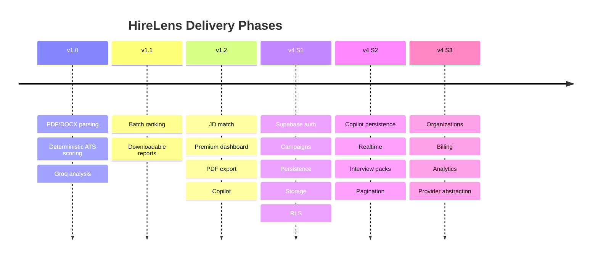

# Roadmap

> Forward-looking product and engineering direction. This is **not** a changelog
> — completed work lives in [CHANGELOG.md](./CHANGELOG.md) and
> [sprints/](./sprints/). Here we track vision, phases, and what is
> **Implemented**, **In Progress**, or **Planned**.

---

## Vision

Make hiring intelligent, fair, and fast — replacing dumb keyword ATS filters
with a hybrid engine that combines **deterministic scoring** (no hallucinated
numbers) and **generative reasoning** (human-grade insight), on a persistent
platform recruiters return to every day.

## Mission

Give every recruiting team a system that parses any resume reliably, ranks
candidates transparently, explains its reasoning, and remembers everything —
so no qualified candidate is lost to formatting and no decision is a black box.

## Current version

- **Shipped:** `v1.2.0` — stateless AI: ATS analysis, JD match, batch ranking,
  Copilot, PDF export.
- **In development:** `v4.0.0` — **Supabase Foundation** (auth, campaigns,
  persistence, storage, RLS). Sprint 1 is feature-complete and the persistence
  infrastructure is **activated & live-verified** (2026-07-18, 15/15 e2e checks);
  see [sprints/V4_SPRINT1.md](./sprints/V4_SPRINT1.md) and
  [PROJECT_AUDIT.md](./PROJECT_AUDIT.md).

---

## Status legend

| Symbol | Meaning |
|:------:|---------|
| ✅ | Implemented (in the codebase today) |
| 🚧 | In Progress (partially built) |
| 🗓️ | Planned (not started) |

---

## Post-v1.0 — Deferred from stabilization (prioritized future work)

These were **intentionally not built** for the v1.0 freeze because they require
external infrastructure or a product decision, not because they are defects. See
[KNOWN_LIMITATIONS.md](./KNOWN_LIMITATIONS.md).

| Priority | Item | Why deferred | Notes |
|:--------:|------|--------------|-------|
| **P0** | **AI provider fallback** | Needs a second provider key (external) | The multi-provider gateway already exists; add a key and the 429-break fails over automatically. Top availability item. |
| **P1** | **pgvector + HNSW** for semantic search | DB extension + migration (external infra) | Replace in-process cosine with a `match_candidates` RPC (`ORDER BY embedding <=> q LIMIT k`); needed for 1000+ candidates/recruiter. |
| **P1** | **Server-side pagination** (candidate/campaign lists) | Coordinated frontend contract change | Keyset/offset; unblocks large campaigns. |
| **P1** | **Background first-index** | Job runner | Move lazy reindex off the request path. |
| **P2** | **Granular RBAC enforcement** | Product decision on role capabilities | `CAMPAIGN_MANAGE`/`AI_USE`/etc. are defined; decide what viewer/interviewer may do, then gate routes. |
| **P2** | **Edge rate limiting** (WAF/proxy) | External infra | Complements the in-app per-IP safety net with global limits. |
| **P2** | **Auth for public analyzer endpoints** | Product decision | Keep the public job-seeker analyzer, or gate `/ats-analysis`/`/batch-analysis`. |
| **P3** | Neural embeddings (`EMBEDDING_PROVIDER=openai/voyage`) | External key | Higher recall than the hashing default. |
| **P3** | Minor hardening | — | OAuth `state` validation, invite-by-token, dedicated `INTEGRATION_ENCRYPTION_KEY`. |

---

## Feature roadmap

### ✅ Implemented
- Hybrid resume parsing (PDF/DOCX) + deterministic ATS scoring
- Groq Llama-3 qualitative analysis (summary, strengths, gaps, readiness)
- Job-description match analysis
- Batch resume ranking with analytics
- AI Recruiter Copilot (grounded Q&A per candidate)
- PDF report export (ATS + Match)
- **Recruiter authentication** (email + password, Supabase)
- **Hiring Campaigns** (CRUD, candidates, pipeline stages, notes, activity)
- **Persistence** of batch AI output (`candidate_analyses`, referenced not recomputed)
- **Private storage** buckets + signed URLs
- **Row Level Security** across all tables and storage
- **Recruiter Workspace (Sprint 2)** — campaign dashboard, candidate management
  table (ranking, filters, bulk actions), candidate detail page, intelligent
  upload queue, and the Executive Intelligence analytics dashboard (`/insights`)
- **AI Foundation Layer (Sprint 3)** — central orchestrator + provider
  abstraction + prompt/context/schema registries + observability; resume analysis
  and job matching migrated through it ([AI_ARCHITECTURE.md](./AI_ARCHITECTURE.md))
- **AI Recruiter Copilot (Sprint 4)** — ambient, context-aware assistant on the
  orchestration layer: server-side context resolution (grounded, priority-ordered),
  structured responses with Sources Used, persistent page-scoped conversations, and
  a global Cursor-style panel ([sprints/V4_SPRINT4.md](./sprints/V4_SPRINT4.md),
  [ADR-007](./decisions/ADR-007-ai-recruiter-copilot.md))
- **AI Candidate Comparison (Sprint 5)** — an AI Hiring Analyst comparing 2–5
  candidates into an executive report (rankings, skill matrix, risks, hiring
  recommendation, interview focus, trade-offs); one engine reused by the campaign
  UI and the Copilot ([sprints/V4_SPRINT5.md](./sprints/V4_SPRINT5.md),
  [ADR-008](./decisions/ADR-008-ai-candidate-comparison.md))
- **AI Semantic Talent Search (Sprint 6)** — embedding-based retrieval (separate
  from the LLM): natural-language search, "find similar candidates", provider- and
  vector-store-agnostic; reused by the Copilot
  ([sprints/V4_SPRINT6.md](./sprints/V4_SPRINT6.md),
  [ADR-009](./decisions/ADR-009-semantic-search-architecture.md))
- **AI Interview Intelligence (Sprint 7)** — a complete interview workbench
  (strategy, technical & behavioral questions, skill verification, risk analysis,
  interviewer scorecard, hiring recommendation) with PDF export; one engine reused
  by candidate detail, the Copilot, and Comparison
  ([sprints/V4_SPRINT7.md](./sprints/V4_SPRINT7.md),
  [ADR-010](./decisions/ADR-010-interview-intelligence-engine.md))
- **Multi-Provider AI Gateway (Sprint 7.5)** — logical model roles, model +
  provider registries, configurable fallback, cost/health tracking, runtime
  provider switch; swap Groq/Gemini/Anthropic/OpenAI/OpenRouter and embedding
  providers by configuration only ([sprints/V4_SPRINT7_5.md](./sprints/V4_SPRINT7_5.md),
  [ADR-011](./decisions/ADR-011-ai-gateway-and-provider-management.md))
- **Executive Hiring Intelligence (Sprint 8)** — AI executive reports grounded in
  real platform data (pipeline health, campaign intelligence, recruiter
  productivity, skill gaps, hiring risks, prioritised recommendations, talent
  snapshot) with PDF export; schedulable service; reused by the Copilot
  ([sprints/V4_SPRINT8.md](./sprints/V4_SPRINT8.md),
  [ADR-012](./decisions/ADR-012-executive-intelligence-architecture.md))
- **Autonomous Recruiting Agent (Sprint 9)** — proactive agent that coordinates the
  existing engines via a tool registry, runs 5 workflows (stalled campaign,
  high-potential candidate, weak pool, interview backlog, deadline risk), and
  produces explainable, human-approved recommendations; scheduler-ready; reused by
  the Copilot ([sprints/V4_SPRINT9.md](./sprints/V4_SPRINT9.md),
  [ADR-013](./decisions/ADR-013-autonomous-agent-architecture.md))
- **Enterprise Platform & Organizations (V6 Sprint 10)** — multi-tenant orgs +
  workspaces, policy-based RBAC, immutable audit log, org usage accounting,
  subscription plans + limits, per-org feature flags, scoped API keys, and an Admin
  Console; layered additively over V5 ([sprints/V6_SPRINT10.md](./sprints/V6_SPRINT10.md),
  [ADR-014](./decisions/ADR-014-enterprise-platform-architecture.md))
- **Integration Platform & Workflow Automation (V6 Sprint 11)** — provider-plugin
  integration layer (Gmail/Outlook/Calendar/Slack/Teams/Meet/Zoom/ATS/webhook) with
  OAuth + encrypted credentials, event-driven automation rules, retry/backoff,
  execution history + replay, and an Integration Hub; Agent → Workflow → Integration
  ([sprints/V6_SPRINT11.md](./sprints/V6_SPRINT11.md),
  [ADR-015](./decisions/ADR-015-integration-platform-architecture.md))
- **Organizational Knowledge & Long-Term Memory (V7 Sprint 12)** — structured,
  time-aware, org-scoped recruiting memory (extraction, explainable retrieval, graph,
  timeline, emergent preferences) injected into every AI capability before reasoning;
  Knowledge Center; independent of the AI gateway
  ([sprints/V7_SPRINT12.md](./sprints/V7_SPRINT12.md),
  [ADR-016](./decisions/ADR-016-organizational-knowledge-architecture.md))
- **Predictive Intelligence & Digital Twin (V8 Sprint 13)** — deterministic
  Organizational Digital Twin + forecasts (completion, delay, offer, capacity, skill
  shortage, cost, pipeline health) + scenario simulation; explainable, evidence-backed;
  AI explains but never generates; Predictive Intelligence workspace
  ([sprints/V8_SPRINT13.md](./sprints/V8_SPRINT13.md),
  [ADR-017](./decisions/ADR-017-predictive-intelligence-architecture.md))

### 🚧 In Progress
- Resume binary → `resumes` bucket during upload (analysis works; file not yet stored)
- Recruiter onboarding flow (profile fields exist; guided UX pending)

### 🗓️ Planned
- Copilot streaming responses (backend already streaming-compatible)
- Autonomous execution of approved agent actions (the `executed` state + tool params
  are ready) · scheduled agent scans & executive briefings (both services are
  scheduler-ready) · multi-agent collaboration · talent recommendations
- Persisted interview packs (the `interview_packs` table exists) + server-rendered PDF
- Neural embeddings in production (swap `EMBEDDING_PROVIDER` to OpenAI/Voyage) +
  optional pgvector backend for large tenants; server-side saved searches
- Realtime pipeline board (Supabase Realtime)
- Keyset pagination + server-side search (trgm indexes already in place)
- OAuth providers (Google / GitHub)
- Payment processing + metered billing on top of the subscription foundation
- Per-row `organization_id` denormalization on campaigns/candidates; rate limiting
- Automated cost/health-based provider routing + per-workspace provider tiers
  (the AI Gateway now exists; manual + config switching ships today)
- Durable usage/cost persistence + dashboards (in-memory tracker ships today)
- Migrate the batch LLM path onto the orchestrator (copilot done)

---

## Development phases

| Phase | Theme | Status |
|-------|-------|:------:|
| v1.0–v1.2 | Stateless AI intelligence | ✅ |
| **V4 Sprint 1** | Persistence foundation | ✅ |
| **V4 Sprint 2** | Recruiter Workspace (dashboard, candidates, upload, analytics) | ✅ |
| V4 Sprint 3 | Realtime · Copilot memory · pagination · orgs/billing | 🗓️ |

---

## Priority matrix

| Initiative | Impact | Effort | Priority |
|-----------|:------:|:------:|:--------:|
| Copilot conversation persistence | High | Low | **P0** |
| Client-side resume upload in batch | High | Low | **P0** |
| Rate limiting | High | Medium | **P1** |
| Realtime pipeline board | High | Medium | **P1** |
| Keyset pagination + search | Medium | Low | **P1** |
| OAuth providers | Medium | Low | P2 |
| Organizations / teams | High | High | P2 |
| Billing / payments | High | High | P2 |
| AI provider abstraction | Medium | Medium | P3 |
| Analytics dashboards | Medium | Medium | P3 |

---

## Cost scaling plan

| Stage | Users | Compute | Data | Est. monthly |
|-------|-------|---------|------|--------------|
| Prototype | 1–50 | Render free / Vercel hobby | Supabase free (500 MB) | ~$0 |
| Early | 50–1k | Render starter, Vercel Pro | Supabase Pro (8 GB) | ~$50–100 |
| Growth | 1k–10k | Horizontal API + queue for LLM | Supabase Team, read replicas | ~$500–1.5k |
| Scale | 10k+ | Autoscaling, cache, batch queue | Dedicated Postgres, storage CDN | usage-based |

**LLM cost control:** results are **stored, not recomputed** (see
[ADR-004](./decisions/ADR-004-store-ai-output.md)), so repeat views cost nothing.
Groq is chosen for low per-token cost and high throughput; a provider abstraction
(planned) will allow routing to cheaper/faster models per task.

---

## Long-term vision

A hiring operating system: every candidate a recruiter has ever seen, searchable
and explained; every campaign a living pipeline with realtime collaboration;
every decision auditable; and an AI layer that is model-agnostic, cost-aware, and
never a black box.
