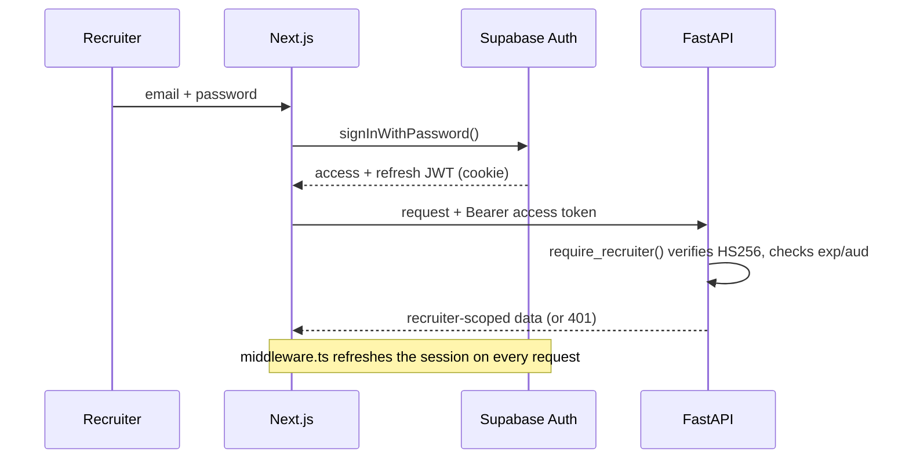

# Security

> How HireLens authenticates recruiters, authorizes data access, protects files,
> and manages secrets. Cross-refs: [ARCHITECTURE.md](./ARCHITECTURE.md),
> [DATABASE.md](./DATABASE.md), [API.md](./API.md).

Security posture in one line: **the backend talks to Postgres and Storage as the
authenticated end user, so Row Level Security is the ultimate guard on every
row and object — with repository-level scoping as defense in depth.**

---

## Authentication

- **Provider:** Supabase Auth (GoTrue). Method: **email + password** (V4 Sprint 1).
- **Tokens:** Supabase issues a short-lived **JWT access token** + refresh token.
  The Next.js frontend stores the session in cookies (SSR via `@supabase/ssr`)
  and attaches the access token as `Authorization: Bearer <token>` on API calls.
- **Backend verification** (`backend/app/core/auth.py`):
  - Primary path: **local HS256 verification** against `SUPABASE_JWT_SECRET`
    (no network round-trip). Requires `exp` and `sub`, checks `aud`
    (`SUPABASE_JWT_AUD`, default `authenticated`).
  - Fallback: if no shared secret is configured, the token is validated remotely
    via `supabase.auth.get_user(token)`.
  - Resolves a `CurrentRecruiter(id, email, access_token, role, claims)`.
- **Dependencies:** `require_recruiter` (raises 401/503) and `optional_recruiter`
  (returns `None` for anonymous callers — used by endpoints that persist *only*
  when authenticated while remaining backward-compatible).

### Authentication lifecycle

**OAuth-ready:** nothing in the verification path is password-specific. Any
Supabase-issued token (Google, GitHub, SSO, magic link) verifies identically —
adding a provider is a dashboard configuration change, no backend code change.
See [ADR-005](./decisions/ADR-005-jwt-authentication.md).

---

## Authorization

Two enforced layers:

1. **Row Level Security (Postgres).** RLS is enabled on all tables. Every policy
   reduces to `recruiter_id = auth.uid()` (`recruiters` uses `id = auth.uid()`).
   Because the API uses the user's token, `auth.uid()` is the recruiter and the
   database physically cannot return another tenant's rows.
2. **Repository scoping (application).** Every query in
   `backend/app/repositories/*` additionally filters `.eq("recruiter_id",
   self.recruiter_id)`. This means even a mistaken service-role (RLS-bypassing)
   client cannot leak cross-tenant data through this layer.

> **Rule:** no recruiter can ever access another recruiter's campaigns,
> candidates, notes, conversations, or files.

---

## JWT flow

| Aspect | Value |
|--------|-------|
| Algorithm | HS256 (shared project secret) |
| Required claims | `exp`, `sub` |
| Verified claims | `aud` = `authenticated`, signature, expiry |
| Identity | `sub` → `recruiters.id` → `auth.uid()` in RLS |
| Transport | `Authorization: Bearer <token>` |
| Missing/invalid token | `401 Unauthorized` (`WWW-Authenticate: Bearer`) |
| Auth not configured | `503 Service Unavailable` |

---

## Supabase RLS

See [DATABASE.md](./DATABASE.md#row-level-security) for the full policy list. Key
properties:

- `alter table ... enable row level security` on all 9 tables.
- Owner policies generated uniformly (`select`/`insert`/`update`/`delete`).
- `(select auth.uid())` wrapped for per-statement plan caching.
- `anon` role has **no** table access; `authenticated` operates only through RLS.

---

## Storage policies

- All buckets are **private** — no public URLs.
- Object keys are namespaced `‹recruiter_id›/…`, and object-level RLS requires
  `(storage.foldername(name))[1] = auth.uid()::text` on every operation.
- Downloads use **short-lived signed URLs** (`SIGNED_URL_TTL_SECONDS`, default
  3600s) minted on demand by the backend `StorageService`.
- MIME allow-lists and size limits are enforced at the bucket level
  (see [DATABASE.md](./DATABASE.md#storage-buckets)).

---

## File validation

Uploads to the stateless AI endpoints and the storage endpoints are validated in
`backend/app/services/upload_utils.py`:

- **Extension allow-list:** `.pdf`, `.docx` (`ALLOWED_EXTENSIONS`).
- **Magic-byte sniffing:** the leading bytes must match the format signature
  (`%PDF` for PDF; `PK\x03\x04` / `PK\x05\x06` / `PK\x07\x08` ZIP header for
  DOCX) — extensions alone can be spoofed.
- **Size limit:** enforced during a chunked write (`MAX_FILE_SIZE_MB`, default
  10 MB) → `413` if exceeded.
- **Empty-file rejection.**
- Temp files are written under a per-request UUID name and always deleted in a
  `finally` block, so concurrent users never see each other's files.

---

## Transport & headers

Request-level protections live in `backend/app/core/observability.py` and
`main.py`:

- **`SecurityHeadersMiddleware`** — sets on every response:

  | Header | Value |
  |--------|-------|
  | `X-Content-Type-Options` | `nosniff` |
  | `X-Frame-Options` | `DENY` |
  | `Referrer-Policy` | `no-referrer` |
  | `Permissions-Policy` | `geolocation=(), microphone=(), camera=()` |
  | `Content-Security-Policy` | `default-src 'none'; frame-ancestors 'none'` |

- **`MaxBodySizeMiddleware`** — rejects oversized bodies early by
  `Content-Length` → `413`. Default limit `MAX_FILE_SIZE_MB + 1 MB` (~11 MB);
  `/batch-analysis` gets `MAX_FILE_SIZE_MB × MAX_BATCH_SIZE + 4 MB` (~1004 MB).
  The streaming per-file check during upload is the authoritative limit.
- **`RequestContextMiddleware`** — assigns a request ID, logs one access line,
  and guarantees a clean JSON `500` (never leaks stack traces).
- **CORS** — origins from `ALLOWED_ORIGINS`; credentials enabled only when
  origins are explicitly listed (never with `*`).

---

## Secrets

- All secrets come from **environment variables** — nothing hardcoded.
- Backend: `GROQ_API_KEY`, `SUPABASE_SERVICE_ROLE_KEY`, `SUPABASE_JWT_SECRET`.
  The service-role key is **backend-only** and bypasses RLS — it must never
  reach a client.
- Frontend: only `NEXT_PUBLIC_*` values are exposed to the browser
  (`NEXT_PUBLIC_SUPABASE_ANON_KEY` is safe by design — RLS enforces access).
- `.env.example` files document every variable; real values live in the host's
  secret store (Vercel / Render / Supabase).

---

## Future security improvements

| Improvement | Priority | Notes |
|-------------|:--------:|-------|
| Rate limiting | High | **None today** — per-IP / per-recruiter throttling on AI + auth endpoints. Batch work is bounded only by an internal `asyncio.Semaphore(5)` |
| Audit log | Medium | Immutable trail derived from `activity_events` |
| Virus/malware scanning | Medium | Scan uploads before storage |
| MFA / SSO | Medium | Supabase supports TOTP + SAML |
| Signed-URL scoping | Low | Per-download tokens with tighter TTLs |
| Secret rotation | Low | Automated JWT-secret + service-key rotation |

See [ROADMAP.md](./ROADMAP.md) for sequencing.
